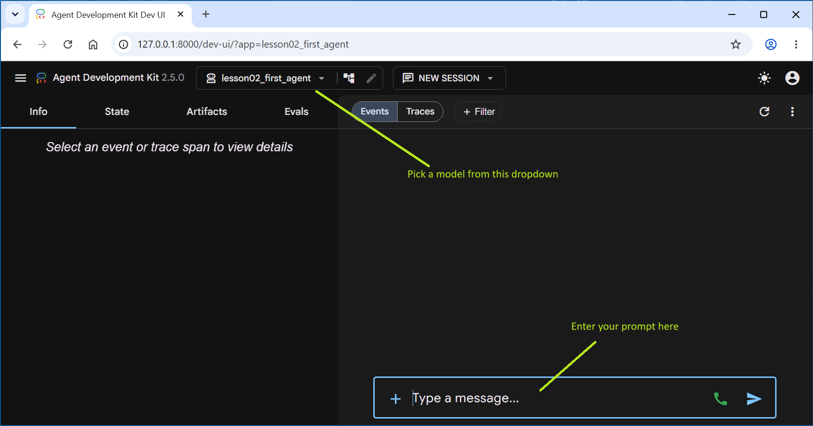
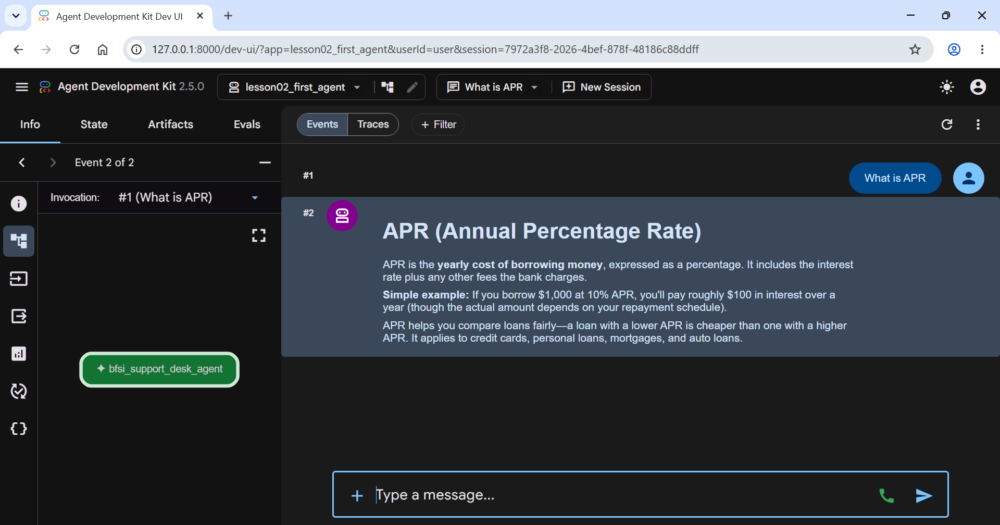

# Lesson 2: Your First Agent

In this lesson, we'll build and run our first working ADK agent: a simple assistant for a retail bank's customer support desk that explains everyday banking terms like APR, EMI, KYC, and overdraft in plain English language. It won't touch real customer data nor do anything BFSI-specific yet, that starts in Lesson 3, but it's enough to show you the three things every ADK agent needs, and the two ways you can run one on your machine.

We'll also see the same agent answer using two different models, Claude Haiku and Gemini Flash, by changing a single line of code! That's worth seeing early, since it tells you something true about ADK: your agent code generally doesn't change when you swap the model underneath it.

We'll also see how we can _tweak_ the behavior of our agent via _hyper-parameters_ such as `temperature`, `max_tokens`, `top_p` and `top_k`.


## Step 1: Create the agent folder

Every ADK agent lives in its own folder with a specific, small structure: an `agent.py` file that defines and exports a `root_agent`, and an `__init__.py` that imports it so ADK can find it.

Open the project root folder (`adk2_tutorial`) in a terminal and run the following commands:

```bash
# On Linux/Mac
mkdir -p agents/lesson02_first_agent
# On Windows 10/11
mkdir agents\lesson02_first_agent
```

You don't need a separate `.env` file inside this folder. ADK automatically looks upward from an agent's folder for a `.env` file, so the one you created at `adk2_tutorial/.env` back in Lesson 1 already covers every agent folder we'll create in this series.

## Step 2: Write the agent

Create `agents/lesson02_first_agent/agent.py`:

```python
"""Lesson 2: Your First Agent.

A minimal agent that answers general banking terminology questions for
a retail bank's customer support desk.

Everything here is hardcoded on purpose. Starting in Lesson 3, model
choice move into config/models.yaml and per-agent
config, so agents stop needing code changes to swap models.
"""

from google.adk.agents import Agent
from google.adk.models.anthropic_llm import AnthropicLlm

# Flip this to True to run the exact same agent on Gemini Flash instead
# of Claude Haiku. Both API keys are already available from the
# project's root .env.
USE_GEMINI_FLASH = False

AGENT_INSTRUCTION = (
    "You are a friendly, knowledgeable assistant for a retail bank's "
    "customer support desk. Answer questions about common banking "
    "terms and concepts, things like APR, EMI, KYC, and overdraft, "
    "in plain language a first-time customer would understand. Keep "
    "answers under 100 words. If a question requires looking at a "
    "specific customer's account or transaction data, say so clearly "
    "rather than guessing, since you don't have access to that data "
    "yet."
)

if USE_GEMINI_FLASH:
    model = "gemini-3.5-flash-lite"
else:
    model = AnthropicLlm(model="claude-haiku-4-5-20251001")

root_agent = Agent(
    name="bfsi_support_desk_agent",
    model=model,
    instruction=AGENT_INSTRUCTION,
    description="Answers general retail banking terminology questions.",
)
```

Create `agents/lesson02_first_agent/__init__.py`:

```python
from . import agent
```

That's it! That's your whole agent 😮. Three required attributes: a `model`, an `instruction`, and a `name`. Everything else, including `description`, is optional.

## What each parameter in `Agent(...)` actually does

Before we move on, it's worth knowing what each of the parameters of the `Agent`'s constructor actually do, since we'll use all of them in every agent we'll build for the rest of this series.

- **`name`** (mandatory❗) — a unique identifier for this agent. ADK enforces two rules on it: **it must be a valid Python identifier** (same rules as naming a Python variable - letters, digits, underscores, no spaces or hyphens, can't start with a digit), and **it can't be the literal string `"user"`** (ADK reserves `user` for the end user's own input). Once you start building multi-agent systems, this name is also how one agent refers to another, so it's worth naming agents descriptively from the start, the way we did with `bfsi_support_desk_agent`.

- **`model`** (mandatory❗) — which LLM answers on this agent's behalf, either a plain string (for models ADK resolves natively, like Gemini) or a model object you construct yourself (as we just did for Claude, with `AnthropicLlm(...)`). This is the one parameter you'll see change the most across the series as we swap between Haiku, Sonnet, and Gemini Flash depending on the lesson.

- **`instruction`** (mandatory❗) — the system prompt: your agent's standing directions for how to behave, what tone to use, and what it should and shouldn't do. This is the single biggest lever you have over an agent's behavior, and it's worth spending real time on. Later in the series, once we cover sessions and state, you'll see this field can also contain placeholders like `{customer_name}` that get filled in from live conversation data, rather than being fixed text like it is here.

- **`description`** (optional) — a short, one-line summary of what this agent does, separate from `instruction`. It doesn't affect how the agent behaves at all. It matters once an agent has other agents working under it: the parent uses each sub-agent's `description` to decide which one to hand a task to - so when it comes to multi-agent systems, treat this as mandatory. In this lesson, with a single standalone agent, it's doing nothing functionally yet, but it's good practice to write it accurately from the start, since it becomes load-bearing the moment this agent joins a larger system in later lessons.

> 📌 **NOTE** These arn't the only attributes of the `Agent`'s constructor. There are many more, which we will gradually _expose_ in later lessons.

## A caveat worth knowing: Claude and Gemini aren't resolved the same way

Notice that Gemini gets passed in as a plain string (`"gemini-3.5-flash-lite"`), but Claude gets wrapped in an `AnthropicLlm(...)` object instead of a string like `"claude-haiku-4-5-20251001"`. This isn't a style choice, it's necessary, and it's worth understanding so it doesn't trip you up later.

When you give ADK a plain model name string, it looks the name up against a set of built-in patterns to decide which provider to use. Gemini names resolve straight to ADK's native Gemini support, no extra step needed. Claude names, if left as a plain string, resolve to a version of Claude meant to run through Google Cloud's Vertex AI, which expects a GCP project to be configured. Since we're using a direct Anthropic API key instead, a bare Claude string would fail with a configuration error. Wrapping it in `AnthropicLlm(...)` sidesteps that entirely and talks to Anthropic directly, using the `ANTHROPIC_API_KEY` you already set in `.env`. You'll use this same pattern every time you reach for Claude in this series.

> 💡 **What about `LiteLLM`?**
> 
> If you have read other ADK tutorials, you must have seen the following Agent coding pattern:
>
> ```python
> from google.adk.models.lite_llm import LiteLlm
>
> AGENT_INSTRUCTION = (
>   "You are a friendly, knowledgeable assistant ...
> )
>
> root_agent = Agent(
>    name="bfsi_support_desk_agent",
>    model=LiteLlm(model="anthropic/claude-3-5-haiku-20241022"),
>    instruction=AGENT_INSTRUCTION,
>    description="Answers general retail banking terminology questions.",
>)
> ```
>
> `LiteLlm` is a great option when you want to interface your ADK agents with a variety of LLM providers, such as OpenAI, Anthropic, Google, Llama etc. We have chosen Claude as our model of choice in this lesson series, and we fall back to Gemini only where ADK mandates using Gemini, so there is no advantage of using `LiteLlm` in this series.

## Step 3: Run the Agent with `adk run`

`adk run` gives you a command-line chat loop, the fastest way to test an agent. Start a new terminal and run the following commands from the project root (i.e. from `adk2_tutorial` folder):

```bash
# first activate your local environment
source .venv/bin/activate # (or .venv\Scripts\activate.bat on Windows)
uv run adk run agents/lesson02_first_agent
```

> 📌 **NOTE** We pass a _folder name_ (specifically the name of the folder containing our `agent.py` file) to the `adk run` command - not a Python module name!
>
> And _yes_, the `uv run adk run ...` command is correct! It's using `uv` to run the `adk run` command 😊.

If all runs correctly, you'll see a bunch of logging information printed on your console, which you can safely ignore, followed by this:

```bash
Running agent bfsi_support_desk_agent, type exit to exit.
[user]: 
```

The `bsfi_support_desk_agent` comes from the value of the `name` parameter we gave our Agent. Type a question like the following after the `[user]` prompt and press Enter:

```
What does APR mean?
```

Within a few seconds you should see a short, plain-language explanation come back, written the way you'd expect a bank's support desk to explain it to a new customer. For example you may see something like this (your text may vary because LLM output is not deterministic!):

```bash
[user]: What does APR mean?
[bfsi_support_desk_agent]: **APR** stands for **Annual Percentage Rate**. It's the yearly cost of borrowing money, shown as a percentage.

Think of it this way: if you borrow $100 at 10% APR, you'll pay $10 in interest over one year (though payments are usually monthly, so it works out differently).

APR helps you compare loans fairly because it includes the interest rate plus any fees the lender charges. A lower APR means you pay less to borrow money, so it's always good to look for the lowest APR when shopping for loans or credit cards.
[user]:
```

Try a couple more terms if you like: EMI, KYC, overdraft. Type `exit` or press `Ctrl+C` when you're done.

> 🎗️ **NOTE: How to supress excessive logging messages when using `adk run`**
>
> You may have noticed a lot of log messages "dumped" on your terminal before you see the `Running agent bfsi_support_desk_agent, type exit to exit.` message. This can be quite distracting & frankly annoying at times 🤬.
> 
> Here's a quick & easy way of supressing all those messages - run the applicable option below depending on which "shell" (terminal) you are using:
>
> **Bash/Zsh/Git-bash**: `PYTHONWARNINGS=ignore uv run adk run agents/lesson02_first_agent`
>
> **Windows CMD**: `set PYTHONWARNINGS=ignore && uv run adk run agents/lesson02_first_agent`
>
> **Windows PowerShell**: `$env:PYTHONWARNINGS="ignore"; uv run adk run agents/lesson02_first_agent`
>
> This will suppress MOST of the messages, making for a much cleaner screen 😊.

## Step 4: Run it with `adk web`

`adk web` starts a local browser-based chat UI, and it becomes genuinely useful once you have more than one agent in your project, since it lists every agent it finds in a dropdown. Run it from your project root (`adk2_tutorial`), pointing at the `agents/` folder rather than this one lesson's subfolder:

```bash
source .venv/bin/activate
uv run adk web agents
```

> 📌 **NOTE:** we are pointing to the _parent_ `agents` folder, not the sub-folder holding the code for this lesson!

ADK will print a local URL, typically `http://127.0.0.1:8000`. Open it in your browser and you'll see something like this:



You'll see a dropdown with one entry, `lesson02_first_agent`, select it, and you'll get a chat window that behaves the same way as `adk run`, just with a proper UI: message history, a text box, and a cleaner read on the agent's responses. Ask it the same banking-terms questions - for example asking `What is APR` may give a response like this:



Right now there's only one agent to pick from, but by the time we're a few lessons in, this dropdown will hold several, which is exactly why the project is structured this way.

> 📌 **NOTE:** If you are coding along with us, then you will see only one entry, `lesson02_first_agent`, in the dropdown. 
>
> However, if you dowloaded the repo from GitHub and are running this lesson, you will see many more entries in the drop down - pick `lesson02_first_agent`

## Step 5: Switch to Gemini Flash model

Open `agent.py` and change one line:

```python
USE_GEMINI_FLASH = True
```

Run either command again:

```bash
uv run adk run agents/lesson02_first_agent
```

Ask the same question you asked before. You'll get an answer from a different model, likely worded a bit differently, but coming from the exact same agent definition, same instruction, same code around it. That's the point of this step: switching providers here took one line, not a rewrite.

Set `USE_GEMINI_FLASH` back to `False` before moving on, since Claude Haiku is our default for the rest of the series.

## Controlling Agent Behavior: Generation Hyperparameters

When building production systems that require reliable facts, compliance checks, or structured data extraction, deterministic and concise output is critical. You can _tune_ how an LLM samples and formats its responses by specifying generation parameters, also called _hyperparameters_.

In Google ADK 2.5.0, hyperparameters are configured using `types.GenerateContentConfig` (`from google.genai`) and passed directly into the `generate_content_config` parameter of the `Agent` constructor. This provides a unified configuration interface whether you run Gemini or Claude or any other LLM.

### Core Hyperparameters

| Parameter | What it Means (What it Controls) | Possible Values | Default Value |
| :--- | :--- | :--- | :--- |
| **`temperature`** | Controls randomness and creativity. Lower values produce deterministic, focused answers; higher values increase output variety. | 0.0 to 1.0 (Claude) / 0.0 to 2.0 (Gemini) | 0.7 to 1.0 |
| **`max_output_tokens`** | Sets the hard upper limit on the number of generated tokens in a single response turn. | Integer $\ge 1$ (up to model output limit) | 4096 or 8192 |
| **`top_p` (Nucleus Sampling)** | Restricts token selection to the cumulative probability threshold $p$. Lowering it eliminates the long tail of unlikely words. | 0.0 to 1.0 | 1.0 (full distribution) |
| **`top_k`** | Limits token selection to the top $k$ most probable candidate tokens at each generation step. | Integer $\ge 1$ | 40 (Gemini; ignored by Claude) |

### How to Apply Hyperparameters in Code

Copy the `lesson02_first_agent` and all its contents to a new folder `lesson02a_first_agent_hyperparams`.

Modify `agents/lesson02a_first_agent_hyperparams/agent.py` as shown below:

```python
"""Lesson 2: Your First Agent, with hyperparams tweaking

A minimal agent that answers general banking terminology questions for
a retail bank's customer support desk. We are showing how to tweak it's
hyperparameters to control behavior.
"""

from google.adk.agents import Agent
from google.adk.models.anthropic_llm import AnthropicLlm
from google.genai import types

USE_GEMINI_FLASH = False

AGENT_INSTRUCTION = (
    "You are a friendly, knowledgeable assistant for a retail bank's "
    "customer support desk. Answer questions about common banking "
    "terms and concepts, things like APR, EMI, KYC, and overdraft, "
    "in plain language a first-time customer would understand. Keep "
    "answers under 100 words. If a question requires looking at a "
    "specific customer's account or transaction data, say so clearly "
    "rather than guessing, since you don't have access to that data "
    "yet."
)

if USE_GEMINI_FLASH:
    model = "gemini-3.5-flash-lite"
else:
    model = AnthropicLlm(model="claude-haiku-4-5-20251001")

# Standardized generation hyperparameters for ADK 2.5.0
generation_config = types.GenerateContentConfig(
    temperature=0.1,
    max_output_tokens=256,
    top_p=0.9,
    top_k=40,
)

root_agent = Agent(
    name="bfsi_support_desk_agent_tuned",
    model=model,
    instruction=AGENT_INSTRUCTION,
    description="Answers general retail banking terminology questions.",
    generate_content_config=generation_config,
)
```

This is exactly the same `Agent` definition as before, with the addition of the `generate_content_config` parameter to the Agent's constructor and the lines the instantiate the `generation_config` itself.

### Run it with `adk run`

Run the following commands from the `adk2_tutorial` folder in a new shell/terminal.

```bash
# first activate your local environment
source .venv/bin/activate # (or .venv\Scripts\activate.bat on Windows)
uv run adk run agents/lesson02a_first_agent_hyperparams
```

You should see a similar prompt from the ADK agent. Enter the same questions as above and observe if the response is any different than before - it may or may not vary. As the same question again, and observe the difference from previous response - there should be very little difference.

Things to try:

* Vary the `temperature` (in the `generation_config = types.GenerateContentConfig(...)` part ) - try values like `0.5` or `1.0` and observe how your Agent behaves when you repeat the question. Higher temperarture values should generate move varied responses each time.
* Increase/reduce `max_tokens` and use the same questions and check if length of the response changes.


## Conclusion

In this lesson, we learnt how to build and test our very first agent, which could answer general questions on Retail banking terminology. We also saw how we could easily _swap_ the LLM used by the Agent and how to vary the _hyper-parameters_ that determine Agent behavior. For brevity, we won't be using the `ypes.GenerateContentConfig(...)` in the coming lessons, but it's important to note that it's the mechanism you'd use in Production to _tweak_ agent behavior. You **should use it** in Production!

In the next lesson, our agent will start doing some real work, like calculating loan EMIs and affordability for retail lending use case. 
