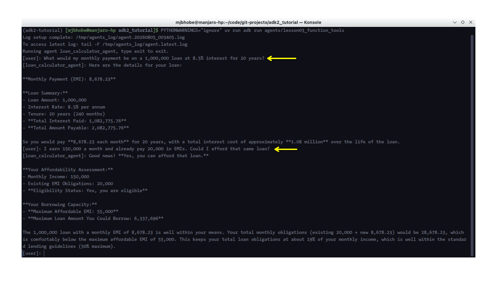

# Lesson 3: Function Tools

Lesson 2 got a bare-bones agent talking to Claude and Gemini. It could explain what an EMI is, but it couldn't actually calculate one for a real customer. That's the gap we're closing in this lesson: giving an agent real Python functions it can call to do actual work, not just talk about it.

## Why do LLMs need tools at all?

An LLM, **on its own**, does only one thing: it takes text as input and produces text as output (ignore multi-modality for the moment, where LLMs can produce images & videos from text as well). The output generated by the LLM comes from it's internal training data (the trillions & trillions of gigabytes of information your LLM was pre-trained on). On it's own, it has no ability to get you "live" or "current" information such as today's interest rate or a live stock price, nor does it have the ability to execute math reliably - such as multiplying a six-digit number across 240 compounding periods, and certainly no ability to reach outside the conversation to touch a database, an API, or a spreadsheet. Everything it "knows" is baked into its training data, and everything it "does" is generate the next plausible chunk of text from that data. That's enough for writing, summarizing, and reasoning in natural language, but it's not enough for a banking assistant that needs to calculate EMI for a customer, or check if they can afford a loan they are seeking.

A tool closes that gap. **A tool is simply a function, written in ordinary code, that the model is told about and is allowed to ask to be run on its behalf**. The model doesn't execute the function itself, it can't, it has no code execution environment inside it by default. Instead, the flow looks like this on every turn where a tool gets used:

<div align="center">
    <image src="images/tool_call_flow.png" alt="ADK Tool Call Flow"/>
</div>

1. You send the model a message, along with a description of every tool it's allowed to call (its name, what it does, and what arguments it takes).
2. The model decides, based on your message, whether answering requires calling one of those tools.
3. If it decides yes, instead of writing a text reply, it outputs a structured request: "call this function, with these argument values."
4. The framework running the conversation, such as the Google ADK framework, actually executes that Python function, with the exact arguments the model chose.
5. The function's return value goes back to the model as a new message.
6. The model reads that result and writes the final, human-readable answer.

This is what makes tools trustworthy for something like EMI math: step 4 runs real, deterministic Python. The model never sees or touches the arithmetic itself; it only sees the finished number and reports it. Anything you can write as a typed Python function, a calculation, a database lookup, an API call, becomes something the model can reliably use, precisely because the model isn't the one doing it.

**How ADK implements this specifically:** you write an ordinary Python function with type hints and a docstring, and pass it into an agent's `tools` list. ADK inspects the function's signature to build a schema (what arguments it takes and what types they are) and uses the docstring as the description the model reads to decide when and how to call it. No manual schema-writing, no registration boilerplate. You'll see exactly how this looks in the code below.

> 📌 **NOTE**: It is important that you annotate all function parameters and write clear & complete doc-strings for all your tools, including clear decription of the function arguments, and return values (and exceptions, if any). It only helps the ADK select the correct tool at runtime.

## The problem we're solving

A retail bank's loan desk fields the same two questions constantly: "What would my monthly payment be on a loan of this size?" and "Given what I earn, how much could I actually afford to borrow?" Right now, answering either one means a loan officer opening a spreadsheet, plugging in numbers, and reading off a result. It's simple arithmetic, but it's arithmetic no LLM should be trusted to do purely by "thinking" about it, since language models are unreliable at multi-step numeric calculation and will occasionally produce a plausible-looking wrong number with total confidence.

The fix is to not ask the model to calculate anything at all. Instead, we give it two Python functions, real EMI (Equated Monthly Installment) math and a loan affordability check, and let the model's job be limited to understanding what the customer is asking, calling the right function with the right numbers, and explaining the result in plain language. The math itself runs as deterministic Python code, not a language model guess.

## Step 1: Set up a shared config-loading helper

Before writing the agent, we're paying off something from Lesson 2: model choice moves out of the agent file and into `config/models.yaml`, which you already created in Lesson 1. Every future lesson will reuse this same helper, so it's worth setting up properly once.

ADK only adds the `agents/` folder itself to Python's import path, not your whole project, so a shared helper needs to live inside `agents/` too, as a plain Python package sitting alongside your lesson folders rather than inside any one of them.

Create the folder:

```bash
mkdir -p agents/common
```

Create `agents/common/__init__.py`. **Leave it empty**, its only job is marking the folder as a Python package.

Create `agents/common/model_config.py`:

```python
"""Shared model-loading helper for every agent in this project.

Reads config/models.yaml once and returns a ready-to-use model value
(either a plain string for Gemini or an AnthropicLlm instance for
Claude) for a given policy tier: "primary", "escalation", or "fallback".
"""

from pathlib import Path
from typing import Literal

import yaml
from google.adk.models.anthropic_llm import AnthropicLlm

# Path(__file__) = adk2_tutorial/agents/common/model_config.py
# parents[2] therefore points to the adk2_tutorial folder
_PROJECT_ROOT = Path(__file__).resolve().parents[2]
_MODELS_CONFIG_PATH = _PROJECT_ROOT / "config" / "models.yaml"

ModelTier = Literal["primary", "escalation", "fallback"]


def get_model(tier: ModelTier = "primary"):
    """Builds the model object for the requested tier in config/models.yaml.

    Args:
        tier: Which entry in config/models.yaml to use. "primary" is
            Claude Haiku by default, "escalation" is Claude Sonnet,
            and "fallback" is Gemini Flash. We are never going to use 
            Claude Opus or Gemini Pro - not needed for any of our examples!

    Returns:
        Either a plain model name string (for Gemini, which ADK
        resolves natively) or an AnthropicLlm instance (for Claude,
        which needs to be constructed explicitly to use a direct
        Anthropic API key instead of Vertex AI).
    """
    with open(_MODELS_CONFIG_PATH, "r", encoding="utf-8") as f:
        config = yaml.safe_load(f)

    # to best understand the following lines, open YAML file
    # side-by-side to this file in your IDE/editor
    entry = config["models"][tier]
    provider = entry["provider"]
    model_id = entry["id"]

    if provider == "anthropic":
        return AnthropicLlm(model=model_id)
    if provider == "google":
        return model_id

    raise ValueError(f"Unknown model provider '{provider}' for tier '{tier}'")
```

This function does three things worth calling out. First, `_PROJECT_ROOT` is computed from the file's own location (two folders up from `agents/common/model_config.py` lands you at the project root), rather than assuming a particular working directory, since ADK can be launched from different places depending on whether you're using `adk run`, `adk web`, or a deployed container later. Second, it reads `config/models.yaml` fresh on every call rather than caching it, which is a deliberate simplicity trade-off for now, this file changes rarely and the file read is cheap; we'll revisit caching if it ever matters. Third, the `provider` branch is exactly the caveat from Lesson 2 turned into reusable code: Claude needs to be wrapped in `AnthropicLlm(...)` explicitly, Gemini can be returned as a plain string.

Every agent from here on imports `get_model` instead of hardcoding a model string or object. Changing your entire series' model policy, or handing this project to someone using a different Anthropic tier, becomes a one-file edit in `config/models.yaml`.

## Step 2: Write the loan calculator tools and agent

Create the folder:

```bash
mkdir -p agents/lesson03_function_tools
```

We're keeping tool functions in their own `tools.py` file, separate from `agent.py`, rather than defining them inline. This is the convention we'll follow for every agent in this series from here on: `agent.py` stays focused on the agent's definition (model, instruction, which tools it's given), while `tools.py` holds the actual function implementations. It keeps each file readable as an agent grows more tools over the course of the series, and it makes tools easy to find, test, and reuse independently of any one agent.

Create `agents/lesson03_function_tools/tools.py`:

```python
"""Loan calculator tools for the retail lending desk agent.

Each function here is a plain, typed Python function with no
dependency on ADK. That's deliberate: a tool function should be
testable and usable on its own, with ADK only responsible for
exposing it to the model, not for how it works internally.
"""


def calculate_emi(
    principal: float,
    annual_interest_rate_percent: float,
    tenure_months: int,
) -> dict:
    """Calculates the monthly EMI for a loan using the standard amortization formula.

    Args:
        principal: The loan amount being borrowed, in the local currency.
        annual_interest_rate_percent: The annual interest rate as a
            percentage, for example 8.5 for 8.5%.
        tenure_months: The loan repayment period in months.

    Returns:
        A dict with the monthly EMI, total amount payable over the
        loan's life, and total interest paid.
    """
    monthly_rate = (annual_interest_rate_percent / 100) / 12

    if monthly_rate == 0:
        emi = principal / tenure_months
    else:
        growth_factor = (1 + monthly_rate) ** tenure_months
        emi = principal * monthly_rate * growth_factor / (growth_factor - 1)

    total_payment = emi * tenure_months
    total_interest = total_payment - principal

    return {
        "monthly_emi": round(emi, 2),
        "total_payment": round(total_payment, 2),
        "total_interest": round(total_interest, 2),
        "principal": principal,
        "tenure_months": tenure_months,
        "annual_interest_rate_percent": annual_interest_rate_percent,
    }


def check_loan_affordability(
    monthly_income: float,
    existing_monthly_emis: float,
    annual_interest_rate_percent: float,
    tenure_months: int,
    max_foir_percent: float = 50.0,
) -> dict:
    """Estimates the maximum loan a customer can afford given their income.

    Uses FOIR (Fixed Obligation to Income Ratio), a standard lending
    guardrail that caps total monthly loan obligations as a percentage
    of monthly income. Most retail lenders use a FOIR ceiling between
    40 and 50 percent.

    Args:
        monthly_income: The customer's gross monthly income.
        existing_monthly_emis: The sum of all EMIs the customer is
            already paying on other loans.
        annual_interest_rate_percent: The annual interest rate the new
            loan would carry, as a percentage.
        tenure_months: The proposed repayment period for the new loan,
            in months.
        max_foir_percent: The maximum percentage of monthly income
            allowed to go toward all loan obligations combined.
            Defaults to 50.0.

    Returns:
        A dict indicating whether the customer is likely eligible,
        along with the maximum affordable EMI and maximum loan amount
        at the given rate and tenure.
    """
    max_total_emi = monthly_income * (max_foir_percent / 100)
    max_new_emi = max_total_emi - existing_monthly_emis

    if max_new_emi <= 0:
        return {
            "is_eligible": False,
            "max_affordable_emi": 0.0,
            "max_loan_amount": 0.0,
            "reason": (
                "Existing EMI obligations already exceed the maximum "
                "allowed FOIR."
            ),
        }

    monthly_rate = (annual_interest_rate_percent / 100) / 12
    growth_factor = (1 + monthly_rate) ** tenure_months
    max_loan_amount = (
        max_new_emi * (growth_factor - 1) / (monthly_rate * growth_factor)
    )

    return {
        "is_eligible": True,
        "max_affordable_emi": round(max_new_emi, 2),
        "max_loan_amount": round(max_loan_amount, 2),
        "max_foir_percent": max_foir_percent,
    }
```

Create `agents/lesson03_function_tools/agent.py`:

```python
"""Lesson 3: Function Tools.

A loan desk assistant for a retail bank that calculates EMIs (Equated
Monthly Installments) and checks loan affordability against a
customer's income, using two real Python functions as ADK tools
rather than asking the model to do the arithmetic itself.
"""

from google.adk.agents import Agent

from common.model_config import get_model
from .tools import calculate_emi, check_loan_affordability

AGENT_INSTRUCTION = (
    "You are a loan desk assistant for a retail bank. Customers will "
    "ask you about monthly payments on a loan they're considering, or "
    "whether they can afford a certain loan amount. Use the "
    "calculate_emi tool for the first kind of question, and the "
    "check_loan_affordability tool for the second. Always state the "
    "key numbers clearly: EMI, total interest, or maximum loan amount "
    "as applicable. If the customer hasn't given you enough "
    "information to call a tool, such as a missing interest rate or "
    "tenure, ask for it before calculating anything. Never estimate "
    "or guess a number yourself; only report numbers that came from a "
    "tool call."
)

root_agent = Agent(
    name="loan_calculator_agent",
    model=get_model("primary"),
    instruction=AGENT_INSTRUCTION,
    description=(
        "Calculates loan EMIs and checks loan affordability against "
        "customer income for a retail bank's loan desk."
    ),
    tools=[calculate_emi, check_loan_affordability],
)
```

Create `agents/lesson03_function_tools/__init__.py`:

```python
from . import agent
```

Your lesson's folder now looks like this:

```
agents/lesson03_function_tools/
├── __init__.py
├── agent.py
└── tools.py
```

A few things worth explaining about what's happening across these two files. The `from .tools import calculate_emi, check_loan_affordability` line in `agent.py` is a relative import, the leading dot means "from the `tools` module in this same package." This works because ADK loads `lesson03_function_tools` as a proper Python package (that's exactly what the `__init__.py` file is for), so the usual Python package rules apply, and `agent.py` can reach its sibling `tools.py` file this way.

The `tools` parameter on `Agent(...)` is new: it's a list of plain Python functions, and ADK automatically wraps each one into a callable tool the model can invoke. You didn't need to write any schema, registration boilerplate, or JSON definitions by hand. ADK builds the function's schema (its name, its parameters, and their types) directly from the function's signature, using your type hints to know that `principal` is a number and `tenure_months` is an integer, for instance. It doesn't matter that the functions live in a separate file, ADK inspects each function object itself, not the file it was defined in.

> 📌 **NOTE**  
> 
> **The docstring on each function matters more than it might look like**. ADK takes the entire docstring, not just a one-line summary, and sends it to the model as the tool's description. This is how the model decides which tool to call and how to fill in the arguments correctly. A vague docstring produces a tool the model calls incorrectly or not at all; the detailed Args and Returns sections above are doing real work, not just satisfying a style guide. 
>
> One caveat worth knowing: as of the current ADK release, per-parameter descriptions in the Args section aren't parsed out into a structured schema field individually, the whole docstring travels to the model as one block of text. Writing clear per-argument descriptions still helps, since the model reads that whole block, but don't expect them to show up as separate structured metadata if you go digging through the generated tool schema. <br/><br/>

Also notice the agent's `instruction` text field explicitly tells the model never to estimate a number itself and to always use the tools. _This is a real, necessary line of defense_: nothing stops a language model from confidently calculating a wrong EMI in its head if you don't tell it not to. Instructing it to only report tool outputs is what actually enforces the "let Python do the math" design.

## Step 3: Run it

Run the following command from the project root (`adk2_tutorial`) from a new terminal.

```bash
# to ensure local environment is active run this command
source .venv/bin/activate # or .venv\Scripts\activate on Windows
# run this command for "console" interface to agent
uv run adk run agents/lesson03_function_tools
```

Try a question that needs the EMI calculator:

```
What would my monthly payment be on a 1,000,000 loan at 8.5% interest for 20 years?
```

You should see the agent recognize this needs a calculation, silently call `calculate_emi` behind the scenes (in `adk run`'s CLI you'll typically see a note that a tool was called, followed by the model's answer), and come back with a clear statement of the monthly EMI, total interest, and total repayment, phrased in plain language rather than as raw numbers.

Now try one that needs affordability, in the same session:

```
I earn 150,000 a month and already pay 20,000 in EMIs. Could I afford that same loan?
```

You should see it call `check_loan_affordability` this time, and answer with a clear yes-or-no plus the maximum loan or EMI it calculated, rather than trying to reuse the previous answer.

Here is how it may look for your (this is a screenshot of my Terminal on a Manjaro Linux KDE system)



For the web UI, run the following command from your terminal (or your IDE's terminal - I use VS Code). Make sure that the local environment is active.

```bash
# to ensure local environment is active run this command
source .venv/bin/activate # or .venv\Scripts\activate on Windows
# run this command to bring up the Web UI
uv run adk web agents
```

You should see a web url (usually http://127.0.0.1:8000) displayed in your terminal. Click on that URL to open the ask web interface - mine opens in VS Code (my preferred IDE), your's could open in your default browser. Click the downdown at the very top that reads "Select an app" and pick `lesson03_function_tools`, and ask the same two questions in the text box that reads `Type a message` at the bottom of the window. For example, the response to the first question `What would my monthly payment be on a 1,000,000 loan at 8.5% interest for 20 years?`, looks something like this in my IDE

<div align="center">
    <image src="images/adk_web_ui_loan_tools.png" alt="ADK Web Session with Loan Tools"/>
</div>

The web UI is worth using here specifically because it will visibly show you the tool call and its raw return value as a separate step in the conversation, before the model's final worded response, which is a good way to build intuition for what's actually happening between your question and the answer you see. 

## If you're coming from LangChain or LangGraph

If you've defined tools in LangChain before, this will feel familiar: LangChain also builds a tool's schema from a Python function's signature and docstring, typically via the `@tool` decorator or `StructuredTool`. The mechanics ADK uses under the hood are different (LangChain generally leans on Pydantic models for tool schemas, ADK builds directly from function signatures), but the developer experience, write a typed function with a good docstring, hand it to the agent, is close enough that this should feel like a small syntax change rather than a new concept.

## How this addressed the problem

We started with a loan officer manually punching numbers into a spreadsheet for every EMI and affordability question. Now a customer can ask either question in plain language, and the agent produces a correct answer, backed by real arithmetic running in Python, not by the model guessing. The critical design choice was keeping the model out of the math entirely: it identifies intent and extracts numbers from a sentence, which is what LLMs are actually reliable at, and hands the arithmetic itself off to deterministic code, which is what LLMs are not reliable at.

Such an agent could also be intergrated into a chat application like we developed in Lesson 2 and the user could ask the bank's chat application these questions from her mobile or laptop without ever visiting the bank!

## A word on cost

Each question in this lesson costs slightly more than Lesson 2's plain chat, since a tool call adds an extra round trip: the model first decides to call a function, then receives the result and turns it into a worded answer. On Claude Haiku this is still a fraction of a cent per exchange, tool-calling overhead on a small model like Haiku is not something you need to budget carefully for at this scale, but it's worth noticing the shape of the cost now, since it becomes more relevant once we're chaining several tool-calling agents together starting in Lesson 8.

## Conclusion

In this lesson we gave an agent its first real capability: the ability to use tools (calling Python functions instead of just generating text). The loan desk assistant now calculates real EMIs and checks real loan affordability using deterministic arithmetic, with the model's role limited to understanding the customer's question, extracting the right numbers, and calling the right tool, never doing the math itself. 

In the next lesson we stay with tools, but shift to a different kind: built-in tools that ADK ships out of the box rather than ones you write yourself, including live web search grounding. We'll also run into a real limitation, ADK's built-in Google Search tool only works with Gemini models, we'll cover how we can overcome that with a custom search function that models other than Gemini can use.