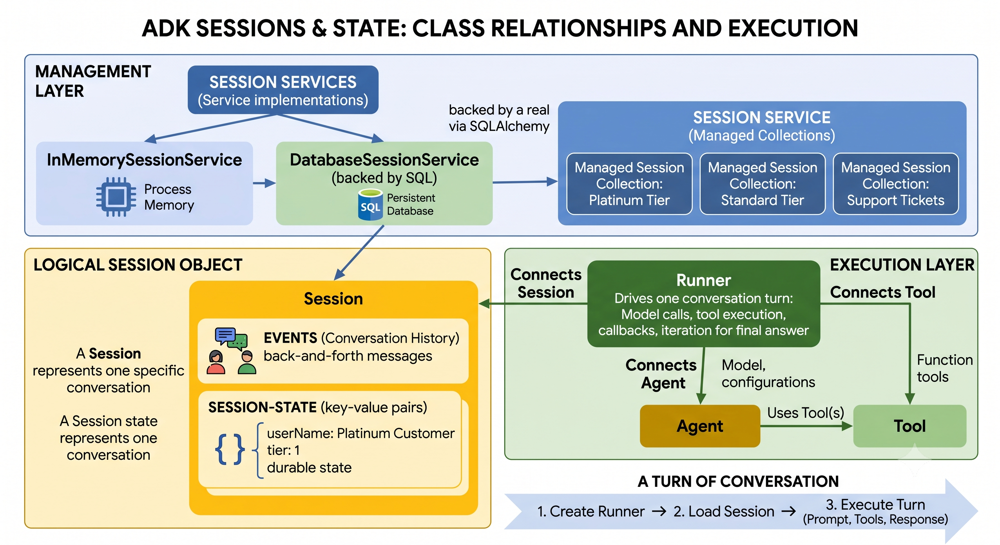

# Lesson 6a: Sessions & State - the Agent View

Up until now, every lesson has run through `adk run` or `adk web`. Both are genuinely useful for quick testing, and we'll keep reaching for them elsewhere in this series. But they've also been quietly doing something you've never had to look at: managing exactly how a conversation's state is created, stored, and handed to your agent turn by turn. That convenience has a cost. It hides the very machinery this lesson is about.

So we're taking the training wheels off. We won't be using `adk run` or `adk web` to test our agent. Instead, we'll write a `main.py` script that builds the three objects powering every single ADK conversation: the `SessionService`, the `Session`, and the `Runner`. Understanding this code is what separates someone who's been testing prompts in a CLI from someone who can build and deploy a real agent backend. And it's also the only way to show you something `adk run`/`adk web` can't: a session that arrives already knowing who it's talking to, the way a real production system would hand one off to an Agent.

## The problem we're solving

A bank's priority support desk doesn't start every call from zero. By the time a Platinum-tier customer's call reaches an assistant, whether that assistant is human or an agent, the bank's CRM system has already identified who's calling, what tier they're in, and who their relationship manager is. A good support experience uses that context from the very first word, greeting the customer by name rather than asking them to identify themselves, and treating a Platinum customer's request differently than a Standard one, without being told to on every single call.

That's a genuinely different shape of problem than anything so far in this series. It's not about a tool fetching data mid-conversation, and it's not about the agent slowly building up facts over several turns. It's about context that exists *before the conversation starts*, handed to the agent by whatever system routed the call there. `adk run` and `adk web` give you no clean way to pre-load a session like that; they always start you from an empty one. To do this properly, you need to create the session yourself.

## The three objects behind every ADK conversation

**`SessionService`** is the component responsible for actually storing and retrieving sessions. There are two variants: an `InMemorySessionService`, which we're using in this lesson, keeps everything in memory for the life of the process and forgets it the moment the process exits; and a `DatabaseSessionService` which is the production-shaped alternative, backed by a real database via SQLAlchemy, so sessions survive restarts and can be shared across multiple running instances of your application. Swapping which service you use is a one-line change in code; nothing about how you talk to a session changes based on which one is backing it. In production, you'll almost always use `DatabaseServiceSession`.

**`Session`** is one specific conversation: its message history (the back-and-forth conversations) and its state (a dict object of key & value pairs), the same state you'll read and write in this lesson. A `SessionService` can hold many sessions at once, for many different users; a `Session` is exactly one of them.

**`Runner`** is what actually executes one turn of a conversation. Hand it a session, an agent, and a new message, and it drives the full exchange: sending the conversation to the model, running any tool the model asks for, applying callbacks, and doing this as many times in a row as the model needs before it's ready to give a final answer. `adk run` and `adk web` have been building a `Runner` for you, invisibly, on every message you've ever sent them.

The diagram below better illustrates the complex inter-relationship between these ADK classes:



**One more thing worth knowing before you see the code**

Every one of these objects is _asynchronous_. Creating a session, and running a turn through the Runner, are both `async` operations, meaning your code needs `await` to actually wait for them to finish, and the loop that drives your conversation needs to be an `async def` function itself, started with `asyncio.run(...)`. This isn't an ADK quirk, it reflects that a real turn involves waiting on network calls (to the LLM, and potentially to tools, databases, or other services), and `async`/`await` is Python's way of not blocking your whole program while that waiting happens. `Runner.run_async` specifically doesn't hand you back one final answer either; it's an async generator, which you consume with `async for`, and it yields one `Event` for every step of the turn as it happens; a tool being called, a tool's result coming back, partial and final text from the model. You'll see all of this directly in the code below, since nothing here is hidden from you anymore.

Ok, enough theory 🥱! Let's code our agent, shall we?

## Step 1: Build the priority support agent

Starting with this lesson, every `main.py`-driven example in this series keeps its own lesson folder self-contained: the driving script and every agent it uses live together under one folder in `agents/`. 

Create the structure:

```bash
mkdir -p agents/lesson06a_sessions_and_state/priority_support
```

Create `agents/lesson06a_sessions_and_state/priority_support/agent.py`:

```python
"""Lesson 6a: Sessions & State.

A priority banking support assistant whose session arrives pre-seeded
with CRM context, customer name, account tier, and relationship
manager, before the agent ever sees a single message. The agent reads
that context straight from its instruction.
"""

from google.adk.agents import Agent

from common.model_config import get_model

AGENT_INSTRUCTION = (
    "You are a priority banking support assistant. You are speaking "
    "with {customer_name}, a {account_tier} tier customer whose "
    "relationship manager is {relationship_manager_name}. Greet them "
    "by name. Platinum and Gold tier customers should be offered a "
    "direct handoff to their relationship manager for anything beyond "
    "a simple question; Standard tier customers can be helped "
    "directly for routine issues."
)

root_agent = Agent(
    name="priority_support_agent",
    model=get_model("primary"),
    instruction=AGENT_INSTRUCTION,
    description=(
        "Priority banking support assistant aware of customer tier and "
        "relationship manager, pre-seeded from CRM data."
    ),
)
```

Create `agents/lesson06a_sessions_and_state/priority_support/__init__.py`:

```python
from . import agent
```

Look closely at the instruction: specifically `{customer_name}`, `{account_tier}`, and `{relationship_manager_name}` - these are actually the names of session variables (keys of the Session dict). At runtime, ADK replaces these variables with the actual values from the session. So for example, if `customer_name` session variable was given a value of `Priya Sharma`, the agent instruction would read _"You are a priority banking support assistant. You are speaking with Priya Sharma, ..."_ before it "hits" the Agent. You will see how these session variable are initialized in Step 2 when we code `main.py.

## Step 2: Write main.py

Create `agents/lesson06a_sessions_and_state/main.py`.

```python
"""Lesson 6a: Sessions & State.

Builds a SessionService, a Session pre-seeded with CRM-style customer
context, and a Runner by hand, then drives a console conversation loop
manually, exactly what adk run has been doing for you invisibly since
Lesson 2.

Run with:
    uv run agents/lesson06a_sessions_and_state/main.py
"""

import asyncio
import sys
from pathlib import Path

from dotenv import load_dotenv

# Load API keys from the project-root .env before importing any ADK
# modules that depend on them. adk run/adk web did this automatically;
# in our own main.py we have to do it ourselves.
load_dotenv(override=True)

# this line is required to bring the agents folder (parents[1]) into
# sys.path, because our utility modules sit inside that folder.
# adk run/adk web automatically added the agents folder to sys.path/
# Since we are running main.py directly, we need to add this line!
sys.path.insert(0, str(Path(__file__).resolve().parents[1]))

from google.adk.runners import Runner
from google.adk.sessions import InMemorySessionService
from google.genai import types

from priority_support.agent import root_agent

APP_NAME = "priority_support_app"
USER_ID = "demo_user"


async def main() -> None:
    """Sets up a pre-seeded session, then runs a console chat loop against it."""
    session_service = InMemorySessionService()

    # This is the moment adk run can't show you: a session created with
    # its state already populated, simulating a real handoff from a
    # bank's CRM system before the conversation even begins.
    session = await session_service.create_session(
        app_name=APP_NAME,
        user_id=USER_ID,
        state={
            "customer_name": "Arjun Mehta",
            "account_tier": "Platinum",
            "relationship_manager_name": "Kavita Rao",
        },
    )

    runner = Runner(
        app_name=APP_NAME,
        agent=root_agent,
        session_service=session_service,
    )

    print("Hello, I am the Priority Support Assistant. How can I help you?\n")
    print("Type in your query (or type 'exit' to quit)\n")

    while True:
        user_input = input("Query: ").strip()
        if user_input.lower() in {"exit", "quit"}:
            break
        if not user_input:
            continue

        user_message = types.Content(role="user", parts=[types.Part(text=user_input)])

        # Runner.run_async is an async generator, not a function that
        # returns one value: it yields one Event per step of the turn as
        # it happens (tool calls, tool results, partial and final text).
        # `async for` consumes that stream as it arrives. This exact loop
        # is what adk run and adk web have been running for you this
        # whole series, just never shown to you directly until now.
        async for event in runner.run_async(
            user_id=USER_ID,
            session_id=session.id,
            new_message=user_message,
        ):
            if event.is_final_response() and event.content and event.content.parts:
                response_text = "".join(
                    part.text for part in event.content.parts if part.text
                )
                print(f"Agent: {response_text}\n")


if __name__ == "__main__":
    asyncio.run(main())
```

Whoa! That's a lot of new things we've not seen before 😯!! 

Let's take a step (or two) back and fully understand what's happening here. **It's important that you fully understand this because later lessons will use thsi mechanism and we'll be glossing over this going forward**. You've been warned!! 

The first is easy to miss but absolutely essential: `load_dotenv(override=True)` near the top. `adk run` and `adk web` call this automatically before anything else runs, which is why our `.env` API keys have worked transparently through every lesson so far. Your own `main.py` gets no such treatment, it's just a plain Python script, and `dotenv` is not called by any ADK library code before your imports. If you forget this line, `ANTHROPIC_API_KEY` simply won't be in the environment when ADK tries to reach the model, and you'll see a slew of authentication errors rather than a response. It's a good practice to use `override=True`- it makes _our_ `.env` the authoritative source of API keys, even if one of those keys already happens to be set in your shell environment from a previous export. Without the flag, `load_dotenv()` silently skips any key that's already set, which can cause confusing behaviour if the shell value points at a different account or project than your `.env` does.

Next, `session_service.create_session(..., state={...})` is the whole trick behind this lesson: passing a dictionary of state at creation time seeds it into the session before anything else happens, which is exactly the pre-loaded-context pattern `adk run`/`adk web` have no clean way to give you. Incidentally, the `create_session(...)` defines `state` as an optional value, which defaults to `None`. So you can skip it entirely, and the session will be "blank" by default.

`APP_NAME` and `USER_ID` both exist because a `SessionService` isn't built to hold just one conversation, it's built to hold many, for many different applications and many different users, all at once. `APP_NAME` is how sessions get namespaced by which application they belong to; a single deployed `SessionService`, especially a shared, `DatabaseSessionService` in production, might store sessions for several different agents or products at once, and `APP_NAME` is what keeps a _support-desk_ session from ever being confused with, say, a completely unrelated _onboarding_ session. `USER_ID` scopes a session to a specific person. In this lesson, both are hardcoded strings, "priority_support_app" and "demo_user", which is fine for a script you're running by hand at a terminal. In a real deployment they almost never would be. `APP_NAME` is typically a stable constant for a given deployed service, though it might come from a config file or an environment variable if the same codebase gets deployed multiple times under different names, for a staging environment versus production, for instance. `USER_ID` is the one that changes the most in practice: in a real banking application, it would come from whatever already identifies the customer, a session token from your authentication system, a customer ID from the bank's own database, but never a hardcoded literal. Hardcoding it would mean every single person talking to the agent shared one conversation and one session!

The console loop itself does three things on every message: wraps your typed input into a `types.Content` object, the same structured message format ADK uses internally regardless of whether a message originated from a terminal, a web form, or an API call; streams it through `runner.run_async`; and prints out the final response text. That streaming is where `event` comes in, and it's worth understanding properly rather than glossing over, since you'll see it in every `main.py` for the rest of this series. An Event is the atomic record of one thing that happened during a turn: the user's message arriving is an event, the model deciding to call a tool is an event, that tool's result coming back is an event, a partial or final chunk of the model's text is an event. `Runner.run_async` doesn't hand you one finished answer, it hands you this whole sequence, one Event at a time, as it happens, which is exactly why the loop uses `async` rather than a plain `await`. The check `event.is_final_response()` is what lets you filter that stream down to just the one event that represents the model's complete, final answer for this turn, ignoring everything else that happened along the way. Every event that streams past also becomes part of the session's permanent transcript, so nothing here is thrown away even when we choose not to print it.

Notice too that `priority_support/agent.py` still imports from `common.model_config import get_model`, exactly as every earlier lesson's agent did, even though it now lives two folders deeper than before. That works because `sys.path` is set up once, by `main.py`, before anything else gets imported; by the time Python reaches agent.py's own import line, `agents/` is already on the path, regardless of how deeply nested the file asking for it is.

> 📌 **NOTE:** Every `main.py`-driven lesson from here on follows this same folder shape: `agents/lessonNN_topic/` holds `main.py` plus one subfolder _per agent_ it uses, all self-contained under a single lesson folder. One consequence worth remembering, in case you ever want to point `adk web` or `adk run` at one of these agents directly for quick testing rather than running it through `main.py`: ADK's agent discovery only scans one level deep, so you'd need to run `adk web agents/lessonNN_topic` (pointing at the folder that directly contains the agent subfolder, `priority_support/` in this case), not the top-level `agents/` directory the rest of this series otherwise uses. To make it clearer, we'd run `adk web agents/lesson06a_sessions_and_state` from the `adk2_tutorial` folder rather than just `adk web agents` as we have been doing in previous lessons.

Whew 😌! That was a lot to absorb, I know. But it's important that you fully understand this pattern as it will keep repeating in the upcoming lessons and we won't explain it again ... unless something changes, of course.

## Step 3: Run it

From the root folder, run the following command.

```bash
uv run agents/lesson06a_sessions_and_state/main.py
```

You should see the greeting prompt, then be able to type directly:

```
Hi, I'm having trouble with a wire transfer.
```

The agent should open by addressing you as Arjun Mehta and referencing your Platinum tier and Kavita Rao, your relationship manager, none of which you told it, since it was already sitting in the session before the conversation began. Ask a couple of follow-up questions and notice that this awareness doesn't fade, every response is still shaped by knowing who it's talking to, because that context lives in the session itself, not in anything you said.

Here are some screen-shots from my interaction with the agent - I ran this in a Git-bash session on Windows 11.

<div align="center">
    <image src="images/lesson6a_query1.png"/>
</div>

Notice how the Agent has responded with your name (Arjun), referenced your Platinum tier and offered to connect you with your RM - Kavita Rao. These came from the values we set in the session for the respective variables.

<div align="center">
    <image src="images/lesson6a_query2.png"/>
</div>

Next, I asked the agent to gather some information, so it asked me for some details for the wire transfer.

<div align="center">
    <image src="images/lesson6a_query3.png"/>
</div>

After entering them, the agent confirms what I entered and _"connects"_ me to the RM. Of course, since there is no connect code, the actual connect won't happen, buy you get the drift.

## A quick segue: what about writing to state?

Everything in this lesson was about state the agent *reads*. Nothing here shows the agent changing its own session state - I mean the agent should have written the info I provided back to the session before transferring to Kavita, right? Honestly, doing that required an entirely different mechanism - callbacks. Callbacks deserve their own proper introduction rather than a rushed one bolted onto an already dense lesson like this one - we'll surely cover it in upcoming lessons.

There is an indirect way an Agent can modify it's session - via tools and it's `ToolContext`. And that's the topic we'll cover in the next lesson. 

## If you're coming from LangChain or LangGraph

Building a `Runner` and driving it with your own loop maps closely to invoking a compiled LangGraph graph directly, `graph.astream(...)` or `graph.ainvoke(...)`, rather than going through LangGraph Studio's dev server. The pattern is the same in both frameworks: a framework-level dev tool hides the object you'd actually be calling in production, and building against that object directly is what a real backend, an API, a script, a job, ends up doing regardless of which framework it's built on. If you've ever driven a LangGraph app this way, `Runner.run_async` and its stream of `Event` objects should feel immediately familiar; it plays the same role as LangGraph's own event stream.

## In this lesson

We stopped letting `adk run` and `adk web` hide the machinery behind every conversation and built it ourselves: a `SessionService`, a `Session` pre-seeded with context the way a real production handoff would provide it, and a `Runner` driving a manual, `async`/`await`-based console loop. The priority support agent read that pre-loaded context straight from its instruction, with no `?` needed since the data was guaranteed present from the start, no tool, no callback, just a session that already knew who it was talking to.

## In the next lesson

The next lesson picks up where this one deliberately stopped: an agent that actually modifies its own session state, not just reads it. It'll do that through a KYC onboarding agent that writes to session state from inside a tool, using `ToolContext`, extending a pattern you already know well from every tool you've built since Lesson 3.
