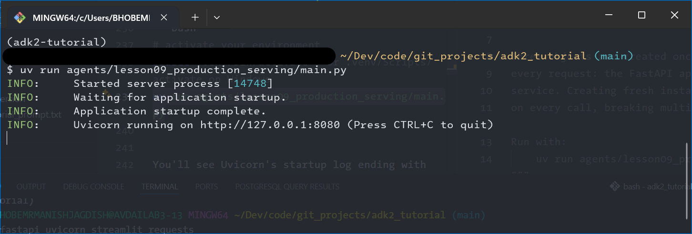

# Lesson 9: From Development to Production — Serving Your Agent Behind an API

Across all lessons so far, every agent has run either through our own `main.py` console loop or through `adk run`/`adk web`. Both approaches work well for development and testing. But neither is how an agent serves real users in production. This lesson covers that final step: wrapping your agent behind a proper HTTP API that any client — a web application, a mobile app, an internal tool — can call without knowing or caring that ADK exists underneath.

## Why a dedicated lesson for this

We covered the `Runner`, `SessionService`, and `MemoryService` objects in detail across Lessons 6a through 8. You know what they do. This lesson's job is to show how those same objects become the backbone of a production-ready API server, and to prove the point concretely by building two very different clients — a Streamlit web UI and a plain console script — that both talk to the same running agent without any ADK knowledge on their end.

This lesson sits here, before multi-agent systems, deliberately. Lessons 11 onward build increasingly complex multi-agent pipelines. Those lessons can focus entirely on how agents coordinate with each other precisely because this lesson has already settled the question of how a running agent gets called from the outside world.

## The agent we're serving

We'll wrap the relationship manager agent from Lesson 8 — the one with `load_memory` and an `after_agent_callback` that saves to long-term memory. It's a good choice because it exercises the full stack: session state, a tool call, a callback, and a memory service. So the serving layer gets a real workout rather than just forwarding simple text.

## Step 1: Create the shared Runner utility

The `agents/common/` folder already holds `model_config.py` from Lesson 3. We're now adding a second shared module: `runner_utils.py`, a reusable helper that wraps the `Runner`, `SessionService`, and event loop pattern into two clean functions that every `main.py` in this series will call. It accepts an optional `memory_service` parameter so it works for agents that use long-term memory (like this lesson's) and equally for those that don't.

Create `agents/common/runner_utils.py`:

```python
"""Shared Runner utility for querying any ADK agent programmatically.

Used from Lesson 6a onward as the standard way to run an agent outside
of adk run / adk web. The optional memory_service parameter was added
in Lesson 9 to support agents that use long-term memory.
"""

from typing import Optional

from google.adk.agents import BaseAgent
from google.adk.memory.base_memory_service import BaseMemoryService
from google.adk.runners import Runner
from google.adk.sessions import BaseSessionService
from google.genai import types


async def get_or_create_session(
    session_service: BaseSessionService,
    app_name: str,
    user_id: str,
    session_id: str,
):
    """Fetches an existing session, or creates a new one if it doesn't exist yet.

    Args:
        session_service: The session service backing this conversation.
        app_name: A name identifying this application to the session service.
        user_id: Identifies the end user for this conversation.
        session_id: Identifies this specific conversation.

    Returns:
        The existing or newly created Session object.
    """
    session = await session_service.get_session(
        app_name=app_name, user_id=user_id, session_id=session_id
    )
    if session is None:
        session = await session_service.create_session(
            app_name=app_name, user_id=user_id, session_id=session_id
        )
    return session


async def run_agent_query(
    agent: BaseAgent,
    app_name: str,
    user_id: str,
    session_id: str,
    query: str,
    session_service: BaseSessionService,
    memory_service: Optional[BaseMemoryService] = None,
) -> str:
    """Sends one query to an agent and returns its final text response.

    Args:
        agent: The ADK agent to run.
        app_name: A name identifying this application to the session service.
        user_id: Identifies the end user for this conversation.
        session_id: Identifies this specific conversation.
        query: The user's message text.
        session_service: The session service backing this conversation.
            Passed in rather than created here so callers can reuse the
            same service, and therefore the same session state, across
            multiple calls.
        memory_service: Optional. Pass this when the agent uses load_memory
            or after_agent_callback to save to long-term memory. Omit it
            for agents that don't use memory at all.

    Returns:
        The agent's final response text for this turn.
    """
    session = await get_or_create_session(session_service, app_name, user_id, session_id)

    runner = Runner(
        app_name=app_name,
        agent=agent,
        session_service=session_service,
        memory_service=memory_service,
    )

    user_message = types.Content(role="user", parts=[types.Part(text=query)])

    final_response_text = "(no response received)"
    async for event in runner.run_async(
        user_id=user_id,
        session_id=session.id,
        new_message=user_message,
    ):
        if event.is_final_response() and event.content and event.content.parts:
            final_response_text = "".join(
                part.text for part in event.content.parts if part.text
            )

    return final_response_text
```

Two things in this implementation are worth calling out. The `memory_service: Optional[BaseMemoryService] = None` parameter defaults to `None`, so agents that don't use memory can call `run_agent_query` without passing it — it simply won't be wired into the `Runner`. When passed in, it forwards to the `Runner` constructor, which is what makes `load_memory` and `add_session_to_memory()` functional.

Second, `get_or_create_session()` captures its return value into `session`, and `runner.run_async` uses `session.id` rather than the raw `session_id` string parameter. In practice these are always the same value (we pass `session_id` explicitly into `create_session`, so the returned session carries exactly that ID), but using `session.id` is unambiguous: we're telling the runner to use the session object we actually hold, not a string we're hoping refers to the same thing.

## Step 2: Install the required packages

This lesson introduces three new packages. Add them all at once:

```bash
uv add fastapi uvicorn streamlit requests
```

- **`fastapi`**: the web framework for the API server
- **`uvicorn`**: the ASGI server that runs the FastAPI app
- **`streamlit`**: the web UI framework for the dummy front-end
- **`requests`**: used by both the Streamlit app and the console client to call the API over HTTP

## Step 3: Create the folder and build the API server

```bash
mkdir -p agents/lesson09_production_serving
```

Create `agents/lesson09_production_serving/main.py`:

```python
"""Lesson 9: Production Serving.

A FastAPI server wrapping the relationship manager agent from Lesson 8.
This is the production-shaped way to run an ADK agent: as a long-lived
API server called by other systems over HTTP, rather than through
adk run's interactive CLI or adk web's browser UI.

Three objects are created once at module load time and shared across
every request: the FastAPI app, the session service, and the memory
service. Creating fresh instances per request would wipe all state
on every call, breaking multi-turn conversations entirely.

Run with:
    uv run agents/lesson09_production_serving/main.py
"""

import sys
from pathlib import Path

from dotenv import load_dotenv

load_dotenv(override=True)

sys.path.insert(0, str(Path(__file__).resolve().parents[1]))

from fastapi import FastAPI
from google.adk.memory import InMemoryMemoryService
from google.adk.sessions import InMemorySessionService
from pydantic import BaseModel

from common.runner_utils import run_agent_query
from lesson08_long_term_memory.relationship_manager.agent import root_agent

APP_NAME = "wealth_management_app"

# All three created once, shared across every HTTP request.
session_service = InMemorySessionService()
memory_service = InMemoryMemoryService()
app = FastAPI(title="Relationship Manager Agent API")


class ChatRequest(BaseModel):
    """The shape of an incoming request to /chat."""

    user_id: str
    session_id: str
    message: str


class ChatResponse(BaseModel):
    """The shape of a response from /chat."""

    response: str


@app.get("/health")
async def health() -> dict:
    """Simple liveness check, useful once this is deployed."""
    return {"status": "ok"}


@app.post("/chat", response_model=ChatResponse)
async def chat(request: ChatRequest) -> ChatResponse:
    """Sends one message to the agent and returns its reply."""
    response_text = await run_agent_query(
        agent=root_agent,
        app_name=APP_NAME,
        user_id=request.user_id,
        session_id=request.session_id,
        query=request.message,
        session_service=session_service,
        memory_service=memory_service,
    )
    return ChatResponse(response=response_text)


if __name__ == "__main__":
    import uvicorn

    uvicorn.run(app, host="127.0.0.1", port=8080)
```

The `/chat` endpoint is deliberately thin: parse the request, call `run_agent_query`, return the response. All the real complexity — the `Runner`, the event loop, session and memory management — lives in `runner_utils.py` where it's reusable across every future lesson.

Here's the full architecture of what we're building. The diagram is included as `production-serving-architecture.png` in the lesson assets — place it in the same folder as this markdown file.


## Step 4: Run the API server

From the project root folder (`adk2_tutorial` folder), run the following command in a dedicated terminal window. 

```bash
# activate your environment
source .venv/bin/activate # or .venv/Scripts/activate on Windows
uv run agents/lesson09_production_serving/main.py
```

You'll see Uvicorn's startup log ending with `Uvicorn running on http://127.0.0.1:8080`. Leave this terminal running — everything else in this lesson calls into it over HTTP. Open `http://127.0.0.1:8080/docs` in a browser to see FastAPI's auto-generated interactive API explorer, where you can fire test requests at `/chat` and inspect the request/response shapes before building any client.



**NOTE:** the above shows a screenshot of a terminal running the git-bash shell on Windows 11 machine. You can use PowerShell/CMD on Windows as an alternative (I prefer git-bash for the Linux/Mac feeel).

## Step 5: Build the Streamlit web front-end

In production this would be a real feature inside your bank's existing customer portal. We're building a deliberately minimal stand-in — just enough to prove the API works from a real web UI.

Create `agents/lesson09_production_serving/streamlit_app.py`:

```python
"""Lesson 9: Streamlit front-end for the relationship manager agent.

Stands in for a real production portal that would call our agent's
API rather than embedding ADK directly. Run this alongside main.py
in a separate terminal, not instead of it.

Run with:
    streamlit run agents/lesson09_production_serving/streamlit_app.py
"""

import uuid

import requests
import streamlit as st

API_URL = "http://127.0.0.1:8080/chat"

st.set_page_config(page_title="Wealth Management Assistant", page_icon="💬")
st.title("Wealth Management Assistant")
st.caption(
    "This is a dummy front-end standing in for a real banking portal. "
    "It knows nothing about ADK; it only talks to our agent's API."
)

# Generate stable IDs for this browser tab on first load.
if "user_id" not in st.session_state:
    st.session_state.user_id = f"streamlit-user-{uuid.uuid4().hex[:8]}"
if "session_id" not in st.session_state:
    st.session_state.session_id = f"streamlit-session-{uuid.uuid4().hex[:8]}"
if "messages" not in st.session_state:
    st.session_state.messages = []

for role, text in st.session_state.messages:
    with st.chat_message(role):
        st.write(text)

user_input = st.chat_input("Ask about your portfolio...")

if user_input:
    st.session_state.messages.append(("user", user_input))
    with st.chat_message("user"):
        st.write(user_input)

    with st.chat_message("assistant"):
        with st.spinner("Thinking..."):
            response = requests.post(
                API_URL,
                json={
                    "user_id": st.session_state.user_id,
                    "session_id": st.session_state.session_id,
                    "message": user_input,
                },
                timeout=60,
            )
            response.raise_for_status()
            reply_text = response.json()["response"]
        st.write(reply_text)

    st.session_state.messages.append(("assistant", reply_text))
```

One thing worth being precise about: `st.session_state` is Streamlit's own concept — a dictionary that persists across reruns of the script within one browser tab — and it is completely unrelated to ADK's `SessionService`. They share a name by coincidence. We're using Streamlit's state purely to hold stable `user_id` and `session_id` strings for this browser tab. The actual conversation history and state that makes the agent remember what you told it lives entirely on the server inside `main.py`'s `InMemorySessionService`, not in Streamlit at all.

In a second terminal, with `main.py` still running in the first:

```bash
streamlit run agents/lesson09_production_serving/streamlit_app.py
```

Streamlit opens a browser tab automatically. Have a conversation with the agent — tell it your investment preferences, then ask something that requires recalling them. It should behave identically to Lesson 8, because underneath it's the exact same agent, tools, and callback. Only the surface you're talking through has changed.

For example, your preferences could be

```
I prefer conservative, low-risk investments. I'm particularly interested in ESG and sustainable funds, and I want to avoid any exposure to fossil fuels, tobacco, or defence stocks. I'm based in India and my investment horizon is 10 years.
```

Given the above preferences, here are some sample questions you could ask the agent - try it.

```
What kind of mutual funds would suit my investment style?

How should I think about allocating between equity and debt given my preferences?

Are there any ESG-focused index funds available in India that I should look at?

Given everything you know about me, what would a balanced monthly SIP plan look like?
```


## Step 6: Build the console client

This one exists to make one point: the API doesn't care what's calling it.

Create `agents/lesson09_production_serving/console_client.py`:

```python
"""Lesson 9: Console client for the relationship manager agent's API.

A second, minimal illustration of calling the same API endpoint the
Streamlit app uses, this time from a plain command-line script.
Run this alongside main.py in a separate terminal.

Run with:
    uv run agents/lesson09_production_serving/console_client.py
"""

import uuid

import requests

API_URL = "http://127.0.0.1:8080/chat"


def main() -> None:
    """Runs a command-line chat loop against the agent's API."""
    user_id = f"console-user-{uuid.uuid4().hex[:8]}"
    session_id = f"console-session-{uuid.uuid4().hex[:8]}"

    print("Relationship Manager Assistant (console client)")
    print("Type 'exit' to quit.\n")

    while True:
        message = input("You: ").strip()
        if message.lower() in {"exit", "quit"}:
            break
        if not message:
            continue

        response = requests.post(
            API_URL,
            json={"user_id": user_id, "session_id": session_id, "message": message},
            timeout=60,
        )
        response.raise_for_status()
        print(f"Agent: {response.json()['response']}\n")


if __name__ == "__main__":
    main()
```

There is nothing ADK-specific in this file. It's a plain `requests.post()` call to a URL. It could be written in any language that can make an HTTP request — no dependency on `google-adk`, no knowledge of agents, tools, sessions, or callbacks. That's the real payoff of putting an API in front of your agent: everything downstream of `main.py` stops needing to know or care that ADK exists.

In a third terminal, with `main.py` still running:

```bash
uv run agents/lesson09_production_serving/console_client.py
```

This conversation starts with a fresh `user_id`, so it won't share memory with your Streamlit conversation. Each client here simulates a different end user talking to the same running agent. So you'll have to enter a separate set of preferences & your follow up questions. 

Try this for example:

```
I'm a 35-year-old IT professional based in Bangalore with a monthly surplus of 50,000 rupees to invest. I have a moderate risk appetite and a 7-year horizon. I want to build a retirement corpus and I'm open to both equity and debt, but I want to avoid sector-specific funds — I prefer diversified options only.
```

And these follow up questions:

```
What broad asset classes should I be looking at given my goal and timeline?
```

```
How much of my monthly 50,000 should go into equity versus debt instruments?
```

```
What are the tax implications I should keep in mind for a 7-year investment plan in India?
```

```
What are the tax implications I should keep in mind for a 7-year investment plan in India?
```

## If you're coming from LangChain or LangGraph

This pattern — a thin API layer wrapping an agent framework's execution logic — isn't unique to ADK. LangChain and LangGraph applications reach production the same way, typically wrapped in FastAPI (or LangChain's own LangServe) for exactly the same reason: the framework's dev-mode entry points aren't meant to be what a production caller talks to directly. If you've deployed a LangGraph app behind FastAPI before, `main.py` here should feel entirely familiar. The object being wrapped is different (ADK's `Runner` instead of a compiled LangGraph graph), but the shape of the solution, and the reason for it, is identical.

## In this lesson

We wrapped the Lesson 8 relationship manager agent behind a proper HTTP API: a FastAPI server with a `/chat` endpoint, backed by a shared `SessionService` and `MemoryService` that live for the life of the process. We then built two completely different clients — a Streamlit web UI and a plain console script — that both call the same running agent without any knowledge of ADK. The API doesn't care who calls it, and neither does the agent on the other side. We also updated `runner_utils.py` with an optional `memory_service` parameter, keeping it backward-compatible with every earlier lesson while making it ready for any agent that needs memory going forward.

## In the next lesson

Lesson 10 is the Anatomy of an Agent recap — a text-heavy, code-light lesson that brings together everything from Lessons 2 through 9 into one picture before the series moves into multi-agent territory. It's the last stop before the complexity jumps significantly.
