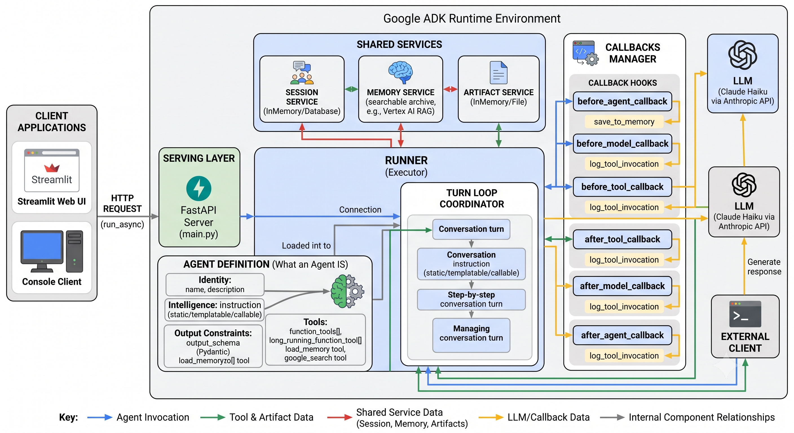

# Lesson 10: Anatomy of an ADK Agent

Nine lessons in, you've built agents that call tools, track state across a conversation, recall information from previous sessions, intercept and modify their own processing through callbacks, generate binary documents as artifacts, and serve themselves behind a production API. Each lesson introduced one concept at a time. This lesson steps back and shows you how all of it fits together into one coherent picture, before the series moves into multi-agent territory where the complexity increases significantly.

No new code to run. This is a reading lesson — a map of everything you've built so far.



## The Runner: the heart of every turn

Start here. Everything else in this recap exists to be coordinated by the `Runner`.

When your application calls `runner.run_async(user_id, session_id, new_message)`, the Runner takes ownership of the entire turn. It fetches the session, builds the conversation context, applies any instruction templating from session state, fires `before_agent_callback`, assembles the full request for the model, fires `before_model_callback`, calls the LLM, fires `after_model_callback`, executes any tools the model requested (with `before_tool_callback` and `after_tool_callback` around each one), loops back to the model if needed, fires `after_agent_callback`, and finally yields the completed events back to your loop.

All of that, for every single turn, driven by one call.

For six lessons you never wrote a `Runner` directly — `adk run` and `adk web` built one for you invisibly. Lesson 6a took that assumption away and had you build one by hand, which is why the rest of the series uses `main.py`.

## The Agent definition: what an agent IS

An `Agent` in ADK is a declaration, not an executor. It describes the agent's identity and capabilities; the `Runner` is what actually runs it.

**`name`** is mandatory and must be a valid Python identifier. It can't be the string `"user"`, which ADK reserves for the end user's messages. In multi-agent systems (coming in Lesson 11 onward), this name is how one agent refers to another.

**`model`** decides which LLM answers. Gemini resolves from a plain string like `"gemini-flash-latest"`. Claude does not — a bare `"claude-*"` string routes to a Vertex AI-backed class that requires a GCP project. The fix used throughout this series: `AnthropicLlm(model="claude-haiku-4-5-20251001")`, which talks directly to Anthropic's API using your key.

**`instruction`** is the system prompt. It's the single biggest lever over an agent's actual behaviour. It can be:
- A static string: `"You are a loan officer assistant."`
- A string with `{key}` placeholders: ADK substitutes the current session state value before every model call. A missing key raises a `KeyError`; add `?` (e.g. `{kyc_status?}`) to get an empty string instead.
- A callable: a function that receives a `ReadonlyContext` and returns a string, letting you build the instruction programmatically from any combination of state, user ID, or runtime logic.

**`description`** doesn't affect behaviour on a standalone agent. It becomes load-bearing in multi-agent systems, where a parent agent reads sub-agent descriptions to decide which one to delegate to.

**`output_schema`** constrains the agent's final response to match a Pydantic model. Every field, every type, guaranteed — no free text mixed in. Combine with `output_key="some_key"` and ADK also writes the validated result into session state automatically after every turn, making it available to any downstream component without explicit wiring.

## Tools: how an agent reaches outside itself

Tools are how an agent does real work rather than just generating text. ADK builds a tool's schema (its name, parameters, and types) directly from a Python function's signature, and uses the docstring as the description the model reads to decide when and how to call it.

**Function tools** are plain Python functions (or `async def` functions) handed to the agent through `tools=[...]`. Always return a dict — ADK wraps non-dict returns in `{"result": ...}`, losing the field names. An `"error"` key in the dict is what ADK's own telemetry uses to detect and log tool failures. Keep tool implementations in a separate `tools.py` file; `agent.py` stays focused on the agent definition.

**Long-running tools** are function tools wrapped in `LongRunningFunctionTool(my_function)`. ADK marks the function call event with `long_running_tool_ids`, which makes `event.is_final_response()` return `True` immediately — surfacing the in-progress state to your application while the slow operation runs. Your event loop needs to collect all final-response events across the turn rather than stopping at the first one. The tool function itself can be a normal slow Python function; no special return type needed.

**Built-in tools** like `google_search` run inside Google's own model-serving infrastructure, not as Python code you write. `GoogleSearchTool(bypass_multi_tools_limit=True)` lets you combine search grounding with other tools in the same agent. Both forms are Gemini-only — for Claude, use a function tool wrapping a search API (Tavily in this series). `load_memory` is the one built-in that works on any model, because it's actually implemented as a plain `FunctionTool` under the hood.

## Session and State: memory within a conversation

A `Session` is one conversation. Its state is a mutable key-value dictionary shared across every turn.

There are three ways to write to state, each appropriate for a different situation:

1. **Application pre-seeding** (Lesson 6a): pass `state={...}` to `session_service.create_session(...)` before the conversation starts. The agent reads it through `{key}` instruction templating. No `?` needed since the data is guaranteed present.

2. **Tool-driven state** (Lesson 6b): write `tool_context.state["key"] = value` inside a tool function. Fires only when the model chooses to call that tool. Keys written this way won't exist before the first tool call, so reference them with `{key?}` in the instruction.

3. **Callback-driven state** (Lesson 7a): write `callback_context.state["key"] = value` inside a `before_agent_callback` or `after_agent_callback`. Fires on every single turn regardless of what was said — right for conversation-level bookkeeping like turn counters or timestamps.

State keys can carry a scope prefix: a plain key is session-scoped (gone when the session ends), `user:key` persists across all sessions for that user, and `app:key` is global across all users of the application.

Behind state sits a `SessionService`. `InMemorySessionService` is pure RAM — it vanishes when the process exits. `DatabaseSessionService` persists to a real database across restarts.

## Artifacts: binary and file-like output

When a tool needs to produce something too large or binary for a state value — a PDF, a CSV, an image — it saves an artifact instead.

```python
# Inside an async tool function
artifact = types.Part.from_bytes(data=pdf_bytes, mime_type="application/pdf")
version = await tool_context.save_artifact(filename="report.pdf", artifact=artifact)
```

Because `save_artifact` is async, any tool that calls it must be `async def`. ADK supports async tool functions natively — no workarounds needed, just add `async def` and `await`.

Artifacts are versioned: saving the same filename again creates version 1 alongside version 0, nothing is overwritten. Filename scoping mirrors state: plain filenames are session-scoped; `user:` prefixed filenames persist across a user's sessions.

Retrieval happens outside the agent, in `main.py`, by checking `event.actions.artifact_delta` during the event loop (to detect that an artifact was saved) and then calling `await artifact_service.load_artifact(...)` after the turn completes.

The `ArtifactService` is wired into the `Runner` like the session and memory services: `Runner(artifact_service=InMemoryArtifactService(), ...)`.

## Callbacks: six interception points per turn

Callbacks let you add cross-cutting behaviour — guardrails, logging, enrichment, compliance scanning — without touching the agent's core logic. Six hook points fire in a fixed order every turn:

```
Before Agent  →  Before Model  →  [LLM]  →  After Model
                      ↑                            ↓
               (loops if tools used)        Before Tool → [Tool] → After Tool
                                                 After Agent
```

**Before/After Agent** fire exactly once per turn, at the very start and end. Use them for access control, session bookkeeping, and saving to long-term memory.

**Before/After Model** fire once per model call — which means multiple times per turn when tools are involved (once before the model requests tools, once again before it produces its final answer with tool results in context). Use `before_model` to inject live context into the prompt; use `after_model` to scan or modify the model's output.

**Before/After Tool** fire once per tool call, potentially multiple times per turn. Use `before_tool` for argument validation and audit logging; use `after_tool` for result validation and PII redaction.

Every callback can short-circuit the step it wraps by returning a non-`None` value. Returning `None` lets the normal processing proceed.

**Parameter names are enforced by ADK** — it calls callbacks as keyword arguments, so your parameter names must match exactly:

| Callback | Required parameter names |
|---|---|
| `before_agent_callback` / `after_agent_callback` | `callback_context` |
| `before_model_callback` | `callback_context`, `llm_request` |
| `after_model_callback` | `callback_context`, `llm_response` |
| `before_tool_callback` | `tool`, `args`, `tool_context` |
| `after_tool_callback` | `tool`, `args`, `tool_context`, `tool_response` |

Keep callback implementations in `callbacks.py`, separate from `agent.py`. Callbacks that are genuinely reusable across agents (like `save_to_memory` or `log_tool_invocation`) belong in `agents/common/`; domain-specific ones (like a tier-check for a specific product) belong in the agent's own folder.

## Long-term memory: recall across sessions

`MemoryService` is a searchable archive that spans across separate sessions for the same user. Think of a `Session` as one chat conversation in Claude.ai or ChatGPT; memory is the equivalent of ChatGPT's memory panel — it surfaces things from previous conversations without the user having to repeat themselves.

Two operations drive it:

- `await callback_context.add_session_to_memory()` — called in `after_agent_callback` to save the current turn to the archive.
- `load_memory` tool — when the model calls it, it runs `search_memory` against the archive and returns relevant past content.

`InMemoryMemoryService` resets when the process exits. For testing cross-session recall in a single script run, both sessions must share the same `MemoryService` instance within one `main()` call. In production you'd swap to `VertexAiRagMemoryService` — the agent code, callbacks, and `load_memory` tool stay identical.

## The serving layer: how the outside world calls the agent

`adk run` and `adk web` are development tools — they hide the `Runner`, `SessionService`, and event loop behind a CLI or browser UI. Production means building your own serving layer: a `FastAPI` application holding one shared `SessionService` (and optionally `MemoryService` and `ArtifactService`) for the life of the process, with a `/chat` endpoint that calls `run_agent_query` from `agents/common/runner_utils.py`.

The shared services are the critical design point: creating fresh instances per request would reset all state on every API call, breaking multi-turn conversations entirely.

`adk api_server` / `get_fast_api_app()` is a production-capable shortcut that handles agent discovery, session wiring, and the REST endpoint schema automatically. Use it when its defaults fit. Use your own `main.py` when you need custom middleware, authentication, pre-seeded state, or a specific memory/artifact backend.

## The complete single-agent picture

Every capability in this recap lives on a single `Agent` object, coordinated by a single `Runner`, served behind a single FastAPI endpoint. The agent we built in Lesson 9 — the relationship manager — exercises most of this stack: it has an instruction that templates from session state, a `load_memory` tool for cross-session recall, an `after_agent_callback` that saves each turn to memory, and a serving layer that exposes it to Streamlit and console clients over HTTP.

What this picture doesn't show yet is what happens when one agent isn't enough. Some problems require a specialist for risk, a specialist for compliance, and a coordinator to orchestrate both — each with a narrower instruction and a tighter tool set than any single generalist agent. That's the world Lesson 11 opens.

## In the next lesson

Lesson 11 introduces multi-agent systems: `SequentialAgent`, `ParallelAgent`, and `LoopAgent` — ADK's primitives for chaining specialist agents into fixed, predictable pipelines. We'll build a loan underwriting pipeline where parallel risk checks feed into sequential decisioning, and drive the whole thing through `main.py` using the same `Runner` patterns from this single-agent arc.
