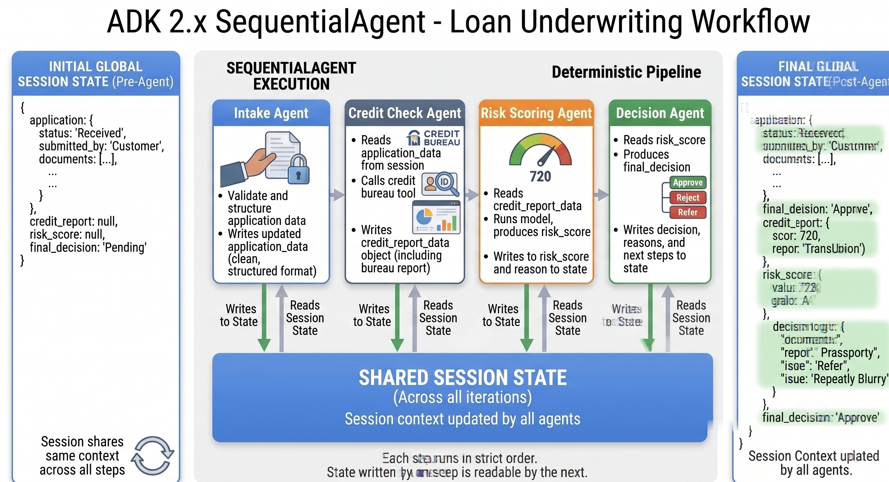
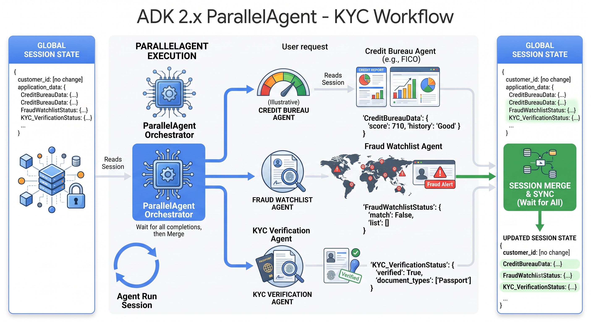
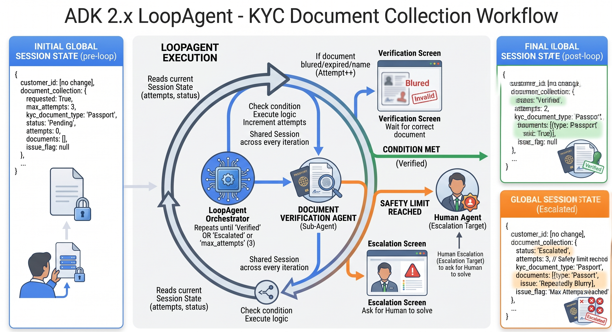

# Lesson 11: Classic Multi-Agent Workflows

Lesson 10 pulled together everything a single ADK agent is made of. One agent, one complete picture. That picture doesn't change here.  Howvever, in most production systems, one agent isn't enough. Real workflows have too many moving parts for one agent to handle well. This lesson introduces multi-agent systems: several focused agents working together, under one shared, predictable structure.

## A quick recap of what a single agent gives you

Before adding a second agent to the mix, it's worth being precise about what you already have, since every one of these pieces carries over unchanged into multi-agent systems. Nothing below gets replaced going forward, it all gets reused, just spread across more than one agent.

- **The `Runner`**, from Lesson 6a onward, is what actually drives a turn, fetching the session, calling the model, executing tools, and firing callbacks in a fixed order. It stays the same whether it's driving one agent or a workflow agent orchestrating several.
- **The `Agent` definition itself**, from Lesson 2 onward, is a declaration: `name` (a unique name for your agent), `model` (declares the LLM your agent will use - we are defaulting to Haiku for all our agents in this series), `instruction` (static, templated, or callable, as Lesson 6a showed), `description`, and optionally `output_schema` with `output_key` from Lesson 5. In a standalone agent, `description` is mostly documentation. In multi-agent systems, you're about to see it become load-bearing.
- **Tools**, from Lesson 3, 4, and 7b, are how an agent reaches outside itself, function tools, long-running tools wrapped in `LongRunningFunctionTool`, and Gemini-only built-ins like `GoogleSearchTool`.
- **Session and state**, from Lesson 6a and 6b, is the shared, mutable dictionary that lets one part of a conversation hand data to another, whether that's an instruction reading `{key?}` or a tool writing `tool_context.state["key"]`.
- **Artifacts**, from Lesson 6c, handle binary or file-like output, PDFs, CSVs, anything too large for a state value.
- **Callbacks**, from Lesson 7 and 7a, give you six fixed interception points per turn for guardrails, logging, and enrichment, without touching the agent's core logic.
- **Long-term memory**, from Lesson 8, lets an agent recall facts across sessions through `MemoryService` and the `load_memory` tool.
- **The serving layer**, from Lesson 9, is how all of the above gets exposed to the outside world over HTTP.

Every one of those lessons built and served a single agent doing a single job. That's about to change, not by replacing anything above, but by giving you a way to run several such agents together, each still using everything you've just recapped, under a shared, deterministic control flow.

## The problem we're solving

Picture a loan underwriting desk at a mid-size NBFC (non-banking financial company). A loan application comes in and has to pass through several distinct checks before anyone can approve or reject it: validate the application data, pull the applicant's credit bureau report, score the risk, and produce a decision with reasons attached.

You could write one agent with one enormous instruction that tries to do all four things in a single turn. In practice, that agent becomes hard to reason about. If the credit check step misbehaves, you can't easily tell whether the problem is in the prompt, the tool call, or the risk scoring logic buried three paragraphs later in the same instruction. Testing is worse: you can't verify the credit check in isolation, because it's tangled up with everything else the agent does.

Split the work into four smaller agents, each with one job, and each problem becomes local. The intake agent's instruction only has to talk about intake. If it needs fixing, you fix that one agent and leave the other three alone. This is the same reasoning that pushes you toward small, single-purpose functions in ordinary Python code, and it applies just as directly to agents.

The question is how you connect those four agents into a pipeline that runs reliably, in the right order, every time.

## Why ADK needs workflow agents at all

You have two ways to get one agent to hand off to another in ADK.

The first is to let an LLM decide. You give an orchestrator agent a tool that wraps another agent (ADK calls this an `AgentTool`, which the next lesson block covers properly), and the orchestrator's model decides at runtime whether and when to call it. That's flexible, and it's the right choice when the next step genuinely depends on judgment, for example deciding which of several specialist agents is relevant to an open-ended customer question.

The second way is to skip the judgment call entirely, because you don't need one. A loan application always needs intake, then credit check, then risk scoring, then decision, in that exact order, every single time. There's no ambiguity for a model to resolve. Asking an LLM to decide "what happens next" for a sequence that never varies just adds latency, cost, and a small but nonzero chance the model decides to skip a step or call things out of order.

ADK's answer to this is workflow agents: `SequentialAgent`, `ParallelAgent`, and `LoopAgent`. None of the three is backed by an LLM. Each one is a plain Python orchestrator that runs a list of sub-agents according to a fixed rule, sequential order, concurrent execution, or repeat-until-condition. The control flow lives in code you can read and reason about, not in a model's discretion. You still use LLM-backed agents to do the actual work, the workflow agent just decides the order they run in.

> **NOTE:** A workflow agent is still an `Agent` from the ADK's point of view, in the sense that it can be a sub-agent of something else, or the root agent a `Runner` drives. What makes it different is that it has no `model` of its own. It orchestrates; it doesn't reason.

## The three workflow agent types

### SequentialAgent

`SequentialAgent` runs a list of sub-agents one after another, in the exact order you give it. Each sub-agent completes its full turn, including any tool calls, before the next one starts. Because every sub-agent shares the same session, an agent later in the sequence can read what an earlier one wrote to session state, typically through that earlier agent's `output_key`.



This is precisely the loan underwriting example above. Intake validates the raw application and writes clean, structured data to state. Credit check reads that data, calls a credit bureau tool, and writes the bureau report to state. Risk scoring reads the bureau report and produces a score. Decision reads the score and produces a final approve, reject, or refer-to-human-underwriter outcome with reasons. Four small agents, one deterministic pipeline. This is the example we'll code in the next lesson.

### ParallelAgent

`ParallelAgent` runs a list of sub-agents concurrently instead of in order. This only makes sense when the sub-agents are independent of each other within that run, none of them needs to read something another one produced in the same turn.



A good BFSI example is a KYC (Know Your Customer) onboarding check. Before you open an account for a new customer, you typically need three things: the credit bureau report, a fraud watchlist screen (checking the applicant against sanctions and politically-exposed-person lists), and document verification (does the submitted ID actually match the applicant's stated details). None of these three checks depends on the outcome of the other two. Running them one after another would mean waiting for three sequential round trips when you could be waiting for the slowest of three parallel ones. `ParallelAgent` fires all three at once and collects the results.

> **NOTE:** "Independent" means independent within a single run of the `ParallelAgent`. It doesn't mean the sub-agents can't read state written before the parallel block started, for example, all three might read the applicant's ID that the intake step already validated. They just can't depend on each other's output from that same parallel run, since there's no guarantee which one finishes first.

`ParallelAgent` shares the same session as every other sub-agent, exactly like `SequentialAgent` does. That's what makes the merge in the diagram above possible at all, the three branches aren't writing to three separate sessions that then get combined, they're writing to the one session the `Runner` is already driving. The catch is that they're doing it concurrently. All three branches read the same state snapshot going in, but if two of them wrote to the *same* state key, whichever write lands last wins, and you can't rely on which that is. The fix is straightforward: give each parallel sub-agent its own `output_key`, so the credit bureau agent, fraud watchlist agent, and KYC agent write to three distinct keys and never collide.

### LoopAgent

`LoopAgent` runs a sub-agent, or a small sequence of sub-agents, repeatedly, until something tells it to stop. That "something" is either a sub-agent explicitly signaling an exit (ADK calls this escalating, via the event's actions), or a `max_iterations` limit you set as a safety net so the loop can't run forever.



Think about KYC document collection - not the entire KYC process, just the document collection step. A customer uploads an ID proof, and the agent checks it. If the document is blurry, expired, or the name doesn't match the application, the agent needs to ask for it again, not just once but potentially several times, until either the document passes or you've asked enough times that you should hand the case to a human. That's a loop with a natural exit condition (document accepted) and a natural safety limit (stop asking after, say, three attempts and escalate to a person instead).

`LoopAgent` shares the same session across every iteration, not just across the sub-agents within one iteration. That's what makes the pattern useful rather than repetitive: each pass through the loop can read what an earlier pass wrote, for example a running attempt count, so the sub-agent can behave differently on attempt three than it did on attempt one, tightening its request or flagging the case for escalation instead of asking the same way every time.

## Choosing between them

| Agent type | Sub-agents run | Use when |
|---|---|---|
| `SequentialAgent` | One after another, in fixed order | Each step depends on the previous step's output |
| `ParallelAgent` | All at once | Steps are independent and can be run in parallel |
| `LoopAgent` | Repeatedly, same sub-agent(s) | You don't know in advance how many attempts a task will take |

> 📌**NOTE:** A realistic BFSI pipeline usually needs more than one of these. 
>
> You might use a `ParallelAgent` for the independent KYC checks, feed its combined output into a `SequentialAgent` for the ordered underwriting steps, and have one of those steps itself be a `LoopAgent` for document re-requests. 
>
> Workflow agents can nest inside each other freely, because from the outside, a `SequentialAgent` or `ParallelAgent` looks just like any other agent you can pass into a sub-agent list.

## A sketch of how this looks in code

You'll see this properly in the next lesson, but it's worth previewing the shape, since it's simpler than it sounds. A `SequentialAgent` just takes a list:

```python
from google.adk.agents import SequentialAgent

loan_pipeline = SequentialAgent(
    name="loan_underwriting_pipeline",
    sub_agents=[intake_agent, credit_check_agent, risk_scoring_agent, decision_agent],
)
```

`ParallelAgent` and `LoopAgent` follow the same shape, a `name`, a list of `sub_agents`, and for `LoopAgent`, an optional `max_iterations`. There's no branching logic to write yourself. The orchestration is entirely declarative: you hand ADK the list, and it enforces the order (or the concurrency, or the repetition) for you.

## A note on models for this pipeline

In this pipeline, every sub-agent uses Haiku. That's a deliberate choice for this example, not a rule that every multi-agent system should follow. In a real-world deployment, different sub-agents in the same pipeline can reasonably use different models depending on how demanding each step's reasoning is. A step like risk scoring, which has to weigh several factors against each other and produce a judgment call rather than a lookup, is a plausible candidate for a more capable model like Sonnet, or even Opus for the hardest cases, while a step like intake validation, which is mostly structured parsing, has less to gain from the extra capability.

## If you're coming from LangChain or LangGraph

If you've used LangGraph, `SequentialAgent` is the direct equivalent of a linear graph, a chain of nodes with no branching, where each node's output feeds the next node's input through shared state. `ParallelAgent` maps to LangGraph's fan-out pattern, or to LangChain's `RunnableParallel`, several branches invoked concurrently and their outputs collected afterward. `LoopAgent` corresponds to a LangGraph cycle, a conditional edge that routes back to the same node until a condition trips and the edge instead routes to `END`.

The practical difference is where the control flow lives. LangGraph makes you draw the graph explicitly, nodes and edges. ADK's workflow agents skip the graph-drawing step for these three common shapes: you list sub-agents, pick the workflow type that matches your control flow, and ADK runs it. This is less flexible than a full graph for genuinely complex routing, which is exactly why ADK 2.0's graph-based workflows exist too, for later in this series when a fixed sequence, parallel fan-out, or simple loop isn't enough.

## In this lesson

You learned why deterministic control flow beats LLM-driven routing when the order of steps isn't actually in question. You saw the three classic workflow agents ADK provides: `SequentialAgent` for fixed-order pipelines, `ParallelAgent` for independent concurrent steps, and `LoopAgent` for repeat-until-condition tasks, each grounded in a concrete BFSI scenario. You also saw how they compare against each other, and against LangGraph's equivalent patterns, along with a preview of how simply they're declared in code.

## In the next lesson

The next lesson builds the `SequentialAgent` loan underwriting pipeline for real: four small agents, each with its own tools and instruction, wired together into one working sequence you can run end to end. You'll see how state flows from one sub-agent to the next through `output_key`, and how to test each step in isolation before trusting the full pipeline.
