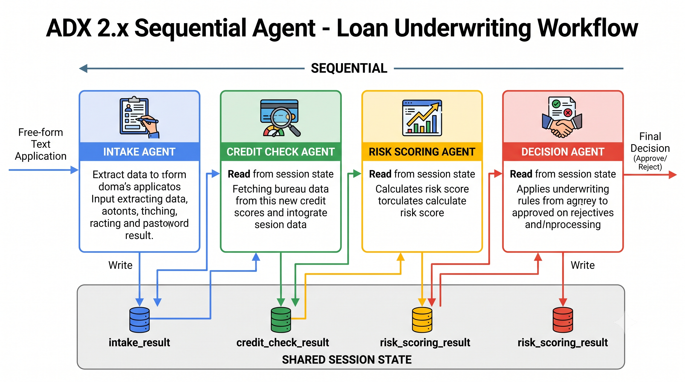
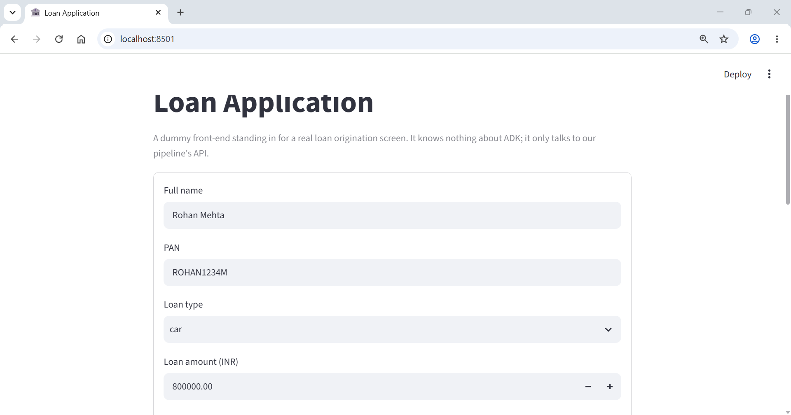
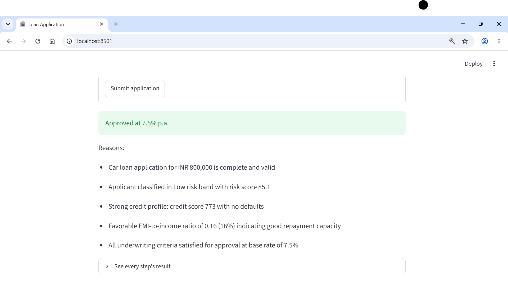
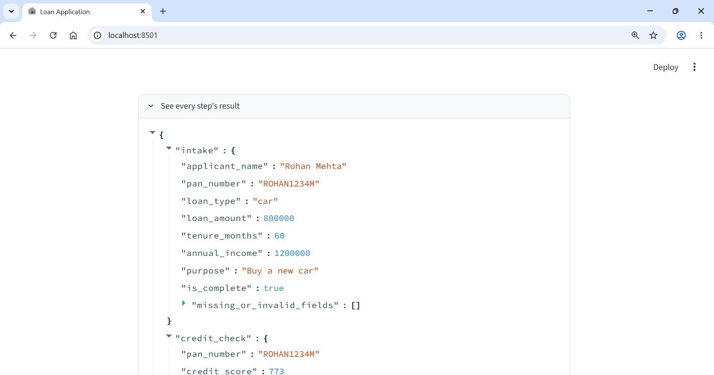

# Lesson 11a: SequentialAgent in Practice

Quick recap: `SequentialAgent` runs a list of sub-agents one after another, in the exact order you give it. Every sub-agent shares the same session, so a later sub-agent can read what an earlier one wrote to state. No LLM sits behind the `SequentialAgent` itself, it's a plain orchestrator. That's everything you need to know going in.

You would use a `SequentialAgent` to mimic a multi-step workflow, where _the steps must follow a strict sequence one-after-another_, like a loan underwriting pipeline. Time to build it.

## The problem we're solving

You're building the loan underwriting pipeline for an NBFC (non-banking financial company), the exact one sketched in the last lesson. A loan application comes in as free text, naming one of three products this NBFC offers, home, car, or personal loan. Four things need to happen to it, in order:

1. **Intake** extracts structured fields from the text, including which of the three loan types was requested, and validates the applicant's PAN (Permanent Account Number, India's tax ID and the standard identity check for financial applications).
2. **Credit check** fetches the applicant's credit bureau report using that PAN.
3. **Risk scoring** combines the bureau data with the applicant's income, the loan terms, and the loan type's base interest rate to produce a risk score and an EMI (equated monthly installment) that reflects what the applicant would actually pay.
4. **Decision** applies the underwriting rules, prices the final interest rate based on risk, and returns approve, reject, or refer to a human underwriter.

This is the kind of pipeline we are going to be implementing:



Each step depends on the one before it. Risk scoring is meaningless without a credit score to feed it. A decision is meaningless without a risk band to base it on. That dependency chain is exactly what `SequentialAgent` is for.

Loan type matters here for a concrete reason: a home loan, a car loan, and a personal loan don't carry the same interest rate, secured loans (backed by the property or the vehicle) are cheaper than unsecured ones. This pipeline uses base rates of 8.5% for home, 7.5% for car, and 10.5% for personal. Risk scoring uses the applicant's loan type to work out a realistic EMI at that base rate, and the decision agent adds a risk-based spread on top, so the final rate an applicant is offered depends on both what they're borrowing for and how risky they look.

> 📌 **NOTE:** This four-step shape isn't specific to India. A US bank would use a Social Security Number instead of a PAN and pull a FICO-style score from Experian, Equifax, or TransUnion (roughly 300 to 850, rather than the 300 to 900 CIBIL-style scale used here). A UK or EU bank would use a national ID and a local bureau instead. 
>
> The pipeline structure carries over cleanly, _intake_, _credit check_, _risk scoring_, and a final _decision_, only the identifiers, bureaus, and score scales change. The bigger differences show up in regulation, not the pipeline shape: US lending falls under the Equal Credit Opportunity Act and Regulation B, and EU/UK automated decisions fall under GDPR's rules on profiling, which can require a human-in-the-loop path that this simplified version doesn't include. Keep that in mind if you ever adapt this pattern for a market outside India.

## How state actually flows through a SequentialAgent

You already know the mechanism in principle from Lesson 6a and Lesson 5: `output_key` writes an agent's result to session state, and `{key}` in a later agent's instruction reads it back. What's new here is seeing it drive an entire pipeline, plus two details that only show up once you actually build one.

Each of the four sub-agents in this lesson uses `output_schema` (a Pydantic model, from Lesson 5) together with `output_key`. That combination writes a validated, structured result to session state after every turn, no free text mixed in, and the next sub-agent's instruction reads it straight out of state.

> 📌 **NOTE:** When `output_schema` is set, ADK stores the validated result in session state as a plain Python dict, not as the Pydantic object and not as a JSON string. That matters for the next point.
>
> Instruction templating does a simple `str(value)` substitution. If `{credit_check_result}` resolves to a dict, what the model actually sees in its prompt is something like `{'pan_number': 'XYZAB3456C', 'credit_score': 690, ...}`. There's no nested access like `{credit_check_result.credit_score}`, you always get the whole dict as text, and the model reads the field it needs out of that text. This works fine in practice, Claude parses a printed dict without trouble, but it's worth knowing what's actually landing in the prompt.

One more thing worth flagging before you write a line of code: as of ADK 2.5.0, the version this series targets, `SequentialAgent` prints a deprecation warning pointing to a newer `Workflow` class. Ignore this message for now.

> **NOTE:** `SequentialAgent` is fully functional today, this lesson's code runs correctly on ADK 2.5.0. The warning exists because ADK is moving toward a more general graph-based `Workflow` primitive, which the series covers later, once you've got the classic workflow agents under your belt. 

## Step 1: Set up the folder structure

Multi-agent lessons get their own nested layout, since there are now several agents living under one lesson. Create this structure under `agents/`:

```
agents/lesson11a_sequential_agent/
├── main.py
├── api.py
├── streamlit_app.py
└── loan_pipeline/
    ├── __init__.py
    ├── agent.py
    └── sub_agents/
        ├── __init__.py
        ├── intake_agent/
        │   ├── __init__.py
        │   ├── agent.py
        │   └── tools.py
        ├── credit_check_agent/
        │   ├── __init__.py
        │   ├── agent.py
        │   └── tools.py
        ├── risk_scoring_agent/
        │   ├── __init__.py
        │   ├── agent.py
        │   └── tools.py
        └── decision_agent/
            ├── __init__.py
            ├── agent.py
            └── tools.py
```

`loan_pipeline/agent.py` is where the `SequentialAgent` itself gets assembled. Each of the four sub-agents gets its own folder underneath, with the same `agent.py` / `tools.py` split you've used since Lesson 3. Every `__init__.py` in this tree, at every level, contains exactly one line:

```python
from . import agent
```

That's the same convention you've used from Lesson 6a onward, it makes each folder's agent module reachable as an attribute of the package.

## Step 2: Build the intake agent

Start with the tool. Extracting fields from free text is squarely an LLM's job, but validating that a PAN matches the required format is not, that's a strict pattern match, and LLMs are unreliable at exact-format checks like this. Give it a tool instead.

```python
# agents/lesson11a_sequential_agent/loan_pipeline/sub_agents/intake_agent/tools.py
"""Lesson 11a: Tools for the intake agent.
"""

import re

PAN_PATTERN = re.compile(r"^[A-Z]{5}[0-9]{4}[A-Z]$")


def validate_pan_format(pan_number: str) -> dict:
    """Validates that a string matches the Indian PAN (Permanent Account Number) format.

    A valid PAN is exactly 10 characters: 5 uppercase letters, 4 digits, then
    1 uppercase letter (e.g. ABCDE1234F). This checks the format only, it
    does not verify the PAN against any government registry.

    Args:
        pan_number: The PAN string extracted from the loan application.

    Returns:
        A dict with:
            valid (bool): True if the format matches, False otherwise.
            pan_number (str): The PAN as received, uppercased and stripped.
            error (str, optional): Present only when valid is False.
    """
    cleaned = pan_number.strip().upper()
    if PAN_PATTERN.match(cleaned):
        return {"valid": True, "pan_number": cleaned}
    return {
        "valid": False,
        "pan_number": cleaned,
        "error": f"'{cleaned}' does not match the PAN format (5 letters, 4 digits, 1 letter).",
    }
```

Nothing new here beyond what Lesson 3 taught you about tools: a plain function, a Google-style docstring the model reads as the tool description, and a dict return with an `error` key for the failure case.

Now the agent itself:

```python
# agents/lesson11a_sequential_agent/loan_pipeline/sub_agents/intake_agent/agent.py
"""Lesson 11a: Intake agent for the loan underwriting pipeline.

Validates a raw loan application, extracts structured fields, and checks
the PAN format before handing off to the credit check agent.
"""

from typing import Literal

from pydantic import BaseModel, Field

from google.adk.agents import Agent

from common.model_config import get_model

from .tools import validate_pan_format


class IntakeResult(BaseModel):
    """Structured output of the intake agent."""

    applicant_name: str = Field(description="Full name of the loan applicant")
    pan_number: str = Field(description="Applicant's PAN (Permanent Account Number)")
    loan_type: Literal["home", "car", "personal"] = Field(description="Type of loan being requested")
    loan_amount: float = Field(description="Requested loan amount, in INR")
    tenure_months: int = Field(description="Requested loan tenure, in months")
    annual_income: float = Field(description="Applicant's declared annual income, in INR")
    purpose: str = Field(description="Stated purpose of the loan")
    is_complete: bool = Field(description="True only if every required field was present and the PAN was valid")
    missing_or_invalid_fields: list[str] = Field(
        default_factory=list,
        description="Names of any fields that were missing or failed validation",
    )


instruction = """You are the intake agent for a loan underwriting pipeline at an NBFC.

A loan application arrives as free-form text. Do the following:

1. Extract these fields from the text: applicant_name, pan_number, loan_type,
   loan_amount, tenure_months, annual_income, purpose. loan_type must be
   exactly one of "home", "car", or "personal", infer it from context if the
   applicant doesn't use that exact word (a vehicle loan is "car", a home
   renovation or purchase loan is "home", anything else is "personal").
2. Call the `validate_pan_format` tool with the extracted pan_number. Never judge
   the PAN format yourself, always call the tool and use its result.
3. Set is_complete to True only if every field above was present in the
   application AND the tool reported the PAN as valid. Otherwise set it to
   False and list every missing or invalid field name in
   missing_or_invalid_fields.

Respond only with the structured fields. Do not add commentary outside them.
"""

intake_agent = Agent(
    name="intake_agent",
    model=get_model("primary"),
    description="Extracts and validates loan application fields from free-form applicant input.",
    instruction=instruction,
    tools=[validate_pan_format],
    output_schema=IntakeResult,
    output_key="intake_result",
)
```

This is the pattern from Lesson 5, `output_schema` plus `output_key`, applied to the first step of a pipeline instead of a standalone agent. `IntakeResult` guarantees every downstream agent gets clean, typed fields to work with, no parsing free text later in the chain. `loan_type` uses a `Literal` rather than a plain `str`, that's what turns "home, car, or personal, nothing else" from a hopeful instruction into something Pydantic actually enforces. `is_complete` and `missing_or_invalid_fields` exist specifically so the decision agent, four steps from now, has something concrete to check before it approves anything.

## Step 3: Build the credit check agent

The tool here simulates a call to a credit bureau. A real integration would hit an external API, this mocks one deterministically (i.e. same PAN -> same result) so the lesson is repeatable:

```python
# agents/lesson11a_sequential_agent/loan_pipeline/sub_agents/credit_check_agent/tools.py
"""Lesson 11a: Tools for the credit check agent.
"""

import hashlib


def get_credit_bureau_report(pan_number: str) -> dict:
    """Fetches a mock credit bureau report for an applicant.

    This simulates a call to a credit bureau (like CIBIL) using a
    deterministic hash of the PAN, so the same applicant always gets the
    same mock score. That makes the pipeline repeatable while you're
    learning. Swap this out for a real bureau API integration in production.

    Args:
        pan_number: The applicant's validated PAN number.

    Returns:
        A dict with:
            pan_number (str): The PAN the report was generated for.
            credit_score (int): A CIBIL-style score between 300 and 900.
            existing_loans_count (int): Number of currently active loans.
            has_defaults (bool): True if the mock history includes a default.
            error (str, optional): Present only if pan_number is empty.
    """
    if not pan_number:
        return {"error": "pan_number is required to fetch a credit bureau report."}

    # ---------- mock credit-bureau call --------------------------
    # in a real scenario, these lines would be replaced with an
    # actual call to the credit bureau's (e.g. CIBIL) API end-point
    # with a valid API key (or using a mechanism defined by bureau)

    digest = hashlib.sha256(pan_number.encode()).hexdigest()
    seed = int(digest[:8], 16)

    credit_score = 300 + (seed % 601)  # 300 to 900
    existing_loans_count = seed % 4  # 0 to 3
    has_defaults = (seed % 7) == 0  # roughly 1 in 7 applicants
    # ---------- mock credit-bureau call --------------------------

    return {
        "pan_number": pan_number,
        "credit_score": credit_score,
        "existing_loans_count": existing_loans_count,
        "has_defaults": has_defaults,
    }
```

Hashing the PAN and deriving the mock values from it means the same applicant always gets the same report across runs, which makes debugging the pipeline far less confusing than random numbers would.

```python
# agents/lesson11a_sequential_agent/loan_pipeline/sub_agents/credit_check_agent/agent.py
"""Lesson 11a: Credit check agent for the loan underwriting pipeline.

Reads the intake agent's output from session state, fetches a mock credit
bureau report, and writes a structured credit check result.
"""

from pydantic import BaseModel, Field

from google.adk.agents import Agent

from common.model_config import get_model

from .tools import get_credit_bureau_report


class CreditCheckResult(BaseModel):
    """Structured output of the credit check agent."""

    pan_number: str = Field(description="PAN the bureau report was fetched for")
    credit_score: int = Field(description="CIBIL-style score, 300 to 900")
    existing_loans_count: int = Field(description="Number of currently active loans")
    has_defaults: bool = Field(description="True if the bureau history shows a prior default")


instruction = """You are the credit check agent for a loan underwriting pipeline at an NBFC.

The intake agent already ran. Its output is available in session state as:
{intake_result}

Read the pan_number out of it, then call the `get_credit_bureau_report` tool
with that PAN to fetch the applicant's credit bureau report. Return the
report exactly as the tool gives it back to you, in the structured fields.

Never fabricate a credit score yourself. Always call the tool.
"""

credit_check_agent = Agent(
    name="credit_check_agent",
    model=get_model("primary"),
    description="Fetches an applicant's credit bureau report using the PAN captured during intake.",
    instruction=instruction,
    tools=[get_credit_bureau_report],
    output_schema=CreditCheckResult,
    output_key="credit_check_result",
)
```

`{intake_result}` in the instruction is the whole point of this exercise. By the time this agent runs, `SequentialAgent` has already completed the intake agent's full turn, tool call included, and written its output to state. This agent reads it straight out, no wiring required on your part.

## Step 4: Build the risk scoring agent

This is the step where you don't want the LLM doing arithmetic. Two things live in the tool: the loan type's base interest rate, and a proper amortized EMI calculated at that rate.

```python
# agents/lesson11a_sequential_agent/loan_pipeline/sub_agents/risk_scoring_agent/tools.py
"""Lesson 11a: Tools for the risk scoring agent.
"""

# In production, base interest rates come from the bank's loan pricing
# engine or loan management system (LMS), for example Finacle, or a
# dedicated rates microservice, not a hardcoded dict. Rates there change
# with market conditions, funding cost, and product-level pricing
# decisions, sometimes daily. Query that service by loan_type (and often
# tenure and loan amount slab too) rather than baking rates into agent
# code. This dict is a stand-in for that lookup, so the lesson doesn't
# depend on a rates service that doesn't exist for it.
BASE_INTEREST_RATES = {
    "home": 8.5,
    "car": 7.5,
    "personal": 10.5,
}


def calculate_emi(loan_amount: float, annual_rate: float, tenure_months: int) -> float:
    """Calculates the standard amortized EMI for a loan.

    Uses the standard reducing-balance EMI formula:
    EMI = P * r * (1 + r)^n / ((1 + r)^n - 1), where r is the monthly
    interest rate and n is the tenure in months.

    Args:
        loan_amount: Principal amount, in INR.
        annual_rate: Annual interest rate, as a percentage (e.g. 8.5 for 8.5%).
        tenure_months: Loan tenure, in months.

    Returns:
        The monthly EMI, in INR.
    """
    monthly_rate = annual_rate / 12 / 100
    if monthly_rate == 0:
        return loan_amount / tenure_months
    growth_factor = (1 + monthly_rate) ** tenure_months
    return loan_amount * monthly_rate * growth_factor / (growth_factor - 1)


def calculate_risk_score(
    loan_type: str,
    credit_score: int,
    annual_income: float,
    loan_amount: float,
    tenure_months: int,
    has_defaults: bool,
) -> dict:
    """Calculates a deterministic risk score for a loan application.

    Combines the bureau credit score with an affordability check based on
    the actual amortized EMI for this loan type's base interest rate. This
    is a teaching model, not a production underwriting formula, real risk
    models weigh many more factors and get validated by a risk team.

    Args:
        loan_type: One of "home", "car", or "personal".
        credit_score: CIBIL-style score between 300 and 900.
        annual_income: Applicant's declared annual income, in INR.
        loan_amount: Requested loan amount, in INR.
        tenure_months: Requested tenure, in months.
        has_defaults: Whether the bureau report shows a prior default.

    Returns:
        A dict with:
            risk_score (float): 0 to 100, higher means lower risk.
            risk_band (str): "Low", "Medium", or "High".
            emi_to_income_ratio (float): EMI as a fraction of monthly income.
            base_interest_rate (float): The loan type's base rate used for
                this calculation.
            error (str, optional): Present only on invalid inputs.
    """
    if loan_type not in BASE_INTEREST_RATES:
        return {"error": f"Unknown loan_type '{loan_type}'."}
    if tenure_months <= 0 or annual_income <= 0:
        return {"error": "tenure_months and annual_income must both be positive."}

    base_interest_rate = BASE_INTEREST_RATES[loan_type]

    credit_component = (credit_score / 900) * 60  # up to 60 points

    monthly_income = annual_income / 12
    emi = calculate_emi(loan_amount, base_interest_rate, tenure_months)
    emi_to_income_ratio = round(emi / monthly_income, 2)
    affordability_component = max(0.0, (1 - emi_to_income_ratio) * 40)  # up to 40 points

    risk_score = credit_component + affordability_component
    if has_defaults:
        risk_score -= 25

    risk_score = round(max(0.0, min(100.0, risk_score)), 1)

    if risk_score >= 70:
        risk_band = "Low"
    elif risk_score >= 45:
        risk_band = "Medium"
    else:
        risk_band = "High"

    return {
        "risk_score": risk_score,
        "risk_band": risk_band,
        "emi_to_income_ratio": emi_to_income_ratio,
        "base_interest_rate": base_interest_rate,
    }
```

Two things worth calling out. First, `calculate_emi` is now a real amortization formula, not the loan-amount-divided-by-tenure shortcut from before, that shortcut silently ignored interest entirely, which meant the "affordability" the risk score was checking wasn't the affordability the applicant would actually experience. Second, notice the base rate comes from the loan type, not the risk band. This step deliberately prices the affordability check at the *base* rate, the same rate every applicant of that loan type starts from, before risk-based pricing gets applied. That mirrors how a real pre-approval works: you check "can they afford this at our standard rate" first, and only the decision agent, one step from now, moves the rate up or down based on how risky they turned out to be.

The rest of the formula is unchanged: up to 60 points from the credit score, up to 40 from affordability, minus a 25-point penalty for a prior default. Real risk models are far more elaborate and get validated by an actual risk team before going anywhere near production, this version exists to give the pipeline something concrete and explainable to work with.

```python
# agents/lesson11a_sequential_agent/loan_pipeline/sub_agents/risk_scoring_agent/agent.py
"""Lesson 11a: Risk scoring agent for the loan underwriting pipeline.

Reads the intake and credit check results from session state and produces
a deterministic risk score and band.
"""

from pydantic import BaseModel, Field

from google.adk.agents import Agent

from common.model_config import get_model

from .tools import calculate_risk_score


class RiskScoringResult(BaseModel):
    """Structured output of the risk scoring agent."""

    risk_score: float = Field(description="Risk score from 0 to 100, higher means lower risk")
    risk_band: str = Field(description='One of "Low", "Medium", or "High"')
    emi_to_income_ratio: float = Field(description="EMI as a fraction of monthly income")
    base_interest_rate: float = Field(description="The loan type's base interest rate used to compute the EMI")


instruction = """You are the risk scoring agent for a loan underwriting pipeline at an NBFC.

Session state has two prior results.

Intake result:
{intake_result}

Credit check result:
{credit_check_result}

Pull loan_type, annual_income, loan_amount, and tenure_months from the intake
result, and credit_score plus has_defaults from the credit check result. Call
the `calculate_risk_score` tool with those six values. Return the tool's
result exactly, in the structured fields.

Always call the tool. Never estimate the score, the EMI, or the base
interest rate yourself.
"""

risk_scoring_agent = Agent(
    name="risk_scoring_agent",
    model=get_model("primary"),
    description="Calculates a deterministic risk score and band from intake and credit bureau data.",
    instruction=instruction,
    tools=[calculate_risk_score],
    output_schema=RiskScoringResult,
    output_key="risk_scoring_result",
)
```

Notice this agent reads from two prior state keys, `{intake_result}` and `{credit_check_result}`, not just the one immediately before it. `SequentialAgent` doesn't restrict you to only reading the previous step's output, every sub-agent shares the same session, so anything written earlier in the pipeline stays readable for the rest of it. And `base_interest_rate` now travels forward in `RiskScoringResult`, so the decision agent doesn't need to know anything about loan types or rate cards itself, it just reads the number risk scoring already resolved.

## Step 5: Build the decision agent

The final step. Its tool now combines two numbers instead of doing a flat lookup: the base rate risk scoring already resolved for this loan type, plus a spread that depends on how risky the applicant turned out to be.

```python
# agents/lesson11a_sequential_agent/loan_pipeline/sub_agents/decision_agent/tools.py
"""Lesson 11a: Tools for the decision agent.
"""

# The spread a bank adds on top of its base rate for a given risk band.
# Like the base rates in the risk scoring agent, this would normally come
# from the same loan pricing engine or LMS, risk-based pricing tables get
# reviewed and adjusted by the risk team, not hardcoded into application
# code. Kept as a simple dict here for the same reason.
RISK_BAND_SPREAD = {
    "Low": 0.0,
    "Medium": 2.5,
}


def lookup_interest_rate(risk_band: str, base_interest_rate: float) -> dict:
    """Looks up the final interest rate offered for a given risk band.

    Combines the loan type's base rate (already resolved by the risk
    scoring agent) with a risk-based spread. "High" risk applicants are
    not offered a rate at all, they're rejected outright.

    Args:
        risk_band: One of "Low", "Medium", or "High".
        base_interest_rate: The loan type's base rate, as computed by the
            risk scoring agent's `calculate_risk_score` tool.

    Returns:
        A dict with:
            risk_band (str): The band that was looked up.
            eligible (bool): False for "High" risk, no rate is offered.
            interest_rate (float, optional): Final annual interest rate as
                a percentage, present only when eligible is True.
            error (str, optional): Present only for an unrecognized band.
    """
    if risk_band not in ("Low", "Medium", "High"):
        return {"error": f"Unknown risk_band '{risk_band}'."}

    if risk_band == "High":
        return {"risk_band": risk_band, "eligible": False}

    interest_rate = round(base_interest_rate + RISK_BAND_SPREAD[risk_band], 2)

    return {
        "risk_band": risk_band,
        "eligible": True,
        "interest_rate": interest_rate,
    }
```

A Low-risk applicant pays exactly the loan type's base rate, no spread. A Medium-risk applicant pays base rate plus 2.5 percentage points. High risk isn't priced at all, it's declined. This is the piece that makes the credit score actually matter to the applicant's wallet, two people applying for the same car loan can walk away with different rates depending on how they scored.

```python
# agents/lesson11a_sequential_agent/loan_pipeline/sub_agents/decision_agent/agent.py
"""Lesson 11a: Decision agent for the loan underwriting pipeline.

Reads all three prior results from session state and produces the final
loan decision.
"""

from typing import Literal, Optional

from pydantic import BaseModel, Field

from google.adk.agents import Agent

from common.model_config import get_model

from .tools import lookup_interest_rate


class DecisionResult(BaseModel):
    """Structured output of the decision agent."""

    decision: Literal["approved", "rejected", "refer_to_underwriter"] = Field(
        description="Final outcome of the loan application"
    )
    interest_rate: Optional[float] = Field(
        default=None, description="Annual interest rate offered, present only when approved"
    )
    reasons: list[str] = Field(description="Short, specific reasons behind the decision")


instruction = """You are the decision agent, the final step in a loan
underwriting pipeline at an NBFC.

Session state has three prior results.

Intake result:
{intake_result}

Credit check result:
{credit_check_result}

Risk scoring result:
{risk_scoring_result}

Apply these rules in order:

1. If the intake result's is_complete is False, decision is
   "refer_to_underwriter". Reason: incomplete application data.
2. Otherwise, call the `lookup_interest_rate` tool with the risk_band and
   base_interest_rate from the risk scoring result.
3. If the tool reports eligible as False, decision is "rejected".
4. If the tool reports eligible as True, decision is "approved", and
   interest_rate is the rate the tool returned.

Always call the tool before approving, never guess the rate yourself. In
reasons, reference the actual loan_type, risk_band, credit_score, and
emi_to_income_ratio values you were given, not generic statements.
"""

decision_agent = Agent(
    name="decision_agent",
    model=get_model("primary"),
    description="Applies the underwriting rules and produces the final loan decision.",
    instruction=instruction,
    tools=[lookup_interest_rate],
    output_schema=DecisionResult,
    output_key="decision_result",
)
```

By this point the instruction has three state keys to read from, and the rules are written as an explicit numbered sequence rather than left for the model to infer. The more a step resembles a policy you could hand to a new employee on day one, the more it helps to write it that literally in the instruction. Notice `lookup_interest_rate` now takes two arguments instead of one, `base_interest_rate` travels all the way from the risk scoring agent's tool call, through session state, into this agent's tool call, without this agent ever needing to know how that number was computed. That's the same state-passing mechanism you saw between every other step in this pipeline, just carrying a number instead of a whole result object this time.

## Step 6: Assemble the SequentialAgent

This is the step that turns four separate agents into one pipeline:

```python
# agents/lesson11a_sequential_agent/loan_pipeline/agent.py
"""Lesson 11a: SequentialAgent that chains the loan underwriting pipeline.

Runs intake, credit check, risk scoring, and decision agents in a fixed
order, using session state to pass each step's output to the next.

@author: Manish Bhobé
My experiments with Python, Agentic AI and ADK.
Code shared for learning purposes only! Use at your own risk.
No warranties or guarantees of any kind.
"""

from google.adk.agents import SequentialAgent

from .sub_agents.intake_agent.agent import intake_agent
from .sub_agents.credit_check_agent.agent import credit_check_agent
from .sub_agents.risk_scoring_agent.agent import risk_scoring_agent
from .sub_agents.decision_agent.agent import decision_agent

root_agent = SequentialAgent(
    name="loan_underwriting_pipeline",
    description="Runs a loan application through intake, credit check, risk scoring, and decision, in order.",
    sub_agents=[
        intake_agent,
        credit_check_agent,
        risk_scoring_agent,
        decision_agent,
    ],
)
```

`SequentialAgent` takes a `name`, a `description`, and the `sub_agents` list, that's the entire declaration. The order of that list is the order the pipeline runs in, this is the one place in this file where list order carries real meaning. Each sub-agent's own `agent.py` file did the actual work of defining what that step does, this file's only job is to put them in a line.

## Step 7: Wire up main.py

Same shape as every `main.py` you've written since Lesson 6a: `load_dotenv`, a `sys.path` insert so `common.*` resolves, `InMemorySessionService`, and an async console loop that calls `run_agent_query` from `agents/common/runner_utils.py`.

```python
# agents/lesson11a_sequential_agent/main.py
"""Lesson 11a: Run the loan underwriting SequentialAgent pipeline.
"""

import asyncio
import sys
import uuid
from pathlib import Path

from dotenv import load_dotenv

load_dotenv(override=True)

sys.path.insert(0, str(Path(__file__).resolve().parents[1]))  # adds agents/ for common.*

from google.adk.sessions import InMemorySessionService

from common.runner_utils import run_agent_query
from loan_pipeline.agent import root_agent

APP_NAME = "lesson11a_sequential_agent"


async def main() -> None:
    """Runs the loan underwriting pipeline against console input."""
    session_service = InMemorySessionService()
    user_id = "console_user"
    session_id = str(uuid.uuid4())

    print("Loan underwriting pipeline (SequentialAgent).")
    print("Paste a loan application as free text, or type 'quit' to exit.\n")

    loop = asyncio.get_event_loop()
    while True:
        try:
            user_input = await loop.run_in_executor(None, lambda: input("Application: "))
        except EOFError:
            break

        if user_input.strip().lower() in ("quit", "exit"):
            break

        response = await run_agent_query(
            agent=root_agent,
            app_name=APP_NAME,
            user_id=user_id,
            session_id=session_id,
            query=user_input,
            session_service=session_service,
        )
        print(f"\nPipeline: {response}\n")


if __name__ == "__main__":
    asyncio.run(main())
```

`run_agent_query` takes `root_agent`, the `SequentialAgent`, exactly the same way it's always taken a single `Agent`. That's the practical payoff of workflow agents being `BaseAgent` subclasses too: the `Runner` and the rest of your infrastructure don't need to know or care that they're driving four agents instead of one.

## Step 8: Run it

```bash
uv run agents/lesson11a_sequential_agent/main.py
```

Paste in a loan application as plain text, something like:

```
Application: Rohan Mehta wants a car loan of INR 800000 over 60 months to buy a new car. His PAN is ROHAN1234M and his annual income is INR 1200000.
```

The pipeline runs through all four steps, intake, credit check, risk scoring, decision, and print the final structured result. With this particular applicant, you should see something close to: `loan_type` captured as `car`, PAN validated, a credit score around 773 with no prior defaults, an EMI-to-income ratio around 0.16, a risk score in the Low band, and an approved decision at 7.5%, the car loan base rate with no spread added, since Low risk pays exactly the base rate.

Now try a personal loan application for a less pristine applicant:

```
Application: Priya Nair needs a personal loan of INR 500000 over 36 months for medical expenses. Her PAN is PRIYA9012N and her annual income is INR 900000.
```

This one should land in the Medium risk band, credit score around 540, still no defaults, but a weaker score pulls the risk score down. The decision agent should still approve it, but at 13.0%, the personal loan base rate of 10.5% plus the 2.5-point Medium-risk spread. Comparing these two runs side by side is the point of this revision: same pipeline, same rules, but the loan type and the risk band together produce a genuinely different rate, not just a different pass/fail outcome.

To complete the picture, try a third application that should get rejected outright:

```
Application: Vikas Kumar wants a personal loan of INR 600000 over 24 months for a wedding. His PAN is VIKAS2345Q and his annual income is INR 480000.  
```

This applicant has a weak credit score around 449, a prior default on record, and an EMI that would eat up roughly 70% of his monthly income at the personal loan base rate. All three factors push the risk score down into the High band, and High risk isn't priced at all, `lookup_interest_rate` returns `eligible: False` before any rate gets considered. You should see `decision: "rejected"`, with interest_rate left empty and reasons pointing at the low credit score, the prior default, and the unaffordable EMI-to-income ratio. Between Rohan's approval at 7.5%, Priya's approval at 13.0%, and Vikas's outright rejection, you've now seen all three outcomes the decision agent can produce, and why each one happened.

Try a fourth application with a fabricated PAN like `NOTAPAN123`, and watch the decision change again. An invalid PAN should push `is_complete` to `False` at the intake step and come out the other end as `refer_to_underwriter`, without the pipeline ever reaching the credit check or risk scoring agents' actual banking logic in a meaningful way, since the whole point of a bad is_complete is that the decision agent short-circuits on it.

## Try it in `adk web` too

Everything above ran through `main.py`, and that's the right way to run this pipeline day to day, but there's a faster way to actually _watch_ `SequentialAgent` work through its four steps: `adk web`. From the root folder (`adk2_tutorial`), run the following command:

```bash
adk web agents
```

`adk web` scans that directory recursively for agent packages, any folder with an `agent.py` in it, and lists them in a dropdown in the browser UI, named by their path relative to `agents/`. Look for `lesson11a_sequential_agent.loan_pipeline`, that's the pipeline itself. You'll also see four extra entries for the individual sub-agent folders, `lesson11a_sequential_agent.loan_pipeline.sub_agents.intake_agent` and one each for the other three, since ADK discovers any folder with an `agent.py`, not just the top-level one. **Ignore those**, _they're not meant to run standalone_.

Select `lesson11a_sequential_agent.loan_pipeline`, paste in the same kind of application text you used earlier, and send it. You'll see the run unfold as four distinct steps in the trace panel, intake, credit check, risk scoring, decision, each with its own tool call and structured output visible individually, in the order SequentialAgent ran them. It's a genuinely useful way to build intuition for what "sub-agents sharing one session" actually looks like turn by turn, something main.py's single printed response doesn't show you.

> 📌 **NOTE:** `adk web` is a development tool, meant for exactly this kind of inspection while you're building and debugging. **It's not how you'd run this pipeline in production**, that's what `main.py` (or, more realistically, the FastAPI serving pattern from Lesson 9) is for. Reach for `adk web` when you want to see what's happening inside a run, reach for main.py or a proper served endpoint when something else needs to actually call this pipeline.

## Serving this behind an API and a Streamlit form

Everything so far has run through `main.py` or `adk web`, both are development tools. A loan officer's desk, or a real banking portal, needs this pipeline behind an HTTP API, exactly the pattern Lesson 9 built for a single agent. It carries over here almost unchanged, `SequentialAgent` is still a `BaseAgent`, so `run_agent_query` doesn't need to know or care that four agents are running instead of one.

### FastAPI, wrapping the pipeline

Create `agents/lesson11a_sequential_agent/api.py`, following the same shape as Lesson 9's `main.py`: a shared `session_service` created once at module load time, and a thin endpoint that does nothing but parse the request, call `run_agent_query`, and shape the response.

```python
# agents/lesson11a_sequential_agent/api.py
"""Lesson 11a: FastAPI server for the loan underwriting SequentialAgent.

Wraps the same SequentialAgent pipeline main.py drives, this time behind
an HTTP API any client can call, a Streamlit form, a bank's real customer
portal, or anything else, without needing to know ADK exists underneath.

session_service is created once at module load time and shared across
every request, exactly as in Lesson 9's main.py. Creating a fresh one
per request would wipe state before we ever got to read it back out.

Run with:
    uv run agents/lesson11a_sequential_agent/api.py
"""

import sys
from pathlib import Path

from dotenv import load_dotenv

load_dotenv(override=True)

sys.path.insert(0, str(Path(__file__).resolve().parents[1]))  # adds agents/ for common.*

from fastapi import FastAPI
from google.adk.sessions import InMemorySessionService

from common.runner_utils import run_agent_query
from loan_pipeline.agent import root_agent
from loan_pipeline.sub_agents.intake_agent.agent import IntakeResult
from loan_pipeline.sub_agents.credit_check_agent.agent import CreditCheckResult
from loan_pipeline.sub_agents.risk_scoring_agent.agent import RiskScoringResult
from loan_pipeline.sub_agents.decision_agent.agent import DecisionResult
from pydantic import BaseModel

APP_NAME = "lesson11a_sequential_agent"

# Created once, shared across every HTTP request, same pattern as Lesson 9.
session_service = InMemorySessionService()
app = FastAPI(title="Loan Underwriting Pipeline API")


class ApplicationRequest(BaseModel):
    """The shape of an incoming request to /apply."""

    user_id: str
    session_id: str
    application_text: str


class ApplicationResponse(BaseModel):
    """The shape of a response from /apply.

    Returns all four sub-agents' results, not just the final decision.
    SequentialAgent runs every step in order and can't skip any of them
    conditionally, so all four are always populated in session state by
    the time a run completes, and all four are worth showing the caller.
    """

    intake: IntakeResult
    credit_check: CreditCheckResult
    risk_scoring: RiskScoringResult
    decision: DecisionResult


@app.get("/health")
async def health() -> dict:
    """Simple liveness check, useful once this is deployed."""
    return {"status": "ok"}


@app.post("/apply", response_model=ApplicationResponse)
async def apply(request: ApplicationRequest) -> ApplicationResponse:
    """Runs one loan application through the full pipeline and returns every step's result."""
    await run_agent_query(
        agent=root_agent,
        app_name=APP_NAME,
        user_id=request.user_id,
        session_id=request.session_id,
        query=request.application_text,
        session_service=session_service,
    )

    session = await session_service.get_session(
        app_name=APP_NAME, user_id=request.user_id, session_id=request.session_id
    )

    return ApplicationResponse(
        intake=session.state["intake_result"],
        credit_check=session.state["credit_check_result"],
        risk_scoring=session.state["risk_scoring_result"],
        decision=session.state["decision_result"],
    )


if __name__ == "__main__":
    import uvicorn

    uvicorn.run(app, host="127.0.0.1", port=8080)
```

One thing is different from Lesson 9's `/chat` endpoint, and it's worth calling out why. `/chat` returned a single string, because a chat agent only has one thing worth returning, its reply. This pipeline produces four separate results, one per sub-agent, and all four are real, useful output, not just the last one. So `/apply` fetches the session back out after run_agent_query returns, and reads `intake_result`, `credit_check_result`, `risk_scoring_result`, and `decision_result` straight out of `session.state`, the same dict-shaped values from the same mechanism you saw throughout this lesson, now serialized back out over HTTP through `IntakeResult`, `CreditCheckResult`, `RiskScoringResult`, and `DecisionResult`, the exact Pydantic classes each agent already defined. Nothing new to validate against, they were already there.

> 📌 **NOTE:** All four sub-agents always run, in order, every time. `SequentialAgent` has no way to skip a step conditionally, even when `intake_result.is_complete` is `False` and the eventual decision is going to be `refer_to_underwriter` regardless. 
>
> The pipeline still calls the credit bureau and still scores the risk on whatever data it has, then the decision agent overrides at the very end. That's a real limitation of a fixed sequence, not a bug, and it's part of why ADK's newer graph-based Workflow primitive, mentioned earlier in this lesson, exists: conditional branching is exactly the kind of thing a fixed list of sub_agents can't express.

## Create the streamlit front-end

Lesson 9's Streamlit app was a chat interface, because the agent it wrapped was a conversation. This pipeline isn't a conversation, it's a form: a loan officer (or an applicant) has a fixed set of fields to provide, and there's no reason to make them type a sentence when a form does it better.

Create `agents/lesson11a_sequential_agent/streamlit_app.py`:

```python
"""Lesson 11a: Streamlit front-end for the loan underwriting pipeline.

Collects the application as separate form fields, matching what a real
loan officer's intake screen would look like, then assembles them into
one sentence and sends that to the API's /apply endpoint. The intake
agent still does its job unchanged: extracting fields and validating
the PAN. This form just gives the applicant a friendlier way to provide
that same information than typing free text.

Run this alongside api.py in a separate terminal, not instead of it.

Run with:
    streamlit run agents/lesson11a_sequential_agent/streamlit_app.py
"""

import uuid

import requests
import streamlit as st

API_URL = "http://127.0.0.1:8080/apply"

st.set_page_config(page_title="Loan Application", page_icon="🏦")
st.title("Loan Application")
st.caption(
    "A dummy front-end standing in for a real loan origination screen. "
    "It knows nothing about ADK; it only talks to our pipeline's API."
)

if "user_id" not in st.session_state:
    st.session_state.user_id = f"streamlit-user-{uuid.uuid4().hex[:8]}"

with st.form("loan_application"):
    applicant_name = st.text_input("Full name")
    pan_number = st.text_input("PAN")
    loan_type = st.selectbox("Loan type", ["home", "car", "personal"])
    loan_amount = st.number_input("Loan amount (INR)", min_value=1.0, step=10000.0)
    tenure_months = st.number_input("Tenure (months)", min_value=1, step=1)
    annual_income = st.number_input("Annual income (INR)", min_value=1.0, step=10000.0)
    purpose = st.text_input("Purpose of the loan")
    submitted = st.form_submit_button("Submit application")

if submitted:
    # The intake agent still expects free text, so we assemble the form
    # fields into a sentence rather than changing the pipeline's contract.
    application_text = (
        f"{applicant_name} wants a {loan_type} loan of INR {loan_amount:.0f} "
        f"over {int(tenure_months)} months for {purpose}. "
        f"PAN is {pan_number} and annual income is INR {annual_income:.0f}."
    )

    with st.spinner("Running the pipeline..."):
        response = requests.post(
            API_URL,
            json={
                "user_id": st.session_state.user_id,
                "session_id": f"session-{uuid.uuid4().hex[:8]}",
                "application_text": application_text,
            },
            timeout=60,
        )
        response.raise_for_status()
        result = response.json()

    decision = result["decision"]
    if decision["decision"] == "approved":
        st.success(f"Approved at {decision['interest_rate']}% p.a.")
    elif decision["decision"] == "rejected":
        st.error("Rejected")
    else:
        st.warning("Referred to a human underwriter")

    st.write("Reasons:")
    for reason in decision["reasons"]:
        st.write(f"- {reason}")

    with st.expander("See every step's result"):
        st.json(result)
```

The interesting design decision here isn't in the Streamlit code, it's in what happens to the form fields before they're sent. Rather than inventing a new structured request shape and changing what the pipeline accepts, the form assembles `applicant_name`, `loan_type`, `loan_amount`, and the rest into one sentence, the exact shape of input the intake agent already expects, and sends that as `application_text`. The intake agent still runs, still extracts fields, still validates the PAN, exactly as it did with hand-typed text in every earlier run. The form only changes how the human provides the information, not what the pipeline does with it. A friendlier front end and an unmodified pipeline, at the same time. 

### Run the streamlit front-end

First startup the api front-end. Run fillowing command from the root folder (`adk2_projects`) in a separate terminal

```bash
uv run agents/lesson11a_sequential_agent/api.py
```

The from a separate terminal, run the following command from project root:

```bash
streamlit run agents/lesson11a_sequential_agent/streamlit_app.py
```

Fire up your browser and point it to `http://localhost:8501/` and you should see the loan application streamlit front-end.

Try out the above test cases listed above (split components into respective fields) - for example, here's how I'd enter the "Rohan Mehta" test-case above.



And after clicking the `Submit application` button, we see something like this:



Expanding the "See every step's result" will reveal the entire session variables like this:



Now you have seen one test-case in action. Try out the others similarly, including an invalid PAN and see how it behaves.

## If you're coming from LangChain or LangGraph

In LangGraph, this same pipeline would be a `StateGraph` with a shared `TypedDict` state, four nodes (one function per step), and edges added between them in a straight line, `intake → credit_check → risk_scoring → decision`, before compiling and invoking the graph. Each node reads from and writes to the same state dict, conceptually close to what `{intake_result}` and `output_key` are doing here.

The difference is in what you write by hand. LangGraph makes you define the state schema, the node functions, and the edges explicitly, you're describing a graph. ADK's `SequentialAgent` skips the graph-drawing step for this specific shape: you give it a `name` and an ordered `sub_agents` list, and it enforces both the order and the state propagation for you.

## In this lesson

You built a working four-agent `SequentialAgent` pipeline for loan underwriting: intake, credit check, risk scoring, and decision, each its own small agent with its own tool and structured output. Intake now captures which of three loan types, home, car, or personal, the applicant wants, and that choice flows all the way through the pipeline: risk scoring uses it to price a realistic, amortized EMI at the loan type's base rate, and the decision agent adds a risk-based spread on top to arrive at the final offered rate. You saw `output_schema` and `output_key` chain results across steps through session state, including a number (`base_interest_rate`) passed forward the same way a whole result object would be, and picked up two details that only show up once you build one of these for real: state gets stored as a plain dict, and instruction templating stringifies it rather than giving you nested field access. You also saw that `SequentialAgent` still works cleanly today, deprecation warning aside, and why that warning doesn't change anything about this lesson's code.

## In the next lesson

The next lesson moves from strict ordering to concurrency. You'll build the KYC (Know Your Customer) onboarding example from earlier with `ParallelAgent`, running the credit bureau, fraud watchlist, and document verification checks at the same time instead of one after another, and see firsthand what changes when sub-agents can't rely on turn order to avoid stepping on each other's state.
