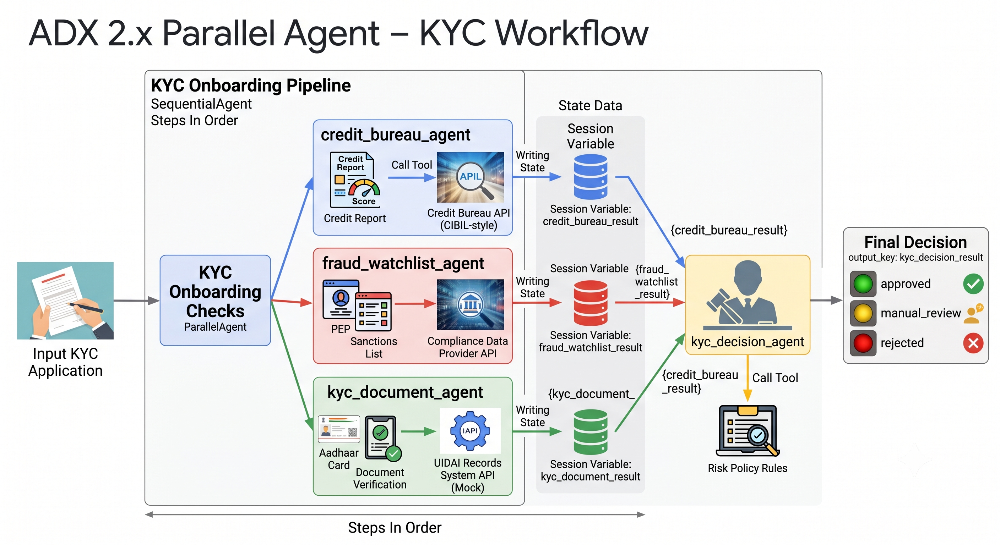

# Lesson 11b: ParallelAgent in Practice

Quick recap: `ParallelAgent` runs a list of sub-agents concurrently instead of in order. That only makes sense when the sub-agents don't depend on each other within a single run, none of them needs to read something another one produces in that same run. All of them still share the same session, though, so state written before the parallel block started is visible to every branch, and each branch needs its own `output_key` to avoid two branches racing to write the same state key. That's everything from the last lesson. Time to build it.

## The problem we're solving

You're building the KYC (Know Your Customer) onboarding checks for the same NBFC, the example sketched in Lesson 11: before a new customer's account gets opened, three independent checks need to happen.

1. **Credit bureau** fetches the applicant's credit bureau report using their PAN.
2. **Fraud watchlist** screens the applicant's name and PAN against sanctions and PEP (Politically Exposed Person) lists.
3. **KYC document verification** checks the applicant's Aadhaar number (India's 12-digit biometric ID, the standard KYC document) against a records system.

None of these three checks needs anything the other two produced. The fraud watchlist screen doesn't care what the credit score turned out to be. The document check doesn't care whether the applicant is on a sanctions list. They're three separate lookups against three separate systems, and in Lesson 11a's `SequentialAgent` pipeline, running them one after another would mean waiting for three round trips back to back when you could be waiting for only the slowest of the three. That's exactly the gap `ParallelAgent` fills.

## How state actually differs in a ParallelAgent

This is the part that's genuinely new, and it's a bigger shift than it first looks, not in the ADK API (the constructor call is nearly identical to `SequentialAgent`), but in how the sub-agents relate to their input and to each other.

In Lesson 11a, every sub-agent after the first read a previous step's `output_key` through `{key}` instruction templating, that's how `loan_type` and `base_interest_rate` traveled from one agent to the next. None of that applies here, _there is no previous step_ inside this pipeline. All three sub-agents read the **same original application text**, the one the user actually sent, directly from the conversation, exactly the way Lesson 11a's very first agent (intake) did before any state existed to read from. None of the three instructions below use `{key}` templating at all, and that absence is the point: it's what "the sub-agents don't depend on each other" looks like in the actual instruction text, not just in the diagram from Lesson 11.

> 📌 **NOTE:** Each sub-agent still needs its own distinct `output_key`. If two branches wrote to the same key, whichever one's write lands last would silently overwrite the other, since both are running concurrently against the same session. That's exactly why the three agents below use three separate keys, `credit_bureau_result`, `fraud_watchlist_result`, `kyc_document_result`, rather than all three writing to something generic like `result`. Giving each branch its own key isn't a naming preference, it's what avoids that overwrite.
>
> There's a second consequence worth knowing before you write `main.py`, and it's not something Lesson 11a's diagrams could show you: the three branches genuinely run at the same time, so they don't finish in any fixed order, it depends on which one happens to be fastest each time you run it. `run_agent_query` (from Lesson 9) was built for single agents and only hands back one "final response," whichever branch happened to finish last. That's a race, not something you can rely on. You'll see how this lesson's `main.py` works around that in Step 6.

One more thing before you start building: three independent checks running concurrently aren't the whole story on their own, something has to look at all three results together and actually decide what to do with them. That's not optional, it's the reason the checks existed in the first place. So this pipeline doesn't stop at the fan-out, `ParallelAgent` runs the three checks, and a fourth agent afterward reads all three and produces the onboarding decision, wrapped together in a `SequentialAgent`. The fan-out is still the main thing this lesson teaches, the merge step just gives it somewhere to land.

Here's what we'll be building



## Step 1: Set up the folder structure

```
agents/lesson11b_parallel_agent/
├── main.py
├── api.py
├── streamlit_app.py
└── kyc_pipeline/
    ├── __init__.py
    ├── agent.py
    └── sub_agents/
        ├── __init__.py
        ├── credit_bureau_agent/
        │   ├── __init__.py
        │   ├── agent.py
        │   └── tools.py
        ├── fraud_watchlist_agent/
        │   ├── __init__.py
        │   ├── agent.py
        │   └── tools.py
        ├── kyc_document_agent/
        │   ├── __init__.py
        │   ├── agent.py
        │   └── tools.py
        └── kyc_decision_agent/
            ├── __init__.py
            ├── agent.py
            └── tools.py
```

Same shape as Lesson 11a's tree, `kyc_pipeline/agent.py` holds the pipeline assembly, four sub-agent folders sit underneath it, three that run concurrently and one that runs after them.

## Step 2: Build the credit bureau sub-agent & its tools

This reuses the same mock mechanism as Lesson 11a's credit check agent, a deterministic hash of the PAN, so results are repeatable, extended with two fields a real bureau report always includes: `total_outstanding_balance` (how much the applicant currently owes across all accounts, not just how many accounts exist) and `recent_enquiries_count` (how many hard credit enquiries, loan or credit card applications, hit the applicant's file in the last 6 months, a real risk signal lenders call "credit hungry" behavior). Both will matter once the decision agent reads this result in Step 5.

Create `agents/lesson11b_parallel_agent/kyc_pipeline/sub_agents/credit_bureau_agent/tools.py`

```python
"""Lesson 11b: Tools for the credit bureau agent.
"""

import hashlib


def get_credit_bureau_report(pan_number: str) -> dict:
    """Fetches a mock credit bureau report for an applicant.

    Same mock mechanism as Lesson 11a's credit check agent: a deterministic
    hash of the PAN, so the same applicant always gets the same result.
    Swap this out for a real bureau API integration in production.

    Args:
        pan_number: The applicant's PAN (Permanent Account Number).

    Returns:
        A dict with:
            pan_number (str): The PAN the report was generated for.
            credit_score (int): A CIBIL-style score between 300 and 900.
            existing_loans_count (int): Number of currently active loans.
            has_defaults (bool): True if the mock history includes a default.
            total_outstanding_balance (float): Total amount currently owed
                across all accounts, in INR.
            recent_enquiries_count (int): Number of hard credit enquiries
                (loan or credit card applications) in the last 6 months.
                A high count is a real risk signal lenders watch for,
                sometimes called "credit hungry" behavior.
            error (str, optional): Present only if pan_number is empty.
    """
    if not pan_number:
        return {"error": "pan_number is required to fetch a credit bureau report."}

    digest = hashlib.sha256(pan_number.encode()).hexdigest()
    seed = int(digest[:8], 16)

    return {
        "pan_number": pan_number,
        "credit_score": 300 + (seed % 601),
        "existing_loans_count": seed % 4,
        "has_defaults": (seed % 7) == 0,
        "total_outstanding_balance": float(seed % 2000000),
        "recent_enquiries_count": seed % 6,
    }
```

Create `agents/lesson11b_parallel_agent/kyc_pipeline/sub_agents/credit_bureau_agent/agent.py`

```python
"""Lesson 11b: Credit bureau agent for KYC onboarding checks.

One of three agents that run concurrently under a ParallelAgent. Reads
the applicant's PAN directly from the original KYC application text,
there's no prior step in this pipeline to read state from.
"""

from pydantic import BaseModel, Field

from google.adk.agents import Agent

from common.model_config import get_model

from .tools import get_credit_bureau_report


class CreditBureauResult(BaseModel):
    """Structured output of the credit bureau agent."""

    pan_number: str = Field(description="PAN the bureau report was fetched for")
    credit_score: int = Field(description="CIBIL-style score, 300 to 900")
    existing_loans_count: int = Field(description="Number of currently active loans")
    has_defaults: bool = Field(description="True if the bureau history shows a prior default")
    total_outstanding_balance: float = Field(description="Total amount currently owed across all accounts, in INR")
    recent_enquiries_count: int = Field(description="Number of hard credit enquiries in the last 6 months")


instruction = """You are the credit bureau agent for a new customer KYC
(Know Your Customer) onboarding check at an NBFC.

A KYC application arrives as free-form text, extract the applicant's
pan_number from it, then call the `get_credit_bureau_report` tool with
that PAN. Return the report exactly as the tool gives it back to you, in
the structured fields.

Never fabricate a credit score yourself. Always call the tool.
"""

credit_bureau_agent = Agent(
    name="credit_bureau_agent",
    model=get_model("primary"),
    description="Fetches an applicant's credit bureau report during KYC onboarding.",
    instruction=instruction,
    tools=[get_credit_bureau_report],
    output_schema=CreditBureauResult,
    output_key="credit_bureau_result",
)
```

Notice the instruction says "extract... from it" about the raw application text, not "read `{some_result}` from state." There's nothing upstream of this agent inside this pipeline, so there's nothing to template in.

## Step 3: Build the fraud watchlist sub-agent & its tools

Create `agents/lesson11b_parallel_agent/kyc_pipeline/sub_agents/fraud_watchlist_agent/tools.py`

```python
"""Lesson 11b: Tools for the fraud watchlist agent.
"""

import hashlib


def check_fraud_watchlist(applicant_name: str, pan_number: str) -> dict:
    """Screens an applicant against a mock sanctions and PEP watchlist.

    PEP (Politically Exposed Person) and sanctions list screening is a
    standard KYC requirement at every regulated bank and NBFC. This mocks
    the screen with a deterministic hash so results are repeatable, real
    screening calls out to a dedicated compliance data provider.

    Args:
        applicant_name: The applicant's full name.
        pan_number: The applicant's PAN (Permanent Account Number).

    Returns:
        A dict with:
            applicant_name (str): The name that was screened.
            pan_number (str): The PAN that was screened.
            is_flagged (bool): True if the applicant matched a watchlist entry.
            watchlist_type (str, optional): Present only when is_flagged is
                True, either "PEP" or "Sanctions List".
            error (str, optional): Present only if inputs are missing.
    """
    if not applicant_name or not pan_number:
        return {"error": "applicant_name and pan_number are both required."}

    digest = hashlib.sha256(f"{applicant_name}|{pan_number}".encode()).hexdigest()
    seed = int(digest[:8], 16)

    is_flagged = (seed % 11) == 0  # deliberately rare, most applicants clear
    watchlist_type = None
    if is_flagged:
        watchlist_type = "PEP" if seed % 2 == 0 else "Sanctions List"

    return {
        "applicant_name": applicant_name,
        "pan_number": pan_number,
        "is_flagged": is_flagged,
        "watchlist_type": watchlist_type,
    }
```

Create the agent: `agents/lesson11b_parallel_agent/kyc_pipeline/sub_agents/fraud_watchlist_agent/agent.py`

```python
"""Lesson 11b: Fraud watchlist agent for KYC onboarding checks.

One of three agents that run concurrently under a ParallelAgent. Reads
the applicant's name and PAN directly from the original KYC application
text, independently of the other two branches.
"""

from typing import Optional

from pydantic import BaseModel, Field

from google.adk.agents import Agent

from common.model_config import get_model

from .tools import check_fraud_watchlist


class FraudWatchlistResult(BaseModel):
    """Structured output of the fraud watchlist agent."""

    applicant_name: str = Field(description="Name that was screened")
    pan_number: str = Field(description="PAN that was screened")
    is_flagged: bool = Field(description="True if the applicant matched a watchlist entry")
    watchlist_type: Optional[str] = Field(
        default=None, description='Either "PEP" or "Sanctions List", present only when flagged'
    )


instruction = """You are the fraud watchlist agent for a new customer KYC
(Know Your Customer) onboarding check at an NBFC.

A KYC application arrives as free-form text, extract the applicant's
applicant_name and pan_number from it, then call the
`check_fraud_watchlist` tool with those two values. Return the result
exactly as the tool gives it back to you, in the structured fields.

Never decide whether someone is flagged yourself. Always call the tool.
"""

fraud_watchlist_agent = Agent(
    name="fraud_watchlist_agent",
    model=get_model("primary"),
    description="Screens an applicant against sanctions and PEP watchlists during KYC onboarding.",
    instruction=instruction,
    tools=[check_fraud_watchlist],
    output_schema=FraudWatchlistResult,
    output_key="fraud_watchlist_result",
)
```

## Step 4: Build the KYC document verification sub-agent & its tools

Create `agents/lesson11b_parallel_agent/kyc_pipeline/sub_agents/kyc_document_agent/tools.py`

```python
"""Lesson 11b: Tools for the KYC document verification agent.
"""

import hashlib
import re

# Aadhaar is India's 12-digit biometric ID, issued by UIDAI, and the most
# commonly used document for KYC address and identity verification.
AADHAAR_PATTERN = re.compile(r"^\d{12}$")


def verify_kyc_documents(applicant_name: str, date_of_birth: str, aadhaar_number: str) -> dict:
    """Verifies a KYC document (Aadhaar) against a mock records system.

    Checks the Aadhaar number's format, then simulates a match check
    against a records database using a deterministic hash. Real e-KYC
    verification calls UIDAI's own verification API rather than checking
    a local hash, this mocks that dependency for the lesson.

    Args:
        applicant_name: The applicant's full name.
        date_of_birth: The applicant's date of birth, as given in the application.
        aadhaar_number: The applicant's 12-digit Aadhaar number.

    Returns:
        A dict with:
            applicant_name (str): The name that was verified.
            aadhaar_number (str): The Aadhaar number, cleaned of spaces.
            aadhaar_valid_format (bool): True if it's 12 digits.
            documents_match (bool): True if the mock records check found a
                match. Always False when aadhaar_valid_format is False.
    """
    cleaned = aadhaar_number.strip().replace(" ", "")
    valid_format = bool(AADHAAR_PATTERN.match(cleaned))

    if not valid_format:
        return {
            "applicant_name": applicant_name,
            "aadhaar_number": cleaned,
            "aadhaar_valid_format": False,
            "documents_match": False,
        }

    digest = hashlib.sha256(f"{applicant_name}|{cleaned}|{date_of_birth}".encode()).hexdigest()
    seed = int(digest[:8], 16)
    documents_match = (seed % 9) != 0  # mostly matches, occasional mismatch

    return {
        "applicant_name": applicant_name,
        "aadhaar_number": cleaned,
        "aadhaar_valid_format": True,
        "documents_match": documents_match,
    }
```

Create the sub-agent: `agents/lesson11b_parallel_agent/kyc_pipeline/sub_agents/kyc_document_agent/agent.py`

```python
"""Lesson 11b: KYC document verification agent for onboarding checks.

One of three agents that run concurrently under a ParallelAgent. Reads
the applicant's name, date of birth, and Aadhaar number directly from
the original KYC application text, independently of the other two
branches.
"""

from pydantic import BaseModel, Field

from google.adk.agents import Agent

from common.model_config import get_model

from .tools import verify_kyc_documents


class KycDocumentResult(BaseModel):
    """Structured output of the KYC document verification agent."""

    applicant_name: str = Field(description="Name that was verified")
    aadhaar_number: str = Field(description="Aadhaar number, cleaned of spaces")
    aadhaar_valid_format: bool = Field(description="True if the Aadhaar number is 12 digits")
    documents_match: bool = Field(description="True if the mock records check found a match")


instruction = """You are the KYC document verification agent for a new
customer onboarding check at an NBFC.

A KYC application arrives as free-form text, extract the applicant's
applicant_name, date_of_birth, and aadhaar_number from it, then call the
`verify_kyc_documents` tool with those three values. Return the result
exactly as the tool gives it back to you, in the structured fields.

Never judge the Aadhaar format or decide on a match yourself. Always call
the tool.
"""

kyc_document_agent = Agent(
    name="kyc_document_agent",
    model=get_model("primary"),
    description="Verifies an applicant's Aadhaar document during KYC onboarding.",
    instruction=instruction,
    tools=[verify_kyc_documents],
    output_schema=KycDocumentResult,
    output_key="kyc_document_result",
)
```

## Step 5: Build the KYC decision agent

This is the merge step, the fourth agent, the one that runs after the three parallel checks and actually does something with all of them together.

Create `agents/lesson11b_parallel_agent/kyc_pipeline/sub_agents/kyc_decision_agent/tools.py`

```python
"""Lesson 11b: Tools for the KYC decision agent.
"""

# How many recent hard enquiries are tolerated before flagging for manual
# review. In production this threshold would come from the same kind of
# risk policy configuration as Lesson 11a's rate cards, not a constant.
MAX_RECENT_ENQUIRIES = 3


def make_kyc_decision(
    is_flagged: bool,
    watchlist_type: str | None,
    aadhaar_valid_format: bool,
    documents_match: bool,
    has_defaults: bool,
    recent_enquiries_count: int,
) -> dict:
    """Applies the onboarding decision rules to the three parallel checks' results.

    Rules, applied in order:
        1. A watchlist hit is an automatic rejection, no exceptions.
        2. A document problem (bad format or no match) sends the case to
           manual review, it could just as easily be a data entry error
           as actual fraud, so a human should look before rejecting.
        3. A prior default sends the case to manual review.
        4. Unusually high recent credit enquiries sends the case to
           manual review, a standard "credit hungry" risk signal.
        5. If none of the above apply, the application is approved.

    Args:
        is_flagged: Whether the applicant matched a sanctions or PEP watchlist.
        watchlist_type: "PEP" or "Sanctions List", if flagged.
        aadhaar_valid_format: Whether the Aadhaar number passed format validation.
        documents_match: Whether the mock records check found a match.
        has_defaults: Whether the credit bureau report shows a prior default.
        recent_enquiries_count: Number of hard credit enquiries in the last 6 months.

    Returns:
        A dict with:
            decision (str): One of "approved", "manual_review", "rejected".
            reasons (list[str]): Every rule that contributed to the decision.
    """
    if is_flagged:
        return {
            "decision": "rejected",
            "reasons": [f"Flagged on watchlist: {watchlist_type}"],
        }

    reasons = []
    if not aadhaar_valid_format or not documents_match:
        reasons.append("KYC document verification failed")
    if has_defaults:
        reasons.append("Prior default on credit bureau record")
    if recent_enquiries_count > MAX_RECENT_ENQUIRIES:
        reasons.append(f"High recent credit enquiries ({recent_enquiries_count})")

    if reasons:
        return {"decision": "manual_review", "reasons": reasons}

    return {"decision": "approved", "reasons": ["All checks cleared"]}
```

The rules run in a fixed order for a reason: a watchlist hit is disqualifying on its own, no amount of clean credit history should override it, so it's checked first and returns immediately. Everything else, a document mismatch, a prior default, unusually heavy recent borrowing activity, gets treated as a reason to send the case to a person rather than an automatic reject, since any one of those could have an innocent explanation a human should look at before the applicant gets turned away.

Create the sub-agent: `agents/lesson11b_parallel_agent/kyc_pipeline/sub_agents/kyc_decision_agent/agent.py`

```python
"""Lesson 11b: KYC decision agent, the merge step after the parallel checks.

Reads all three parallel checks' results from session state and applies
the onboarding decision rules. This is the step that gives the
ParallelAgent's fan-out somewhere to land, three independent checks are
only useful if something downstream actually does something with all
three together.
"""

from typing import Literal

from pydantic import BaseModel, Field

from google.adk.agents import Agent

from common.model_config import get_model

from .tools import make_kyc_decision


class KycDecisionResult(BaseModel):
    """Structured output of the KYC decision agent."""

    decision: Literal["approved", "manual_review", "rejected"] = Field(
        description="Final outcome of the KYC onboarding check"
    )
    reasons: list[str] = Field(description="Every rule that contributed to the decision")


instruction = """You are the KYC decision agent, the final step in a new
customer onboarding check at an NBFC.

Session state has three results, written concurrently by the credit
bureau, fraud watchlist, and KYC document checks that ran before you.

Fraud watchlist result:
{fraud_watchlist_result}

KYC document result:
{kyc_document_result}

Credit bureau result:
{credit_bureau_result}

Pull is_flagged and watchlist_type from the fraud watchlist result,
aadhaar_valid_format and documents_match from the KYC document result,
and has_defaults and recent_enquiries_count from the credit bureau
result. Call the `make_kyc_decision` tool with those six values. Return
the tool's result exactly, in the structured fields.

Always call the tool. Never decide the outcome yourself.
"""

kyc_decision_agent = Agent(
    name="kyc_decision_agent",
    model=get_model("primary"),
    description="Applies the onboarding decision rules to the three parallel checks' results.",
    instruction=instruction,
    tools=[make_kyc_decision],
    output_schema=KycDecisionResult,
    output_key="kyc_decision_result",
)
```

This instruction templates in three separate state keys, `{fraud_watchlist_result}`, `{kyc_document_result}`, `{credit_bureau_result}`, one for each of the three branches. That's only possible because, by the time this agent runs, all three have already finished, this agent isn't itself part of the parallel block, it comes after it. You'll see exactly how that ordering gets expressed in the next step.

## Step 6: Assemble the pipeline: fan out, then merge

Create `agents/lesson11b_parallel_agent/kyc_pipeline/agent.py`

```python
"""Lesson 11b: KYC onboarding pipeline, fan out then merge.

The root agent is a SequentialAgent with two steps. The first step is a
ParallelAgent, the credit bureau, fraud watchlist, and KYC document
checks, running concurrently exactly as before. The second step is the
decision agent, reading all three results after the parallel step
completes and producing a final onboarding outcome.

This is the shape a standalone ParallelAgent almost never appears in on
its own: independent checks are only useful once something downstream
looks at all of them together. SequentialAgent and ParallelAgent nest
freely, a ParallelAgent can be one step of a SequentialAgent's sequence,
which is exactly what's happening here.
"""

from google.adk.agents import ParallelAgent, SequentialAgent

from .sub_agents.credit_bureau_agent.agent import credit_bureau_agent
from .sub_agents.fraud_watchlist_agent.agent import fraud_watchlist_agent
from .sub_agents.kyc_document_agent.agent import kyc_document_agent
from .sub_agents.kyc_decision_agent.agent import kyc_decision_agent

kyc_checks = ParallelAgent(
    name="kyc_onboarding_checks",
    description="Runs credit bureau, fraud watchlist, and KYC document checks concurrently for new customer onboarding.",
    sub_agents=[credit_bureau_agent, fraud_watchlist_agent, kyc_document_agent],
)

root_agent = SequentialAgent(
    name="kyc_onboarding_pipeline",
    description="Runs the three KYC checks concurrently, then applies the onboarding decision rules to the combined result.",
    sub_agents=[kyc_checks, kyc_decision_agent],
)
```

Two agent objects here, not one. `kyc_checks` is the exact `ParallelAgent` from earlier, unchanged, still just three independent branches with three separate keys. `root_agent` is new, and it's a `SequentialAgent`, the same class from Lesson 11a, whose two-item `sub_agents` list happens to have a `ParallelAgent` as its first element instead of a plain `Agent`. `SequentialAgent` doesn't care what kind of agent each step is, it just runs whatever's in the list in order and waits for each one to fully finish before starting the next. That's what guarantees `kyc_decision_agent` only starts once all three parallel branches, and their interleaved events, have completely settled, no race left to worry about by the time this step's instruction gets templated in.

## Step 7: Wire up main.py

`main.py` still reads results back from session state rather than trusting `run_agent_query`'s return value, but now there's a fourth result worth reading too: the decision.

Create `agents/lesson11b_parallel_agent/main.py`

```python
"""Lesson 11b: Run the KYC onboarding pipeline (ParallelAgent + decision).
"""

import asyncio
import sys
import uuid
from pathlib import Path

from dotenv import load_dotenv

load_dotenv(override=True)

sys.path.insert(0, str(Path(__file__).resolve().parents[1]))  # adds agents/ for common.*

from google.adk.sessions import InMemorySessionService

from common.runner_utils import run_agent_query
from kyc_pipeline.agent import root_agent

APP_NAME = "lesson11b_parallel_agent"


async def main() -> None:
    """Runs the KYC onboarding pipeline against console input."""
    session_service = InMemorySessionService()
    user_id = "console_user"

    print("KYC onboarding pipeline (ParallelAgent, then decision).")
    print("Paste a KYC application as free text, or type 'quit' to exit.\n")

    loop = asyncio.get_event_loop()
    while True:
        try:
            user_input = await loop.run_in_executor(None, lambda: input("Application: "))
        except EOFError:
            break

        if user_input.strip().lower() in ("quit", "exit"):
            break

        # A fresh session per application: each KYC check is a one-shot
        # run, not an ongoing conversation.
        session_id = str(uuid.uuid4())

        await run_agent_query(
            agent=root_agent,
            app_name=APP_NAME,
            user_id=user_id,
            session_id=session_id,
            query=user_input,
            session_service=session_service,
        )

        # The three parallel branches interleave their events, so
        # run_agent_query's single "final response" text is only
        # reliable here because it's the decision agent, the sequential
        # step running after the parallel one, that produces the actual
        # final response. Still read every result back from session
        # state, so the three checks that fed the decision are visible
        # too, not just the outcome.
        session = await session_service.get_session(
            app_name=APP_NAME, user_id=user_id, session_id=session_id
        )
        print("\nCredit bureau:  ", session.state.get("credit_bureau_result"))
        print("Fraud watchlist:", session.state.get("fraud_watchlist_result"))
        print("KYC documents:  ", session.state.get("kyc_document_result"))
        print("Decision:       ", session.state.get("kyc_decision_result"))
        print()


if __name__ == "__main__":
    asyncio.run(main())
```

## Step 8: Run it

```bash
uv run agents/lesson11b_parallel_agent/main.py
```

Paste in a KYC application as plain text, something like:

```
Application: New customer KYC application: Rahul Verma, PAN RAHULV3456Q, date of birth 1986-06-15, Aadhaar number 444455556666.
```

All three checks should come back clean: a credit score around 626 with no defaults and no recent enquiries, not flagged on any watchlist, and Aadhaar verified with a document match. The decision should come back `approved`. Notice the four results print together, not one at a time the way Lesson 11a's steps did, that's the concurrency for the first three, followed by the decision agent's own single turn right after.

Now try an applicant who trips the fraud watchlist:

```
Application: New customer KYC application: Deepak Rao, PAN DEEPAK6789R, date of birth 1985-03-20, Aadhaar number 345678901234.
```

This one should come back with a decent credit score around 626 and a valid, matching Aadhaar, but flagged on the watchlist as a PEP (Politically Exposed Person). That's worth sitting with for a second: the credit bureau and document checks have no idea anything is wrong, because nothing is wrong from their point of view, they're not looking at the same thing the fraud watchlist agent is. The decision agent is the only one that sees the full picture, and here it should come back `rejected`, on the watchlist hit alone, regardless of how clean the other two checks were.

Try a third application where the applicant has a prior default:

```
Application: New customer KYC application: Priya Nambiar, PAN PRIYAN1234R, date of birth 1991-02-10, Aadhaar number 111122223333.
```

Credit bureau should show `has_defaults: true` with a clean fraud watchlist and document check, and the decision should come back `manual_review`, with the reason pointing specifically at the prior default. That's the middle ground the rules are for: nothing here is disqualifying on its own the way a watchlist hit is, but it's not clean enough to auto-approve either.

Try a fourth application with a malformed Aadhaar number, something with fewer than 12 digits, and watch `aadhaar_valid_format` and `documents_match` both come back `False`, the other two checks complete normally regardless, and the decision lands on `manual_review` again, this time for a document problem instead of a credit one.

## Try it in adk web too

Point `adk web` at the whole `agents/` folder, not this lesson's own folder, since `common` only resolves correctly when `agents/` itself is on the Python path:

```bash
adk web agents
```

Look for `lesson11b_parallel_agent.kyc_pipeline` in the dropdown, that's the pipeline. You'll also see four extra entries for the individual sub-agent folders, ignore those, they're not meant to run standalone.

Select `lesson11b_parallel_agent.kyc_pipeline`, paste in Rahul Verma's application, and watch the trace panel. This is genuinely the best way to *see* what `ParallelAgent` does that a diagram can't: three tool calls firing close together rather than one after another, followed by the decision agent's own turn once they've all settled, and the trace won't always render the first three in the same order twice, run it a few times and notice that.

> **NOTE:** As in Lesson 11a, `adk web` is a development and inspection tool, not how this pipeline gets called in production. `main.py`, or the FastAPI server built next, is for that.

## Serving this behind an API and a Streamlit form

### FastAPI, wrapping the pipeline

Same shape as Lesson 11a's `api.py`: a shared `session_service`, a thin endpoint, `run_agent_query` to drive the run. The response still gets built from `session.state` rather than `run_agent_query`'s return value, now with a fourth field for the decision.

Create `agents/lesson11b_parallel_agent/api.py`

```python
"""Lesson 11b: FastAPI server for the KYC onboarding pipeline.

Same shape as Lesson 11a's api.py: a shared session_service, a thin
endpoint, and the response built from session.state after the run
completes. All four results (the three parallel checks plus the final
decision) are read back from state rather than trusted from
run_agent_query's single "final response" text, so the response stays
consistent even though, with this pipeline's SequentialAgent-wrapping-
ParallelAgent shape, that text happens to be reliable now (it's the
decision agent, running after the parallel step, that produces it).

Run with:
    uv run agents/lesson11b_parallel_agent/api.py
"""

import sys
from pathlib import Path

from dotenv import load_dotenv

load_dotenv(override=True)

sys.path.insert(0, str(Path(__file__).resolve().parents[1]))  # adds agents/ for common.*

from fastapi import FastAPI
from google.adk.sessions import InMemorySessionService
from pydantic import BaseModel

from common.runner_utils import run_agent_query
from kyc_pipeline.agent import root_agent
from kyc_pipeline.sub_agents.credit_bureau_agent.agent import CreditBureauResult
from kyc_pipeline.sub_agents.fraud_watchlist_agent.agent import FraudWatchlistResult
from kyc_pipeline.sub_agents.kyc_document_agent.agent import KycDocumentResult
from kyc_pipeline.sub_agents.kyc_decision_agent.agent import KycDecisionResult

APP_NAME = "lesson11b_parallel_agent"

# Created once, shared across every HTTP request, same pattern as Lesson 9 and 11a.
session_service = InMemorySessionService()
app = FastAPI(title="KYC Onboarding Pipeline API")


class KycRequest(BaseModel):
    """The shape of an incoming request to /kyc-check."""

    user_id: str
    session_id: str
    application_text: str


class KycResponse(BaseModel):
    """The shape of a response from /kyc-check.

    All three parallel checks are returned alongside the final decision,
    so a caller can see both what was found and what it added up to.
    """

    credit_bureau: CreditBureauResult
    fraud_watchlist: FraudWatchlistResult
    kyc_document: KycDocumentResult
    decision: KycDecisionResult


@app.get("/health")
async def health() -> dict:
    """Simple liveness check, useful once this is deployed."""
    return {"status": "ok"}


@app.post("/kyc-check", response_model=KycResponse)
async def kyc_check(request: KycRequest) -> KycResponse:
    """Runs the full KYC pipeline (parallel checks, then decision) and returns every result."""
    await run_agent_query(
        agent=root_agent,
        app_name=APP_NAME,
        user_id=request.user_id,
        session_id=request.session_id,
        query=request.application_text,
        session_service=session_service,
    )

    session = await session_service.get_session(
        app_name=APP_NAME, user_id=request.user_id, session_id=request.session_id
    )

    return KycResponse(
        credit_bureau=session.state["credit_bureau_result"],
        fraud_watchlist=session.state["fraud_watchlist_result"],
        kyc_document=session.state["kyc_document_result"],
        decision=session.state["kyc_decision_result"],
    )


if __name__ == "__main__":
    import uvicorn

    # A different port from Lesson 11a's api.py (8080), so both can run
    # side by side without clashing.
    uvicorn.run(app, host="127.0.0.1", port=8081)
```

Run it:

```bash
uv run agents/lesson11b_parallel_agent/api.py
```

### A Streamlit form for the onboarding desk

Same design decision as Lesson 11a: collect the fields separately, assemble them into the sentence-shaped text the agents already expect, and send that through unchanged. The decision now sits above the three columns, since it's the thing whoever's running this screen actually needs to act on, the three individual checks are there to explain why.

Create `agents/lesson11b_parallel_agent/streamlit_app.py`

```python
"""Lesson 11b: Streamlit front-end for the KYC onboarding pipeline.

Collects the application as separate form fields, then assembles them
into one sentence and sends that to the API's /kyc-check endpoint. The
three checks still run independently from that same text, and the
decision agent still merges them, the form just gives whoever's
onboarding the customer a friendlier way to provide the information
than typing free text.

Run this alongside api.py in a separate terminal, not instead of it.

Run with:
    streamlit run agents/lesson11b_parallel_agent/streamlit_app.py
"""

import uuid

import requests
import streamlit as st

API_URL = "http://127.0.0.1:8081/kyc-check"

st.set_page_config(page_title="KYC Onboarding", page_icon="🪪")
st.title("New Customer KYC Onboarding")
st.caption(
    "A dummy front-end standing in for a real onboarding screen. "
    "It knows nothing about ADK; it only talks to our pipeline's API."
)

if "user_id" not in st.session_state:
    st.session_state.user_id = f"streamlit-user-{uuid.uuid4().hex[:8]}"

with st.form("kyc_application"):
    applicant_name = st.text_input("Full name")
    pan_number = st.text_input("PAN")
    date_of_birth = st.date_input("Date of birth")
    aadhaar_number = st.text_input("Aadhaar number (12 digits)")
    submitted = st.form_submit_button("Run KYC checks")

if submitted:
    application_text = (
        f"New customer KYC application: {applicant_name}, PAN {pan_number}, "
        f"date of birth {date_of_birth.isoformat()}, Aadhaar number {aadhaar_number}."
    )

    with st.spinner("Running credit bureau, fraud watchlist, and document checks..."):
        response = requests.post(
            API_URL,
            json={
                "user_id": st.session_state.user_id,
                "session_id": f"session-{uuid.uuid4().hex[:8]}",
                "application_text": application_text,
            },
            timeout=60,
        )
        response.raise_for_status()
        result = response.json()

    decision = result["decision"]
    if decision["decision"] == "approved":
        st.success("Approved")
    elif decision["decision"] == "manual_review":
        st.warning("Referred to manual review")
    else:
        st.error("Rejected")

    st.write("Reasons:")
    for reason in decision["reasons"]:
        st.write(f"- {reason}")

    col1, col2, col3 = st.columns(3)

    with col1:
        st.subheader("Credit bureau")
        st.json(result["credit_bureau"])

    with col2:
        st.subheader("Fraud watchlist")
        fraud = result["fraud_watchlist"]
        if fraud["is_flagged"]:
            st.error(f"Flagged: {fraud['watchlist_type']}")
        else:
            st.success("Clear")
        st.json(fraud)

    with col3:
        st.subheader("KYC documents")
        docs = result["kyc_document"]
        if docs["aadhaar_valid_format"] and docs["documents_match"]:
            st.success("Verified")
        else:
            st.error("Verification failed")
        st.json(docs)
```

The three-column layout below the decision is the same deliberate choice as before: it visually reinforces that these are three independent results, the same idea `main.py`'s printout and the trace panel in `adk web` were both making in their own way. The decision banner above it is new, and it's what actually closes the loop this lesson opened, three checks that fan out, and one clear outcome they fold back into.

Run it alongside `api.py`, in a separate terminal:

```bash
streamlit run agents/lesson11b_parallel_agent/streamlit_app.py
```

## If you're coming from LangChain or LangGraph

In LangGraph, this maps to the fan-out pattern: three nodes with no edges between them, all reachable from the same entry point, each writing to a different key in the shared state, then a join node that waits for all three branches to complete before running, which is exactly the role `kyc_decision_agent` plays here. LangChain's `RunnableParallel` is the more direct equivalent if you're not using the graph API at all, a dict of runnables executed concurrently, with the output keyed by name, conceptually close to what three distinct `output_key` values are doing here, though you'd still need a step after it to do what the decision agent does.

The difference, as with `SequentialAgent`, is in what you write by hand. LangGraph and `RunnableParallel` both require you to declare the fan-out, and the join afterward, explicitly. ADK infers the fan-out from the fact that you didn't chain any `{key}` references between the three parallel instructions, you just listed three independent agents inside a `ParallelAgent`. The join is equally explicit on ADK's side, it's just familiar rather than new: it's the same `SequentialAgent` from Lesson 11a, with a `ParallelAgent` as one of its steps instead of a plain `Agent`.

## In this lesson

You built a working four-agent KYC onboarding pipeline: three agents, credit bureau, fraud watchlist, and document verification, running concurrently under a `ParallelAgent`, followed by a fourth, the decision agent, that reads all three results and produces a final onboarding outcome. You saw the defining difference from `SequentialAgent` show up directly in the three parallel instructions, no `{key}` templating anywhere, because each reads the same original input rather than chaining off another's output, and then saw exactly where that changes: the decision agent's instruction templates in all three results at once, something only possible because `SequentialAgent` guarantees the parallel step has fully finished before it runs. You ran into a real consequence of genuine concurrency, `run_agent_query`'s single final-response text isn't reliable mid-pipeline, and saw how wrapping the `ParallelAgent` inside a `SequentialAgent` actually resolves that, the decision agent's own turn becomes the reliable final response, while `main.py`, the FastAPI server, and the Streamlit form all still read every individual result back from session state so the checks behind the decision stay visible too. You also picked up the `adk web agents` command (pointing at the whole `agents/` folder, not the lesson's own folder) and why that specific path matters for `common` to resolve.

## In the next lesson

The next lesson covers the third classic workflow agent, `LoopAgent`, repeating a sub-agent until an exit condition is met or a maximum iteration count is hit. You'll build the document re-request scenario from Lesson 11: an applicant's KYC document gets rejected, the agent asks again, and the loop keeps going until the document passes or a retry limit sends the case to a human.
