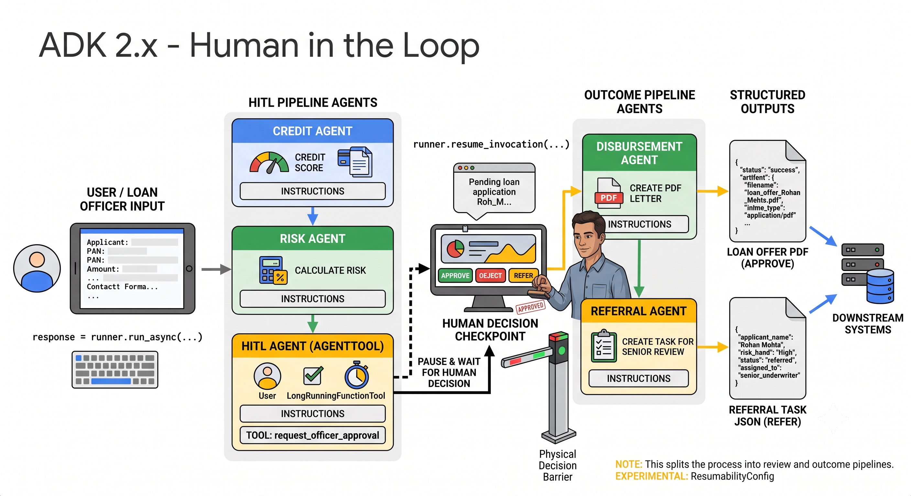

# Lesson 12: Human-in-the-Loop

Every pipeline you've built so far, `SequentialAgent` in 11a, `ParallelAgent` in 11b, `LoopAgent` in 11c, decides everything on its own once you press go. This lesson builds a pipeline that stops and genuinely waits for a person, a loan officer, to make a real decision before continuing, from a console prompt or a web page, using the same mechanism either way.



## The problem we're solving

A loan application comes in. A `credit_agent` pulls the applicant's details and credit bureau report. A `risk_agent` scores it. Then, instead of an agent deciding approve or reject the way Lesson 11a's decision agent did, the pipeline stops. It shows everything it's found to a loan officer and waits, for as long as it takes, before doing anything else. Once the officer responds with APPROVE, REJECT, or REFER, the pipeline continues: approval generates a PDF loan offer letter, referral writes up a note for a senior underwriter, rejection does neither.

## Two agents worth knowing before you build this 

Two pieces of ADK make this possible, both things you'll use directly.

**`LongRunningFunctionTool`**, from Lesson 7b, marks a tool as "don't wait for this to finish in the normal sense." When a model calls a tool wrapped this way, ADK pauses right there instead of continuing the turn.

**`ResumabilityConfig`** is what lets that pause survive being picked back up later, from a separate call entirely, a different HTTP request, even a different process. You enable it on an `App`:

```python
app = App(name="...", root_agent=..., resumability_config=ResumabilityConfig(is_resumable=True))
```

Together, these two turn a normal tool call into a real checkpoint: the pipeline can stop, hand control back to whatever's calling it, and pick up again later exactly where it left off.

## Why this lesson uses two pipelines instead of one

> 📌 <font color="yellow"> **NOTE:** rewrite this section!! </font> 👇👇

When you resume a paused invocation, ADK sends the resuming answer straight to the specific agent that made the paused call, `hitl_agent`, not to the `SequentialAgent` wrapping it. That means resuming completes `hitl_agent`'s own turn, but nothing after it in the same pipeline runs automatically.

So this lesson splits the work into two pipelines:

- **`review_pipeline`** (resumable): `credit_agent → risk_agent → hitl_agent`. This is the part that pauses.
- **`outcome_pipeline`** (not resumable, doesn't need to be): `disbursement_agent → referral_agent`. Triggered explicitly by code, right after the officer's decision is recorded.

Both run against the same session, so everything credit and risk wrote is still there when `outcome_pipeline` reads it.

> **NOTE:** `ResumabilityConfig` is marked experimental in ADK's own source. It works, but treat it as something that may still change.

> 📌 <font color="yellow"> **NOTE:** rewrite this section!! </font> 👆👆

## How the HITL step actually works

`hitl_agent` calls exactly one tool, wrapped in `LongRunningFunctionTool`:

```python
def request_officer_approval(
    applicant_name, pan_number, loan_amount, 
    credit_score, risk_band,
) -> dict:
    return {
        "status": "pending_officer_review",
        ...
    }

request_officer_approval_tool = LongRunningFunctionTool(request_officer_approval)
```

The `dict` this returns isn't the officer's decision, there isn't one yet, it's a placeholder. The real decision arrives later, from outside, fed back into the same tool call when the invocation resumes.

`hitl_agent` has no `output_schema` or `output_key`. The officer's decision gets written to session state directly by the code driving the pipeline, not through the model's own answer, the same reliable pattern from Lesson 11c: write state directly rather than trusting a model turn to carry a decision forward correctly.

## Step 1: Set up the folder structure

```
agents/lesson12_human_in_the_loop/
├── main.py
├── api.py
├── streamlit_app.py
└── loan_pipeline/
    ├── __init__.py
    ├── agent.py
    ├── pipeline_runner.py
    └── sub_agents/
        ├── __init__.py
        ├── credit_agent/
        │   ├── __init__.py
        │   ├── agent.py
        │   └── tools.py
        ├── risk_agent/
        │   ├── __init__.py
        │   ├── agent.py
        │   └── tools.py
        ├── hitl_agent/
        │   ├── __init__.py
        │   ├── agent.py
        │   └── tools.py
        ├── disbursement_agent/
        │   ├── __init__.py
        │   ├── agent.py
        │   └── tools.py
        └── referral_agent/
            ├── __init__.py
            ├── agent.py
            └── tools.py
```

One new file this lesson doesn't have a precedent for: `pipeline_runner.py`. It holds the two functions, `submit_application` and `submit_officer_decision`, that both `main.py` and `api.py` call directly. Neither front end talks to `Runner` or the session service on its own, they both go through this one shared module. That's what guarantees the console and the web version behave identically, they're not two implementations of the same idea, they're one implementation called from two places.

## Step 2: Build the credit agent & tools

Combines what Lesson 11a split into two steps, intake and credit check, into one agent, so this lesson's complexity budget goes toward the new material rather than re-teaching PAN extraction.

Create `agents/lesson12_human_in_the_loop/loan_pipeline/sub_agents/credit_agent/tools.py`

```python
"""Lesson 12: Tools for the credit agent.
"""

import hashlib
import re

PAN_PATTERN = re.compile(r"^[A-Z]{5}[0-9]{4}[A-Z]$")


def validate_pan_format(pan_number: str) -> dict:
    """Validates that a string matches the Indian PAN (Permanent Account Number) format.

    Same check as Lesson 11a's intake agent: 5 uppercase letters, 4 digits,
    1 uppercase letter.

    Args:
        pan_number: The PAN string extracted from the loan application.

    Returns:
        A dict with:
            valid (bool): True if the format matches, False otherwise.
            pan_number (str): The PAN as received, uppercased and stripped.
            error (str, optional): Present only when valid is False.
    """
    cleaned = pan_number.strip().upper()
    if PAN_PATTERN.match(cleaned):
        return {"valid": True, "pan_number": cleaned}
    return {
        "valid": False,
        "pan_number": cleaned,
        "error": f"'{cleaned}' does not match the PAN format (5 letters, 4 digits, 1 letter).",
    }


def get_credit_bureau_report(pan_number: str) -> dict:
    """Fetches a mock credit bureau report for an applicant.

    Same deterministic mock mechanism used throughout this series: a
    hash of the PAN, so the same applicant always gets the same result.

    Args:
        pan_number: The applicant's validated PAN number.

    Returns:
        A dict with:
            pan_number (str): The PAN the report was generated for.
            credit_score (int): A CIBIL-style score between 300 and 900.
            existing_loans_count (int): Number of currently active loans.
            has_defaults (bool): True if the mock history includes a default.
    """
    digest = hashlib.sha256(pan_number.encode()).hexdigest()
    seed = int(digest[:8], 16)
    return {
        "pan_number": pan_number,
        "credit_score": 300 + (seed % 601),
        "existing_loans_count": seed % 4,
        "has_defaults": (seed % 7) == 0,
    }
```

Create `agents/lesson12_human_in_the_loop/loan_pipeline/sub_agents/credit_agent/agent.py`

```python
"""Lesson 12: Credit agent, the first step of the loan approval pipeline.
"""

from pydantic import BaseModel, Field

from google.adk.agents import Agent

from common.model_config import get_model

from .tools import get_credit_bureau_report, validate_pan_format


class CreditResult(BaseModel):
    """Structured output of the credit agent."""

    applicant_name: str = Field(description="Full name of the loan applicant")
    pan_number: str = Field(description="Applicant's PAN (Permanent Account Number)")
    loan_amount: float = Field(description="Requested loan amount, in INR")
    tenure_months: int = Field(description="Requested loan tenure, in months")
    annual_income: float = Field(description="Applicant's declared annual income, in INR")
    credit_score: int = Field(description="CIBIL-style score, 300 to 900")
    existing_loans_count: int = Field(description="Number of currently active loans")
    has_defaults: bool = Field(description="True if the bureau history shows a prior default")


instruction = """You are the credit agent for a loan approval pipeline at
a retail bank.

A loan application arrives as free-form text. Do the following:

1. Extract applicant_name, pan_number, loan_amount, tenure_months, and
   annual_income from it.
2. Call `validate_pan_format` with the extracted pan_number.
3. Call `get_credit_bureau_report` with the validated pan_number.

Respond with the structured fields, combining what you extracted with
what the credit bureau tool returned. Always call both tools, never
fabricate a credit score yourself.
"""

credit_agent = Agent(
    name="credit_agent",
    model=get_model("primary"),
    description="Extracts loan application fields and fetches the applicant's credit bureau report.",
    instruction=instruction,
    tools=[validate_pan_format, get_credit_bureau_report],
    output_schema=CreditResult,
    output_key="credit_result",
)
```

## Step 3: Build the risk agent & tools

Create `agents/lesson12_human_in_the_loop/loan_pipeline/sub_agents/risk_agent/tools.py`

```python
"""Lesson 12: Tools for the risk agent.
"""

# A single flat rate for this lesson's pipeline, matching Lesson 11a's
# personal loan base rate, so the numbers stay consistent with earlier
# lessons. In production this would come from the bank's loan pricing
# engine, per the same note made in Lesson 11a.
ASSUMED_INTEREST_RATE = 10.5


def calculate_emi(loan_amount: float, annual_rate: float, tenure_months: int) -> float:
    """Calculates the standard amortized EMI for a loan.

    Same reducing-balance formula used in Lesson 11a.

    Args:
        loan_amount: Principal amount, in INR.
        annual_rate: Annual interest rate, as a percentage.
        tenure_months: Loan tenure, in months.

    Returns:
        The monthly EMI, in INR.
    """
    monthly_rate = annual_rate / 12 / 100
    growth_factor = (1 + monthly_rate) ** tenure_months
    return loan_amount * monthly_rate * growth_factor / (growth_factor - 1)


def calculate_risk_score(
    credit_score: int,
    annual_income: float,
    loan_amount: float,
    tenure_months: int,
    has_defaults: bool,
) -> dict:
    """Calculates a deterministic risk score for a loan application.

    Same formula shape as Lesson 11a: up to 60 points from the credit
    score, up to 40 from affordability, minus a 25-point penalty for a
    prior default.

    Args:
        credit_score: CIBIL-style score between 300 and 900.
        annual_income: Applicant's declared annual income, in INR.
        loan_amount: Requested loan amount, in INR.
        tenure_months: Requested tenure, in months.
        has_defaults: Whether the credit report shows a prior default.

    Returns:
        A dict with:
            risk_score (float): 0 to 100, higher means lower risk.
            risk_band (str): "Low", "Medium", or "High".
            emi_to_income_ratio (float): EMI as a fraction of monthly income.
    """
    credit_component = (credit_score / 900) * 60

    monthly_income = annual_income / 12
    emi = calculate_emi(loan_amount, ASSUMED_INTEREST_RATE, tenure_months)
    emi_to_income_ratio = round(emi / monthly_income, 2)
    affordability_component = max(0.0, (1 - emi_to_income_ratio) * 40)

    risk_score = credit_component + affordability_component
    if has_defaults:
        risk_score -= 25

    risk_score = round(max(0.0, min(100.0, risk_score)), 1)

    if risk_score >= 70:
        risk_band = "Low"
    elif risk_score >= 45:
        risk_band = "Medium"
    else:
        risk_band = "High"

    return {
        "risk_score": risk_score,
        "risk_band": risk_band,
        "emi_to_income_ratio": emi_to_income_ratio,
    }
```

Create `agents/lesson12_human_in_the_loop/loan_pipeline/sub_agents/risk_agent/agent.py`

```python
"""Lesson 12: Risk agent, the second step of the loan approval pipeline.
"""

from pydantic import BaseModel, Field

from google.adk.agents import Agent

from common.model_config import get_model

from .tools import calculate_risk_score


class RiskResult(BaseModel):
    """Structured output of the risk agent."""

    risk_score: float = Field(description="Risk score from 0 to 100, higher means lower risk")
    risk_band: str = Field(description='One of "Low", "Medium", or "High"')
    emi_to_income_ratio: float = Field(description="EMI as a fraction of monthly income")


instruction = """You are the risk agent for a loan approval pipeline at a
retail bank.

Session state has the credit agent's result:
{credit_result}

Pull credit_score, annual_income, loan_amount, tenure_months, and
has_defaults from it, and call `calculate_risk_score` with those five
values. Return the tool's result exactly, in the structured fields.

Always call the tool. Never estimate the score yourself.
"""

risk_agent = Agent(
    name="risk_agent",
    model=get_model("primary"),
    description="Calculates a deterministic risk score and band from the credit agent's findings.",
    instruction=instruction,
    tools=[calculate_risk_score],
    output_schema=RiskResult,
    output_key="risk_result",
)
```

## Step 4: Build the HITL agent & tools

Create `agents/lesson12_human_in_the_loop/loan_pipeline/sub_agents/hitl_agent/tools.py`

```python
"""Lesson 12: Tools for the HITL (human-in-the-loop) agent.
"""

from google.adk.tools import LongRunningFunctionTool


def request_officer_approval(
    applicant_name: str,
    pan_number: str,
    loan_amount: float,
    credit_score: int,
    risk_band: str,
) -> dict:
    """Submits this application for a human loan officer's review and decision.

    This is a long-running operation. Calling it does not return the
    officer's actual decision, it pauses the pipeline here. The pipeline
    resumes only when something external, a console prompt or a web
    front end, supplies a real decision (APPROVE, REJECT, or REFER) and
    the invocation is resumed. Never call this tool more than once for
    the same application, ADK marks it long-running specifically so you
    don't retry it while it's still pending.

    Args:
        applicant_name: The applicant's full name.
        pan_number: The applicant's PAN.
        loan_amount: The requested loan amount, in INR.
        credit_score: The applicant's CIBIL-style credit score.
        risk_band: "Low", "Medium", or "High", from the risk agent.

    Returns:
        A dict indicating the application is now pending officer review.
        This is a placeholder, not the officer's actual decision, that
        arrives later, asynchronously, when the pipeline is resumed.
    """
    return {
        "status": "pending_officer_review",
        "applicant_name": applicant_name,
        "pan_number": pan_number,
        "loan_amount": loan_amount,
        "credit_score": credit_score,
        "risk_band": risk_band,
    }


# Wrapping in LongRunningFunctionTool is what makes ADK pause the
# invocation here rather than waiting for this function to "finish" in
# the usual sense. See Lesson 7b for where this class was introduced.
request_officer_approval_tool = LongRunningFunctionTool(request_officer_approval)
```

Create `agents/lesson12_human_in_the_loop/loan_pipeline/sub_agents/hitl_agent/agent.py`

```python
"""Lesson 12: HITL agent, the human checkpoint in the loan approval pipeline.

Deliberately has no output_schema or output_key. The officer's real
decision doesn't travel through this agent's own structured output,
it gets written to session state directly by pipeline_runner.py when
the pipeline resumes, the same tool-writes-state-directly pattern
Lesson 11c settled on after the SetModelResponseTool reliability
problems there. This agent's own final response is just a plain-text
acknowledgement.
"""

from google.adk.agents import Agent

from common.model_config import get_model

from .tools import request_officer_approval_tool


instruction = """You are the human-in-the-loop checkpoint for a loan
approval pipeline at a retail bank. Your job is not to decide anything
yourself, it's to hand the case to a human officer and wait.

Session state has the credit and risk agents' results:

Credit result:
{credit_result}

Risk result:
{risk_result}

Call `request_officer_approval` exactly once, with the applicant's
name, pan_number, loan_amount, credit_score, and risk_band pulled from
those two results.

If this is the first time you're running, that call will pause the
pipeline, a human officer hasn't decided anything yet. If you're seeing
this because the pipeline was resumed, the tool's result now reflects
the officer's real decision, acknowledge it briefly in plain text, no
special formatting required.
"""

hitl_agent = Agent(
    name="hitl_agent",
    model=get_model("primary"),
    description="Pauses the pipeline for a human loan officer's approve, reject, or refer decision.",
    instruction=instruction,
    tools=[request_officer_approval_tool],
)
```

## Step 5: Build the disbursement agent & tools

Reuses the Lesson 6c artifact pattern, `tool_context.save_artifact`, this time to persist an actual generated PDF. `reportlab` is used for the PDF generation itself, a real, pure-Python, pip-installable library.

Create `agents/lesson12_human_in_the_loop/loan_pipeline/sub_agents/disbursement_agent/tools.py`

```python
"""Lesson 12: Tools for the disbursement agent.
"""

import io

from google.adk.tools import ToolContext
from google.genai import types
from reportlab.lib.pagesizes import letter
from reportlab.pdfgen import canvas


async def generate_loan_offer_letter(
    tool_context: ToolContext,
    applicant_name: str,
    loan_amount: float,
    tenure_months: int,
    interest_rate: float,
) -> dict:
    """Generates a loan offer letter as a PDF and saves it as an artifact.

    Uses the Lesson 6c artifact pattern, tool_context.save_artifact, to
    persist the generated file against this session.

    Args:
        tool_context: Supplied automatically by ADK.
        applicant_name: The approved applicant's full name.
        loan_amount: The approved loan amount, in INR.
        tenure_months: The loan tenure, in months.
        interest_rate: The annual interest rate, as a percentage.

    Returns:
        A dict with:
            artifact_filename (str): The saved PDF's filename.
            artifact_version (int): The version ADK assigned it.
    """
    buffer = io.BytesIO()
    pdf = canvas.Canvas(buffer, pagesize=letter)

    pdf.setFont("Helvetica-Bold", 16)
    pdf.drawString(72, 740, "Loan Offer Letter")

    pdf.setFont("Helvetica", 11)
    lines = [
        f"Dear {applicant_name},",
        "",
        "We are pleased to offer you the following loan, subject to the",
        "terms and conditions set out in your formal loan agreement.",
        "",
        f"Loan amount: INR {loan_amount:,.0f}",
        f"Tenure: {tenure_months} months",
        f"Interest rate: {interest_rate}% per annum",
        "",
        "This letter is generated for demonstration purposes as part of",
        "an ADK tutorial and is not a real financial instrument.",
    ]
    y = 700
    for line in lines:
        pdf.drawString(72, y, line)
        y -= 20

    pdf.save()
    pdf_bytes = buffer.getvalue()

    filename = f"loan_offer_{applicant_name.replace(' ', '_')}.pdf"
    artifact_part = types.Part.from_bytes(data=pdf_bytes, mime_type="application/pdf")
    version = await tool_context.save_artifact(filename=filename, artifact=artifact_part)

    return {"artifact_filename": filename, "artifact_version": version}
```

Create `agents/lesson12_human_in_the_loop/loan_pipeline/sub_agents/disbursement_agent/agent.py`

```python
"""Lesson 12: Disbursement agent, generates the loan offer letter.

Always runs, since SequentialAgent can't skip a step, but only
actually does anything when the officer approved the application. This
is the same pattern Lesson 11a and 11b's decision agents used, an
agent that checks whether its own work applies before doing it.
"""

from google.adk.agents import Agent

from common.model_config import get_model

from .tools import generate_loan_offer_letter


instruction = """You are the disbursement agent for a loan approval
pipeline at a retail bank.

Session state has:

Officer decision: {officer_decision?}
Credit result: {credit_result}
Risk result: {risk_result}

If officer_decision is exactly "APPROVE", call
`generate_loan_offer_letter` with the applicant's name, loan_amount,
tenure_months from the credit result, and an interest_rate of 10.5.
Then briefly confirm the letter was generated.

If officer_decision is anything else, "REJECT", "REFER", or missing,
do not call the tool. Just note in one sentence that disbursement
doesn't apply to this application.
"""

disbursement_agent = Agent(
    name="disbursement_agent",
    model=get_model("primary"),
    description="Generates a loan offer letter PDF if the officer approved the application.",
    instruction=instruction,
    tools=[generate_loan_offer_letter],
)
```

## Step 6: Build the referral agent & tools

Create `agents/lesson12_human_in_the_loop/loan_pipeline/sub_agents/referral_agent/tools.py`

```python
"""Lesson 12: Tools for the referral agent.
"""

from google.adk.tools import ToolContext


def create_referral_task(
    tool_context: ToolContext,
    applicant_name: str,
    risk_band: str,
    reason: str,
) -> dict:
    """Creates a follow-up task for a senior underwriter to review a referred case.

    Writes the task directly to session state, the same reliability
    pattern used for the officer's decision itself, rather than routing
    it through this agent's own structured output.

    Args:
        tool_context: Supplied automatically by ADK.
        applicant_name: The applicant's full name.
        risk_band: "Low", "Medium", or "High", from the risk agent.
        reason: A short note on why this case needs a closer look.

    Returns:
        The referral task dict that was written to state.
    """
    task = {
        "applicant_name": applicant_name,
        "risk_band": risk_band,
        "reason": reason,
        "assigned_to": "senior_underwriting_team",
    }
    tool_context.state["referral_task"] = task
    return task
```

Create `agents/lesson12_human_in_the_loop/loan_pipeline/sub_agents/referral_agent/agent.py`

```python
"""Lesson 12: Referral agent, writes up a follow-up task for a referred case.
"""

from google.adk.agents import Agent

from common.model_config import get_model

from .tools import create_referral_task


instruction = """You are the referral agent for a loan approval pipeline
at a retail bank.

Session state has:

Officer decision: {officer_decision?}
Credit result: {credit_result}
Risk result: {risk_result}

If officer_decision is exactly "REFER", call `create_referral_task`
with the applicant's name, the risk_band from the risk result, and a
short reason drawn from what the credit and risk results actually show,
for example a high loan amount relative to income, or a middling risk
score. Then briefly confirm the task was created.

If officer_decision is anything else, "APPROVE", "REJECT", or missing,
do not call the tool. Just note in one sentence that referral doesn't
apply to this application.
"""

referral_agent = Agent(
    name="referral_agent",
    model=get_model("primary"),
    description="Creates a follow-up task for a senior underwriter if the officer referred the application.",
    instruction=instruction,
    tools=[create_referral_task],
)
```

## Step 7: Assemble the two pipelines

Create `agents/lesson12_human_in_the_loop/loan_pipeline/agent.py`

```python
"""Lesson 12: The loan approval pipeline, split into two apps.

review_pipeline (resumable): credit -> risk -> HITL. This is the part
that pauses.

outcome_pipeline (not resumable, doesn't need to be): disbursement ->
referral. pipeline_runner.py drives this explicitly, right after
resuming review_pipeline, against the same session.
"""

from google.adk.agents import SequentialAgent
from google.adk.apps import App, ResumabilityConfig

from .sub_agents.credit_agent.agent import credit_agent
from .sub_agents.risk_agent.agent import risk_agent
from .sub_agents.hitl_agent.agent import hitl_agent
from .sub_agents.disbursement_agent.agent import disbursement_agent
from .sub_agents.referral_agent.agent import referral_agent

APP_NAME = "lesson12_human_in_the_loop"

review_pipeline = SequentialAgent(
    name="loan_review_pipeline",
    description="Runs credit check and risk scoring, then pauses for a human officer's decision.",
    sub_agents=[credit_agent, risk_agent, hitl_agent],
)

review_app = App(
    name=APP_NAME,
    root_agent=review_pipeline,
    resumability_config=ResumabilityConfig(is_resumable=True),
)

outcome_pipeline = SequentialAgent(
    name="loan_outcome_pipeline",
    description="Generates a disbursement letter or a referral task based on the officer's decision.",
    sub_agents=[disbursement_agent, referral_agent],
)

outcome_app = App(
    name=APP_NAME,
    root_agent=outcome_pipeline,
)

# adk web / adk run look for a variable named root_agent. review_pipeline
# is the one worth pointing those tools at, it's the part that pauses.
root_agent = review_pipeline
```

## Step 8: Build the shared pipeline runner

This is what both front ends call. Neither `main.py` nor `api.py` constructs a `Runner` or touches the session service directly, they both go through these two functions.

Create `agents/lesson12_human_in_the_loop/loan_pipeline/pipeline_runner.py`

```python
"""Lesson 12: Shared pipeline runner for the loan approval pipeline.

Both main.py (console) and api.py (web) call these exact two functions.
Neither front end talks to Runner or the session service directly,
which is what guarantees the HITL mechanism behaves identically no
matter which one is driving it.
"""

from google.adk.events.event import Event
from google.adk.events.event_actions import EventActions
from google.adk.runners import Runner
from google.adk.sessions import BaseSessionService
from google.genai import types

from .agent import APP_NAME, outcome_app, review_app

TOOL_NAME = "request_officer_approval"
VALID_DECISIONS = ("APPROVE", "REJECT", "REFER")


async def _drive_run(runner: Runner, user_id: str, session_id: str, new_message: types.Content) -> bool:
    """Consumes one run_async call, reporting whether it paused.

    Args:
        runner: The Runner driving this call.
        user_id: Identifies the applicant/officer's session owner.
        session_id: Identifies this specific application.
        new_message: The message to send.

    Returns:
        True if this run stopped at a long-running tool call.
    """
    paused = False
    async for event in runner.run_async(user_id=user_id, session_id=session_id, new_message=new_message):
        if event.long_running_tool_ids:
            paused = True
    return paused


async def submit_application(
    application_text: str,
    user_id: str,
    session_id: str,
    session_service: BaseSessionService,
) -> dict:
    """Runs a new application through credit check and risk scoring, up to the HITL checkpoint.

    Args:
        application_text: The applicant's details, as free-form text.
        user_id: Identifies this applicant's session owner.
        session_id: Identifies this specific application.
        session_service: Shared across calls, so state persists between
            this call and a later submit_officer_decision call.

    Returns:
        A dict with status "pending_officer_review" (the expected
        outcome) plus the credit and risk findings for display, or
        status "unexpected_completion" in the unlikely case nothing
        paused at all.
    """
    session = await session_service.get_session(app_name=APP_NAME, user_id=user_id, session_id=session_id)
    if session is None:
        await session_service.create_session(app_name=APP_NAME, user_id=user_id, session_id=session_id)

    runner = Runner(app=review_app, session_service=session_service)
    paused = await _drive_run(
        runner, user_id, session_id,
        new_message=types.Content(role="user", parts=[types.Part(text=application_text)]),
    )

    session = await session_service.get_session(app_name=APP_NAME, user_id=user_id, session_id=session_id)
    if paused:
        return {
            "status": "pending_officer_review",
            "credit_result": session.state.get("credit_result"),
            "risk_result": session.state.get("risk_result"),
        }
    return {"status": "unexpected_completion", "state": dict(session.state)}


async def submit_officer_decision(
    decision: str,
    user_id: str,
    session_id: str,
    session_service: BaseSessionService,
) -> dict:
    """Resumes a paused application with the officer's decision, then runs the outcome pipeline.

    Args:
        decision: One of "APPROVE", "REJECT", or "REFER".
        user_id: Must match the user_id submit_application was called with.
        session_id: Must match the session_id submit_application was called with.
        session_service: Must be the same instance used for submit_application.

    Returns:
        A dict with the officer's decision plus the outcome pipeline's
        results, disbursement details or a referral task, whichever
        applied.

    Raises:
        ValueError: If decision isn't one of the three valid values, or
            no pending application is found for this session.
    """
    decision = decision.strip().upper()
    if decision not in VALID_DECISIONS:
        raise ValueError(f"decision must be one of {VALID_DECISIONS}, got {decision!r}")

    session = await session_service.get_session(app_name=APP_NAME, user_id=user_id, session_id=session_id)
    if session is None:
        raise ValueError("No application found for this session. Call submit_application first.")

    # Find the pending officer-approval call to resume. It's the most
    # recent event carrying long_running_tool_ids.
    pending_call_id = None
    for event in reversed(session.events):
        if event.long_running_tool_ids:
            pending_call_id = next(iter(event.long_running_tool_ids))
            break
    if pending_call_id is None:
        raise ValueError("No pending officer approval found for this session.")

    # Write the decision to state directly, before resuming, rather
    # than trusting a resumed model turn to write it correctly.
    decision_event = Event(
        author="pipeline_runner",
        actions=EventActions(state_delta={"officer_decision": decision}),
    )
    await session_service.append_event(session, decision_event)

    # Resume review_pipeline. This completes hitl_agent's own turn.
    review_runner = Runner(app=review_app, session_service=session_service)
    resume_message = types.Content(
        role="user",
        parts=[
            types.Part(
                function_response=types.FunctionResponse(
                    id=pending_call_id,
                    name=TOOL_NAME,
                    response={"officer_decision": decision},
                )
            )
        ],
    )
    await _drive_run(review_runner, user_id, session_id, new_message=resume_message)

    # Then explicitly run the outcome pipeline. It doesn't run on its
    # own, resuming review_pipeline only advances hitl_agent.
    outcome_runner = Runner(app=outcome_app, session_service=session_service)
    await _drive_run(
        outcome_runner, user_id, session_id,
        new_message=types.Content(role="user", parts=[types.Part(text="Officer decision recorded, proceed.")]),
    )

    session = await session_service.get_session(app_name=APP_NAME, user_id=user_id, session_id=session_id)
    return {
        "officer_decision": session.state.get("officer_decision"),
        "referral_task": session.state.get("referral_task"),
    }
```

> **NOTE:** You may see `Event from an unknown agent: ...` warnings in the console. They're harmless, `review_app` and `outcome_app` share the same session on purpose, so each one occasionally sees the other's history.

## Step 9: Wire up main.py (our console interface)

Create `agents/lesson12_human_in_the_loop/main.py`

```python
"""Lesson 12: Run the loan approval pipeline, pausing for officer sign-off.
"""

import asyncio
import sys
import uuid
from pathlib import Path

from dotenv import load_dotenv

load_dotenv(override=True)

sys.path.insert(0, str(Path(__file__).resolve().parents[1]))  # adds agents/ for common.*

from google.adk.sessions import InMemorySessionService

from loan_pipeline.pipeline_runner import submit_application, submit_officer_decision

USER_ID = "console_user"


async def main() -> None:
    """Runs one loan application through the pipeline, pausing for a human decision."""
    session_service = InMemorySessionService()

    print("Loan approval pipeline (Human-in-the-Loop).")
    print("Paste a loan application as free text, or type 'quit' to exit.\n")

    loop = asyncio.get_event_loop()
    while True:
        try:
            user_input = await loop.run_in_executor(None, lambda: input("Application: "))
        except EOFError:
            break

        if user_input.strip().lower() in ("quit", "exit"):
            break

        session_id = str(uuid.uuid4())

        result = await submit_application(user_input, USER_ID, session_id, session_service)

        if result["status"] != "pending_officer_review":
            print("Unexpected: pipeline completed without pausing.", result)
            continue

        print("\n--- Pending officer review ---")
        print("Credit result:", result["credit_result"])
        print("Risk result:  ", result["risk_result"])

        decision = None
        while decision not in ("APPROVE", "REJECT", "REFER"):
            decision = await loop.run_in_executor(
                None, lambda: input("Decision (APPROVE / REJECT / REFER): ").strip().upper()
            )
            if decision not in ("APPROVE", "REJECT", "REFER"):
                print("Please enter APPROVE, REJECT, or REFER.")

        outcome = await submit_officer_decision(decision, USER_ID, session_id, session_service)
        print("\nOutcome:", outcome)
        print()


if __name__ == "__main__":
    asyncio.run(main())
```

Notice this is two separate calls into `pipeline_runner.py`, with a real `input()` prompt in between. `submit_application` finishes and returns before you ever see the prompt, the pause lives in the session's saved state, not in anything waiting on your keystrokes.

## Step 10: Run it

From the project root (`adk2_projects`) run these commands from a new terminal session:

```bash
# activate local environment
source .venv/bin/activate
# run program
uv run agents/lesson12_human_in_the_loop/main.py
```

Paste in a loan application:

```
Application: Rohan Mehta wants a personal loan of INR 500000 over 36 months. PAN is ROHAN1234M, annual income is INR 900000.  
```

You should see the credit and risk findings printed, then a prompt for your decision. Type `APPROVE`, and you should see a disbursement outcome with a generated PDF filename. Try the same application with `REFER`, and you should see a referral task instead. Try `REJECT`, and you should see neither.

## Try it in adk web too

```bash
adk web agents
```

Select `lesson12_human_in_the_loop.loan_review_pipeline`. You can submit an application and watch it pause. `adk web`'s browser UI doesn't have a way to submit a resuming decision the way `pipeline_runner.py` does, so use it here to watch the pause and inspect the trace, not to complete the flow, `main.py` or the API is what you want for that.

## Serving this behind an API and a Streamlit form

### FastAPI, two endpoints instead of one

Create `agents/lesson12_human_in_the_loop/api.py`

```python
"""Lesson 12: FastAPI server for the loan approval pipeline.

Two endpoints, /apply and /officer-decision, both thin wrappers around
pipeline_runner.py's two functions, the same ones main.py calls
directly. This is what guarantees the console and the web front end
behave identically, neither one talks to Runner or the session service
on its own.

Run with:
    uv run agents/lesson12_human_in_the_loop/api.py
"""

import sys
from pathlib import Path

from dotenv import load_dotenv

load_dotenv(override=True)

sys.path.insert(0, str(Path(__file__).resolve().parents[1]))  # adds agents/ for common.*

from fastapi import FastAPI
from google.adk.sessions import InMemorySessionService
from pydantic import BaseModel

from loan_pipeline.pipeline_runner import submit_application, submit_officer_decision

# Created once, shared across every HTTP request, same pattern as every
# other api.py in this series. This is what lets a later
# /officer-decision request find the session an earlier /apply request
# paused.
session_service = InMemorySessionService()
app = FastAPI(title="Loan Approval Pipeline API")


class ApplicationRequest(BaseModel):
    """The shape of an incoming request to /apply."""

    user_id: str
    session_id: str
    application_text: str


class DecisionRequest(BaseModel):
    """The shape of an incoming request to /officer-decision."""

    user_id: str
    session_id: str
    decision: str


@app.get("/health")
async def health() -> dict:
    """Simple liveness check, useful once this is deployed."""
    return {"status": "ok"}


@app.post("/apply")
async def apply(request: ApplicationRequest) -> dict:
    """Submits a loan application, running it up to the officer checkpoint."""
    return await submit_application(
        request.application_text, request.user_id, request.session_id, session_service
    )


@app.post("/officer-decision")
async def officer_decision(request: DecisionRequest) -> dict:
    """Submits a loan officer's decision, resuming a paused application."""
    return await submit_officer_decision(
        request.decision, request.user_id, request.session_id, session_service
    )


if __name__ == "__main__":
    import uvicorn

    uvicorn.run(app, host="127.0.0.1", port=8083)
```

Notice this API has no idea it's fronting a paused, resumable agent invocation. It just calls two functions and returns their result. All the pause/resume complexity is contained in `pipeline_runner.py`, which is exactly why this front end and `main.py` behave identically, they're both thin callers of the same logic.

Run it:

```bash
uv run agents/lesson12_human_in_the_loop/api.py
```

### A Streamlit form with two stages

Create `agents/lesson12_human_in_the_loop/streamlit_app.py`

```python
"""Lesson 12: Streamlit front-end for the loan approval pipeline.

Two forms, not one. Submitting the first calls /apply and shows the
credit and risk findings, exactly what the console version prints.
Choosing a decision and submitting the second calls /officer-decision,
resuming the same paused application by session_id. This is the same
two-call pattern main.py's console loop uses, just spread across two
separate page interactions instead of two console prompts.

Run this alongside api.py in a separate terminal, not instead of it.

Run with:
    streamlit run agents/lesson12_human_in_the_loop/streamlit_app.py
"""

import uuid

import requests
import streamlit as st

API_URL = "http://127.0.0.1:8083"

st.set_page_config(page_title="Loan Approval", page_icon="🏦")
st.title("Loan Approval Pipeline")
st.caption(
    "A dummy front-end standing in for a loan officer's review screen. "
    "It knows nothing about ADK; it only talks to our pipeline's API."
)

if "user_id" not in st.session_state:
    st.session_state.user_id = f"streamlit-user-{uuid.uuid4().hex[:8]}"
if "pending_session_id" not in st.session_state:
    st.session_state.pending_session_id = None
if "pending_result" not in st.session_state:
    st.session_state.pending_result = None

# Once an application is pending, show the officer's review form instead
# of the application form, until a decision is submitted.
if st.session_state.pending_session_id is None:
    with st.form("loan_application"):
        application_text = st.text_area(
            "Loan application",
            placeholder="Rohan Mehta wants a personal loan of INR 500000 over 36 months. "
            "PAN is ROHAN1234M, annual income is INR 900000.",
        )
        submitted = st.form_submit_button("Submit application")

    if submitted and application_text.strip():
        session_id = f"session-{uuid.uuid4().hex[:8]}"
        with st.spinner("Running credit check and risk scoring..."):
            response = requests.post(
                f"{API_URL}/apply",
                json={
                    "user_id": st.session_state.user_id,
                    "session_id": session_id,
                    "application_text": application_text,
                },
                timeout=60,
            )
            response.raise_for_status()
            result = response.json()

        st.session_state.pending_session_id = session_id
        st.session_state.pending_result = result
        st.rerun()

else:
    result = st.session_state.pending_result
    st.subheader("Pending officer review")
    st.write("Credit result:")
    st.json(result["credit_result"])
    st.write("Risk result:")
    st.json(result["risk_result"])

    decision = st.radio("Decision", ["APPROVE", "REJECT", "REFER"], horizontal=True)
    if st.button("Submit decision"):
        with st.spinner("Resuming the pipeline with your decision..."):
            response = requests.post(
                f"{API_URL}/officer-decision",
                json={
                    "user_id": st.session_state.user_id,
                    "session_id": st.session_state.pending_session_id,
                    "decision": decision,
                },
                timeout=60,
            )
            response.raise_for_status()
            outcome = response.json()

        st.success(f"Decision recorded: {outcome['officer_decision']}")
        if outcome.get("referral_task"):
            st.write("Referral task created:")
            st.json(outcome["referral_task"])
        st.json(outcome)

        # Reset for the next application.
        st.session_state.pending_session_id = None
        st.session_state.pending_result = None
```

This is the payoff: the browser tab can be closed between submitting the application and submitting the decision, reopened later, and as long as `pending_session_id` is known, the same `/officer-decision` call resumes the same paused pipeline, driven from a web form instead of a console prompt, through the exact same two functions.

Run it alongside `api.py`, in a separate terminal:

```bash
streamlit run agents/lesson12_human_in_the_loop/streamlit_app.py
```

## If you're coming from LangChain or LangGraph

LangGraph has first-class support for this pattern: a graph compiled with a checkpointer can hit an `interrupt()` call at any node and resume later from a separate invocation using the same thread ID. That's the same idea as `ResumabilityConfig`, just more established, LangGraph's version has been the standard way to build HITL workflows in that ecosystem for a while.

The practical difference: LangGraph makes the interrupt point and the resume value explicit in the graph definition itself. ADK's version means understanding a few separate pieces, `LongRunningFunctionTool`, `ResumabilityConfig`, and how resuming targets a specific agent, that don't yet compose as cleanly. That's likely to improve, and it's part of what Lesson 16's graph-based approach is meant to smooth over.

## In this lesson

You built a pipeline that pauses for a human decision and resumes later, from a separate call, using `ResumabilityConfig` and `LongRunningFunctionTool` together. Because resuming routes to the specific agent that paused, not the pipeline around it, the design splits into two pipelines, `review_pipeline` and `outcome_pipeline`, with `pipeline_runner.py` driving the second one explicitly once a decision is in hand. That one shared module is what let a console app and a web API behave identically, neither one talks to `Runner` directly. And you generated a real PDF artifact on approval, reusing the Lesson 6c pattern, and a referral task on refer, both driven by a decision from an actual person, not an agent's own judgment.

## In the next lesson

The next lesson covers Skills, packaging the tool logic you've now written several times, PAN validation, credit bureau mocks, EMI calculations, into reusable bundles agents can share, rather than copying the same `tools.py` patterns into every new lesson's folder.
