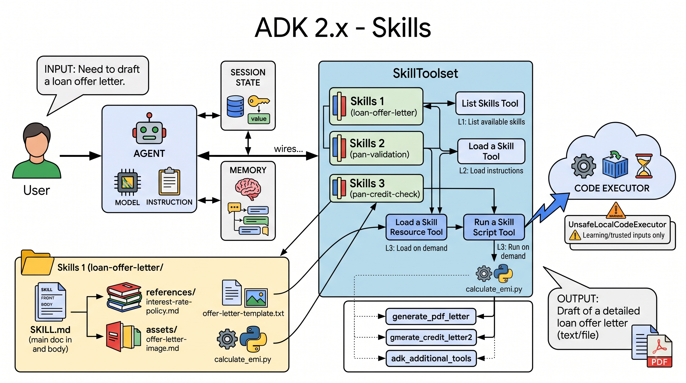

# Lesson 13: Skills — Packaging and Reusing Agent Capabilities

You've now got three ways to reuse agent behavior. `SequentialAgent`, `ParallelAgent`, and `LoopAgent` reuse a fixed shape of orchestration. `AgentTool`, from Lesson 11d, reuses a whole agent, its own model, its own instruction, its own tools, as one callable unit. This lesson covers a different kind of reuse `Skills`: skills package knowledge and procedure, not agents, so any agent can pick it up on demand, without that knowledge being hardcoded into its instruction ahead of time.

## Why this exists: the gap a shared tools.py doesn't close

Across `11a`, `11b`, and `12`, PAN validation, the credit bureau mock, and the EMI formula got written fresh into each lesson's own `tools.py`. The obvious fix is a shared module, one `validate_pan_format` function, imported into every agent that needs it. That solves code duplication. It doesn't solve two other things:

1. **Every agent still needs its own instruction text** explaining when and how to use that tool, as we have been doing in our instructions to our agents. The function is shared; the guidance around how to use it isn't.
2. **A plain function tool has no "only when relevant" mode.** Once `validate_pan_format` is in an agent's `tools=[]` list, it's sent to the model as one of its available functions on *every single turn*, whether that conversation ever mentions a PAN or not. There's no way to say "this agent knows PAN validation exists, but only pulls in the real detail once a PAN actually shows up", a plain function tool is either in the list or it isn't.

A Skill closes both gaps. The instructions live in one place, `SKILL.md`, not copied into every agent's own instruction. And they're discovered and loaded on demand, an agent with several skills available doesn't carry the full weight of all of them on every turn, only the ones it actually decides to use.



## What a Skill actually is

A Skill is a folder with a specific shape. Here's an example that actually uses every part of it, a skill for drafting a loan offer letter:

```
loan-offer-letter/
├── SKILL.md
├── references/
│   └── interest-rate-policy.md
├── assets/
│   └── offer-letter-template.txt
└── scripts/
    └── calculate_emi.py
```

- **`references/`**: additional documents the instructions can point to: longer background material, a detailed spec, anything too long to put directly in `SKILL.md` itself but worth having on hand. Here's an example `interest-rate-policy.md`:

```markdown
# Interest Rate Policy

Current base rates by loan type:
- Home loan: 8.5% per annum
- Car loan: 9.0% per annum
- Personal loan: 11.5% per annum

Applicants with a credit score above 750 qualify for a 0.25% discount
off the base rate for their loan type.
```

- **`assets/`**: non-text files the skill might need, a template, a sample file, an image, anything that isn't documentation and isn't executable code. Here, `offer-letter-template.txt`:

```
Dear {applicant_name},

We are pleased to offer you a {loan_type} loan of INR {loan_amount},
over a tenure of {tenure_months} months, at an interest rate of
{interest_rate}% per annum.

Your monthly EMI will be INR {emi}.

This offer is valid for 15 days from the date of this letter.
```

- **`scripts/`**: will hold real executable code, a `.py` file the model can actually run through `RunSkillScriptTool`, not just read. Here's an example `calculate_emi.py`, which computes the exact EMI needed to fill in the template above.

`SKILL.md` itself ties all three together, like this:

```markdown
---
name: loan-offer-letter
description: |
  Drafts a loan offer letter for an approved applicant, using the
  bank's current interest rate policy and a standard letter template.
  Use this once a loan has been approved and a formal offer needs to
  go out.
license: Apache-2.0
compatibility: Requires no external services; pure Python calculation.
metadata:
  author: your-team-name
  version: "1.0"
  adk_additional_tools:
    - generate_pdf_letter
  adk_inject_state: true
---

# Loan Offer Letter

1. Load references/interest-rate-policy.md to confirm the correct
   rate for this applicant's loan type and credit score.
2. Run scripts/calculate_emi.py to get the exact EMI for the approved
   loan amount, tenure, and rate.
3. Load assets/offer-letter-template.txt and fill in the applicant's
   name, loan amount, tenure, rate, and EMI.
4. Return the completed letter text.
```

### The fields, and which ones are actually required

| Field | Holds | Required? |
|---|---|---|
| `name` | kebab-case or snake_case, must match the directory name exactly | Yes |
| `description` | What the skill does and when to use it, the L1 text an agent sees before deciding whether to load anything further | Yes |
| `license` | A license identifier, useful if you're sharing the skill outside your own project | No |
| `compatibility` | Free text noting anything the skill depends on, or doesn't | No |
| `metadata` | A free-form dict for anything client-specific | No |

Two keys inside `metadata` mean something to ADK specifically: `adk_additional_tools`, a list of tool names that should become available once this skill is loaded, drawn from whatever `SkillToolset` was given via its own `additional_tools` parameter; and `adk_inject_state`, which, set to `true`, lets the instructions body use `{var}` interpolation from session state, the same `{key}` / `{key?}` syntax you've used in agent instructions since Lesson 6a.

> **NOTE:** One more field exists in the open `agentskills.io` spec, `allowed-tools`, but ADK 2.5.0, the version we are using, doesn't act on it at all. It's parsed and stored, nothing more. Worth knowing it exists if you ever see it in someone else's skill, not worth reaching for in your own.

> **NOTE:** `scripts/` is *not* where the tools named in `adk_additional_tools` live. Those are ordinary Python functions, defined in your own project's regular code, wherever you'd normally put them, and handed to `SkillToolset` directly through its own `additional_tools` parameter. `13a`'s `validate_pan_format`, for instance, lives in `credit_tools.py`, sitting outside the skill's folder entirely. `scripts/` holds something different: standalone programs the model runs as their own process, not functions your code already owns and calls directly.

The directory name has to match `name` in the frontmatter exactly, `loan-offer-letter/` for a skill named `loan-offer-letter`. That's not a style convention, ADK's own loader raises an error if they don't match.

## Why it's split into layers

The frontmatter and the body aren't loaded at the same time, and that's the actual point of a Skill, not an implementation detail.

- **L1**: just the frontmatter, `name` and `description`. Cheap enough that an agent can be shown dozens of these at once, just to figure out which ones might be relevant.
- **L2**: the full markdown body, `SKILL.md`'s instructions. Only loaded once a specific skill actually looks relevant.
- **L3**: anything in `references/`, `assets/`, or `scripts/`. Loaded later still, only if the instructions in L2 actually point at one of them.

An agent that has ten skills available never pays the cost of all ten's full instructions on every turn, it sees ten short descriptions, decides which one or two are relevant to the request in front of it, and only pulls in the full detail for those.

> **NOTE:** If you've used Claude, Claude Code, or Cowork's Skills feature, this format will look familiar, same idea of a `SKILL.md` file with layered detail. That's not a coincidence, but it's also not the same feature under a different name. ADK's Skills system is its own independent implementation, built around a shared open format (`agentskills.io`), not something wired into Anthropic's product surface. They converge on a similar shape because it's a good shape for this problem, not because one is built on top of the other.

## Where do the skills live in your ADK project structure?

ADK has no opinion on this. No CLI flag scans a folder for skills. No shipped registry reads them off your local disk either. ADK does ship one concrete `SkillRegistry`, called `GcpSkillRegistry`, but that's a *remote* registry, not something that looks at files on your machine. Wherever you point `load_skill_from_dir`, that's where a skill lives, ADK never goes looking on its own. Google's own shipped BigQuery skills follow this too, they sit inside the BigQuery tool's own package, next to the code that uses them, not in some project-wide skills directory.

That leaves the actual placement decision to you, and two shapes make sense depending on scope. A skill specific to one agent belongs under that agent's own folder, alongside that agent's own code. A skill genuinely reused across multiple agents belongs somewhere shared, `agents/common/skills/`, alongside this project's other shared code like `model_config.py`. Neither is enforced, both are just what makes sense for how widely a given skill actually gets used, and Lesson 13a builds the first case.

## How ADK wires this together

```python
from google.adk.tools.skill_toolset import SkillToolset
from google.adk.skills import load_skill_from_dir

pan_skill = load_skill_from_dir("skills/pan-validation")

root_agent = Agent(
    name="orchestrator",
    model=get_model("primary"),
    tools=[SkillToolset(skills=[pan_skill])],
)
```

`SkillToolset` doesn't hand the agent the skill's instructions directly. It hands the agent four tools of its own:

- **List skills**: see what's available, frontmatter only, L1.
- **Load a skill**: pull in one specific skill's full instructions, L2.
- **Load a skill resource**: pull in something from `references/` or `assets/`, L3.
- **Run a skill script**: execute something from `scripts/`, L3, and only if `SkillToolset` was given a `code_executor`.

The model decides when to call each of these, the same way it decides when to call any other tool. Nothing about a skill is force-fed into the conversation.

## The two flavors

**Instructions-only** means `SKILL.md`, nothing in `scripts/`, like this:

```markdown
---
name: pan-validation
description: Validates Indian PAN (Permanent Account Number) format.
---

# PAN Validation

A valid PAN is 10 characters: 5 uppercase letters, 4 digits, 1 uppercase
letter, e.g. ABCDE1234F.
```

The model loads the instructions, then does the actual work itself, reasoning through the steps. This particular example, note, has no `metadata` at all, no `adk_additional_tools`, which means it genuinely can't call any tool, the model works purely from what it just read. This is also what the wiring snippet above actually loads, `skills/pan-validation`.

Instructions-only can go further than this, though. Add `metadata.adk_additional_tools` to a skill's frontmatter, and loading the skill also activates specific function tools alongside the instructions, not just guidance to reason from:

```markdown
---
name: pan-credit-check
description: |
  Validates an Indian PAN (Permanent Account Number) and fetches a mock
  credit bureau report for that PAN.
metadata:
  adk_additional_tools:
    - validate_pan_format
    - get_credit_bureau_report
---

# PAN & Credit Check

1. Call `validate_pan_format` with the PAN as given.
2. If it's valid, call `get_credit_bureau_report` with the same PAN.
```

Same flavor, `SKILL.md` only, nothing in `scripts/`, just with the option to unlock real tools once loaded, rather than relying purely on the model's own reasoning.

**Scripted** adds a `scripts/` folder with actual executable code. Instead of reasoning through a task by following written-out steps, the model can call `RunSkillScriptTool` and have the skill's own script do the work directly, `loan-offer-letter`'s `scripts/calculate_emi.py`, shown in full earlier, is exactly this: a real script the model runs rather than a formula it reasons through by hand.

Here's what actually wiring that up looks like, for `loan-offer-letter`:

```python
from google.adk.code_executors.unsafe_local_code_executor import UnsafeLocalCodeExecutor
from google.adk.skills import load_skill_from_dir
from google.adk.tools.skill_toolset import SkillToolset

loan_offer_letter_skill = load_skill_from_dir("skills/loan-offer-letter")

root_agent = Agent(
    name="loan_processing_agent",
    model=get_model("primary"),
    tools=[
        SkillToolset(
            skills=[loan_offer_letter_skill],
            code_executor=UnsafeLocalCodeExecutor(),
        ),
    ],
)
```

Running a script needs somewhere to actually execute it, that's the `code_executor` parameter on `SkillToolset`, shown right there in the constructor. ADK ships several:

- **`UnsafeLocalCodeExecutor`**: runs whatever code the model generates directly in your own Python process. Zero setup, no Docker, no cloud account, works the moment you install ADK.
- **`ContainerCodeExecutor`**: runs code inside a Docker container, real isolation, needs Docker installed and configured.
- **`VertexAiCodeExecutor`**, **`AgentEngineSandboxCodeExecutor`**, **`GkeCodeExecutor`**: run code in a managed cloud sandbox, need actual GCP resources.

The name `UnsafeLocalCodeExecutor` isn't a scare tactic, it's accurate. It executes arbitrary, model-generated code in your own process, with no sandbox at all. For a script you wrote yourself, in a skill you control, running on your own machine while you're learning, that's a reasonable trade against the setup cost of Docker or a cloud sandbox. It is not something you'd point at untrusted input, or run anywhere near production, without real isolation underneath it. Lesson 13a uses `UnsafeLocalCodeExecutor` for exactly that reason, it's the only option that doesn't require you to set up infrastructure just to see a scripted skill work, and it says so again right where it's used.

In practice, this is the less common of the two, and worth being upfront about that rather than implying it's an equal, everyday choice. Plain function tools, whether gated behind a skill's `adk_additional_tools` metadata or sitting bare in `tools=[]`, are the default reach for most logic, no subprocess, no `code_executor` to configure, nothing to sandbox, easier to test and maintain. A scripted skill earns its place in a narrower set of situations: the skill is meant to be shared or distributed outside your own codebase, to a team, a different project, possibly people not using ADK or Python at all; the logic genuinely isn't Python, a shell script, a compiled binary, something bundled into the skill rather than ported; or the task needs real process isolation, something that could hang or crash without taking your agent's own process down with it. ADK's own naming is a signal here too: the only zero-setup `code_executor` is literally called `UnsafeLocalCodeExecutor`, not a framework's way of encouraging you to reach for scripted execution routinely.

In the next lesson we'll implement EMI calculation using this mechanism.

## Skills, `AgentTool`, and a shared `tools.py`, side by side

Three different things get called "reuse" in this series, and they're not interchangeable.

| | Reuses | Always present? | Own model? |
|---|---|---|---|
| Shared `tools.py` | Code (one function) | Yes, if it's in the `tools` list | No, runs inside the calling agent |
| `AgentTool` (11d) | A whole agent | Only when the model chooses to call it | Yes, its own model, own config, own isolation |
| Skill | Knowledge and procedure, optionally with bundled tools/scripts | Only the L1 description; full detail loaded on demand | No, it's not an agent at all |

A shared `tools.py` function is the right call when the logic is small, stable, and every agent that needs it should just always have it, no discovery step required, that's most of what 11a through 12 actually did. `AgentTool` is the right call when the reused thing needs its own model or configuration, or when a model has to decide, at runtime, whether to delegate to a genuinely separate agent. A Skill is the right call when what you're packaging is guidance, a procedure, domain knowledge, something an agent should be able to find and pull in only when it's relevant, without carrying it, or its instruction-bloat, on every single turn regardless.

## Can you combine all three on one agent?

Yes, freely, with no special handling. A plain function tool, an `AgentTool`, and a `SkillToolset` can all sit in the same `tools=[]` list at once:

```python
root_agent = Agent(
    name="orchestrator",
    model=get_model("primary"),
    instruction="...",
    tools=[
        calculate_something,               # plain function tool
        AgentTool(agent=some_specialist),  # a whole agent as a tool
        SkillToolset(skills=[some_skill]), # skills, discoverable on demand
    ],
)
```

This isn't three competing mechanisms you have to pick one of, it's three tools an agent's own list can hold at the same time, resolved the same way regardless of which kind each one is. `13a`'s demo agent already does part of this, a `SkillToolset` sitting in a `tools=[]` list on its own, nothing else in the way.

## In this lesson

You learned what a Skill is: a `SKILL.md` file with required `name` and `description` frontmatter, an instructions body, and optional `references/`, `assets/`, and `scripts/` folders, loaded in layers so an agent only pays for what it actually uses. You saw the two flavors, instructions-only and scripted, and what a scripted skill actually needs underneath, a `code_executor`, with `UnsafeLocalCodeExecutor` being the only zero-setup option and exactly why that name is a real warning, not a formality. You also saw where a Skill sits next to the two other reuse mechanisms this series has already covered, reusing code, reusing a whole agent, or reusing knowledge, each solving a genuinely different problem.

## In the next lesson

Lesson 13a builds this for real, three skills in one small demo agent. The simplest case first, a skill with nothing but instructions, no tools at all, just guidance the model reasons through on its own. Then an instructions-only skill that does gate a tool, PAN validation and the credit bureau mock, activated through `adk_additional_tools`. Then a scripted skill, running the EMI calculation as an actual executed script. After that, Lesson 13b covers the one mechanism this theory lesson describes but doesn't yet demonstrate, `load_skill_resource`, loading real content out of a skill's own `references/` and `assets/` folders.
