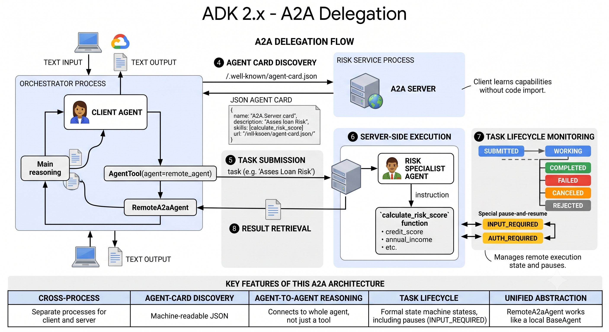

# Lesson 15: Agent-to-Agent Delegation (A2A)

`AgentTool` (Lesson 11d) reaches another agent, but one living in your own process, your own code, your own deploy. MCP (Lesson 14) reaches outside your process, but only for tools and data, not another agent's own reasoning. A2A (Agent-to-Agent) is the remaining case: reaching an entire other *agent*, one that lives in a genuinely separate process, possibly owned by a different team, possibly built on a completely different framework, over an open, cross-vendor protocol rather than an import or a direct function call.

## What A2A actually is

A2A defines a client-server relationship between agents, the same shape MCP defines between an agent and a tool server, but one level up. An A2A **server** exposes an agent's capabilities over the protocol. An A2A **client** connects to it and can send that agent tasks, and get results back, without needing to know or care what framework, or what language, the server side actually runs on.

The distinction from MCP is worth stating plainly, since the two protocols solve adjacent but different problems: MCP connects an agent to *tools and data it doesn't have*. A2A connects an agent to *another agent's own reasoning*, a full LLM-driven participant on the other end, not a function that returns a value.

So how does a client agent figure out what a remote agent is actually capable of, before it ever sends it a task?



## Consider this agent

Everything below is easier to follow anchored to one real agent, `risk_specialist_agent`, the same one already built in Lesson 13a:

```python
from google.adk.agents import Agent

from common.model_config import get_model

from .tools import calculate_risk_score

instruction = """You are a loan risk specialist. Given an applicant's
credit_score, annual_income, loan_amount, tenure_months, and
has_defaults, call `calculate_risk_score` with those five values and
report the risk_score, risk_band, and emi_to_income_ratio back.

Always call the tool. Never estimate the score yourself.
"""

risk_specialist_agent = Agent(
    name="risk_specialist_agent",
    model=get_model("primary"),
    description="Assesses loan risk given credit and applicant details, and returns a risk score and band.",
    instruction=instruction,
    tools=[calculate_risk_score],
)
```

Nothing new here, an ordinary agent with one tool, exactly the shape you've built many times. What's new is what happens to it next.

## Serving an agent over A2A

```python
from google.adk.a2a.utils.agent_to_a2a import to_a2a

app = to_a2a(risk_specialist_agent, host="localhost", port=8001)
```

That's the whole thing. `to_a2a()` takes the agent above and wraps it into a full A2A server, returning a Starlette app (the framework FastAPI itself is built on, not FastAPI directly). Run it with `uvicorn`, same as every other server in this series, and it exposes two things automatically: the actual task-execution endpoint, and an Agent Card discovery endpoint. Nothing about `risk_specialist_agent` itself needed to change to become servable this way.

So how does a client agent figure out what this now-running server can actually do, before it ever sends it a task?

## The Agent Card

An A2A server advertises what it can do through an **Agent Card**, a JSON document served at a standard, discoverable location, `/.well-known/agent-card.json`. It's A2A's equivalent of an MCP server's tool list, the thing a client reads before deciding to engage.

### Where this file actually lives

Despite how it looks, `/.well-known/agent-card.json` is **not a file path on your computer**. It's a URL path, the last part of an address like `http://localhost:8001/.well-known/agent-card.json`. The `/.well-known/` prefix is a real, standard convention (RFC 8615) for exactly this purpose, service metadata living at a predictable address, the same idea as `robots.txt` sitting at a website's root, nothing to do with your project's folder structure.

More importantly: in the normal flow, **you never create this file at all**. The `to_a2a()` call above already built one, in memory, directly from `risk_specialist_agent`, name, description, and skills extracted automatically, and it started serving that card as a live response the moment the server started. Nothing was saved anywhere.

### The fields, and which ones are actually required

| Field | Holds | Required? |
|---|---|---|
| `name` | Human-readable agent name | Yes |
| `description` | What the agent does | Yes |
| `url` | The endpoint clients should call to interact with it | Yes |
| `version` | The agent's own version string | Yes |
| `capabilities` | Whether it supports streaming, push notifications, state history | Yes |
| `default_input_modes` | MIME types the agent accepts by default, e.g. `text/plain` | Yes |
| `default_output_modes` | MIME types the agent returns by default | Yes |
| `skills` | The list of distinct capabilities this agent advertises | Yes |
| `provider` | Who runs this agent | No |
| `documentation_url` | Link to human-readable docs | No |
| `icon_url` | Link to an icon | No |
| `security_schemes` / `security` | What authentication this agent expects | No |
| `preferred_transport` | `JSONRPC`, `GRPC`, or `HTTP+JSON`, defaults to `JSONRPC` | No |
| `protocol_version` | Which A2A protocol version this agent supports, defaults to `0.3.0` | No |

### The exact card `to_a2a()` generates for `risk_specialist_agent`

```json
{
  "name": "risk_specialist_agent",
  "description": "Assesses loan risk given credit and applicant details, and returns a risk score and band.",
  "url": "http://localhost:8001/",
  "version": "1.0.0",
  "capabilities": {
    "streaming": false,
    "pushNotifications": false
  },
  "defaultInputModes": ["text/plain"],
  "defaultOutputModes": ["text/plain"],
  "skills": [
    {
      "id": "calculate_risk_score",
      "name": "calculate_risk_score",
      "description": "Assesses loan risk given credit and applicant details, and returns a risk score and band."
    }
  ]
}
```

Every field here is one of the eight required ones. Notice `name`, `description`, and `url` come straight from the agent object and the `host`/`port` given to `to_a2a()`, nothing here needed to be written by hand.

> **NOTE:** `skills` here, the field in the middle of that JSON, is A2A's own formal term for the discrete capabilities a remote agent advertises. It has nothing to do with ADK's Skills system from Lesson 13, same word, two unrelated concepts, defined by two different specifications. When you see "skills" in an Agent Card, it means "things this remote agent can do," not `SKILL.md` files.

### When you'd actually want a custom card instead

The auto-generated card only knows what it can read off the agent object itself, it has no way to know who runs this service, or where to point people for documentation, information that genuinely isn't part of an ADK `Agent`. `to_a2a()`'s `agent_card` parameter accepts a path to a hand-written JSON file for exactly this case:

```python
app = to_a2a(
    risk_specialist_agent,
    host="localhost",
    port=8001,
    agent_card="risk_specialist_agent_card.json",
)
```

That file would carry everything the auto-generated version has, plus fields nothing could infer automatically, `provider`, for instance:

```json
{
  "provider": {
    "organization": "Your Company Name",
    "url": "https://yourcompany.example"
  }
}
```

Reach for this when the auto-generated card is missing something you specifically want a consumer to see, not as a routine step, the automatic version covers the common case correctly on its own.

## Consuming a remote agent

Now imagine a second process, a loan orchestrator, wanting to reach the server above.

```python
from google.adk.agents.remote_a2a_agent import RemoteA2aAgent

remote_agent = RemoteA2aAgent(
    name="risk_assessment_agent",
    agent_card="http://localhost:8001/.well-known/agent-card.json",
)
```

`RemoteA2aAgent` accepts the card three different ways, confirmed directly from its own docstring: a direct `AgentCard` object, a URL to the card's JSON, or a local file path to one. The URL form is what you'll use most, point it at a running server's discovery endpoint and it resolves the rest.

The detail that matters most: `RemoteA2aAgent` is itself a `BaseAgent`. Everything Lesson 11d already taught applies to it completely unchanged, wrap it in `AgentTool` for a calling agent's model to decide when to delegate, or use it directly as a sub-agent in a `SequentialAgent`. The network boundary disappears once you have one, it behaves like any other agent from that point on.

```python
from google.adk.tools.agent_tool import AgentTool

orchestrator = Agent(
    name="loan_orchestrator",
    model=get_model("primary"),
    tools=[AgentTool(agent=remote_agent)],
)
```

> **NOTE:** `RemoteA2aAgent` is marked experimental directly in ADK's own source, the same honest flag `ResumabilityConfig` carried in Lesson 12. It works, and it's what this pair of lessons is built on, but treat it as something that may still change.

## The task lifecycle

Every request an A2A client sends becomes a task on the server side, and that task moves through a real, formal state machine, more nuanced than anything else in this series has needed. Eight states, each meaning something specific:

- **`SUBMITTED`**: the task has been received and accepted, but work hasn't started yet. This is the very first state, before the server has actually begun processing anything.
- **`WORKING`**: the agent is actively processing the task. For anything that takes real time, this is where a task sits while the remote agent is reasoning, calling its own tools, or waiting on something of its own.
- **`COMPLETED`**: the task finished successfully, and a result is available to read. A terminal state, nothing more happens to this task after this.
- **`FAILED`**: something went wrong on the server side, an error the agent couldn't recover from. Also terminal, and worth distinguishing from `REJECTED` below, this means the task was accepted and attempted, then failed partway through.
- **`CANCELED`**: the task was stopped before completing, either the client asked to cancel it, or the server had a reason to stop. Terminal, and distinct from `FAILED`, nothing necessarily went wrong, the task was just called off.
- **`REJECTED`**: the server declined to even start the task, before ever entering `WORKING`. This is the "I won't attempt this at all" response, an invalid request, something outside the agent's declared skills, or a request the server has a policy reason to refuse outright.
- **`INPUT_REQUIRED`**: the task paused mid-flight because the remote agent needs more information from the caller before it can continue. This is the protocol-level version of exactly the problem Lesson 12 solved by hand: a remote agent can genuinely pause, signal what it needs, and resume once that input arrives, the same shape as `ResumabilityConfig`'s pause-and-resume, except here it's native to the protocol rather than something built manually with a `LongRunningFunctionTool`. Not terminal, the task picks back up once the caller responds.
- **`AUTH_REQUIRED`**: the same pausing behavior as `INPUT_REQUIRED`, specifically for the case where the remote agent needs the caller to complete an authorization step before it can continue. Also not terminal.

Two states, `SUBMITTED` and `WORKING`, mark a task still in progress. Three, `COMPLETED`, `FAILED`, and `CANCELED`, are terminal, nothing more happens to the task once it reaches one of them. `REJECTED` is a special terminal case, one that never really started at all. And two, `INPUT_REQUIRED` and `AUTH_REQUIRED`, are genuinely paused, not finished, not failed, just waiting.

## A2A, MCP, `AgentTool`, and Skills, the full picture

Four lessons now have covered a way to reach beyond an agent's own fixed instruction, and this is the natural point to see all four side by side.

| | Reaches | Same process? | What's on the other end |
|---|---|---|---|
| Skills (13) | Knowledge and procedure | Yes | Instructions, optionally a script |
| `AgentTool` (11d) | A whole other agent | Yes | Another agent, your own code |
| MCP (14) | Tools and data | No | A tool server, not a reasoning agent |
| A2A (15) | A whole other agent | No | Another agent, possibly a different framework entirely |

A2A is `AgentTool`'s cross-process counterpart in exactly the way MCP is a plain function tool's cross-process counterpart. Same underlying idea, reach something that isn't yours, twice over, once for "another agent" and once for "a tool," each with an in-process and an out-of-process version.

## Real-world considerations

**Timeouts.** `RemoteA2aAgent` defaults to a 600-second timeout, generous, but a real number, not infinite. A remote agent that's slow, overloaded, or genuinely stuck will eventually cause the call to fail rather than hang forever, worth knowing before you're debugging why a request took ten minutes to return an error.

**An unreachable remote agent** fails the same way any HTTP client failure would, connection refused, DNS failure, timeout, nothing A2A-specific to it. Your own agent's error handling needs to account for the remote service simply not being there, the same discipline any distributed system needs.

**Auth for a remote agent** parallels `McpToolset`'s story from Lesson 14: the Agent Card's own `security_schemes` and `security_requirements` fields describe what a server expects, and `RemoteA2aAgent`'s constructor accepts a custom `httpx_client` (or, in the newer path, an `a2a_client_factory`) for supplying credentials, a bearer token, an API key, whatever the specific server requires, the same shape of problem, solved the same general way.

## In this lesson

You learned what A2A actually adds beyond `AgentTool` and MCP, the ability to reach a genuinely separate agent, in a separate process, described through a standard Agent Card rather than imported code. You saw both sides, `to_a2a()` for serving, `RemoteA2aAgent` for consuming, and the one detail that ties it back to everything already built: `RemoteA2aAgent` being a `BaseAgent` means nothing about orchestrating it is new, only what's actually on the other end of the connection is. You saw A2A's own `skills` field disambiguated from ADK's Skills system, and its task lifecycle, especially `INPUT_REQUIRED`, connected directly to the HITL problem Lesson 12 solved manually.

## In the next lesson

`15a` builds this for real: a loan orchestrator in one process, delegating risk assessment to a separately-run risk service in another, reusing the risk-scoring formula from 11a, 12, and 13a so the lesson's focus stays on the network boundary and Agent Card discovery, not a new domain formula.
