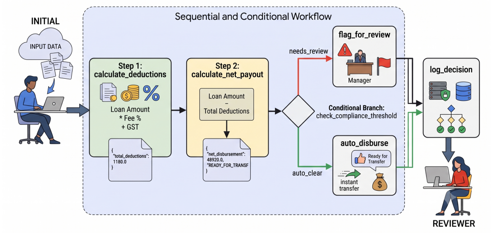

# Lesson 16: Graph-Based Workflows

Every multi-agent pattern you have built so far had a fixed shape. `SequentialAgent` runs its sub-agents in a straight line, one after another, no exceptions. `ParallelAgent` fans everything out at once, then waits. `LoopAgent` repeats the same block until something tells it to stop. All three are useful, and all three are rigid. You pick the shape before you write a line of logic, and the shape never changes while the agent runs.

There is a tempting alternative to all three, and it is worth naming so you can recognize it. Give one big `LlmAgent` every tool your business process could ever need, write one long instruction describing the whole job, and let the model figure out which tool to call and in what order. This works for a demo. It falls apart in production. The model's path through your tools becomes unpredictable, every extra tool in its context adds latency and cost, and when it eventually calls something in the wrong order, there is no clean place to look for why. You end up debugging a black box instead of a program.

`Workflow` is the answer to that trap. Instead of one agent guessing its way through everything, you draw the process out as a graph. The steps that are genuinely deterministic, fetching a record, validating a number, checking a threshold, become plain function nodes. They run instantly and cost nothing, because no LLM is involved in them at all. The steps that genuinely need judgment, summarizing a case, drafting a response, become agent nodes, and only those steps touch the model. The edges between nodes are explicit, written by you, so the path data takes through your system is something you decided, not something the model improvised. You get the model's reasoning exactly where you want it, and deterministic, auditable control everywhere else.

This split matters even more in BFSI than most domains. A loan does not always follow the same five steps in the same order. A transaction either looks fine and clears, or it looks odd and gets flagged, and those two paths do different things before they ever meet again. An AML investigation might need to loop back and re-check a customer's history after a new piece of evidence comes in. None of this fits neatly into "always run A then B then C," and none of it should be left to an LLM to improvise silently, not when the outcome is a real financial decision that needs to hold up to an auditor later. A graph gives you branching and convergence without giving up the paper trail.

`Workflow` is ADK 2.x's flagship new feature for exactly this reason. It is a true graph-based orchestrator, you describe a set of nodes and how they connect, some connections plain, some conditional, and the graph figures out at runtime which path to take, while every step it takes stays traceable back to an edge you wrote. If you have used LangGraph before, a lot of this will feel familiar, nodes, edges, state. If you have not, do not worry, these lessons don't assume you know LangGraph. We build everything from first principles.


## The Graph Workflows Vocabulary

When it comes to graphs, there are four team you should be intimately familiar with. So spend enough time to understand these cold.

**Node.** A node is one unit of work in the graph. Technically speaking, a node can be anything that inherits a `BaseNode` class. In most cases, you'll use plain Python functions annotated with `@node` decorator as your graph nodes. Incidentally, annotating with `@node` makes a plain Python function behave like a `BaseNode`.

However, a node can also wrap other things, such as an `Agent`, a tool, or even another `Workflow`! These don't require the `@node` decorator as they already inherit from `BaseNode` class.

A node takes some input, does something with it, and returns a result, which is passed down to the next node in the workflow or back to the user as the result.

`START` is a special node provide by the ADK. It is a fixed sentinal that indicates the marks the entry point of your graph. **You do nothing with `START`**. Every graph must begin with `START`. **However, unlike LangGraph, there is no `END` sentinal that marks the end of the graph**.

**Edge.** An edge is a connection from one node to another. The _simplest edge_ just means "when this node finishes, run that node next." A _conditional edge_ means "when this node finishes, look at which route it chose, and run whichever node matches that route." Edges are what turn a pile of nodes into an actual graph. Values returned from a node flow down the edges to the next node in sequence.

**Graph.** The graph is the full map, every node and every edge, considered together. You do not usually build a `Graph` object directly. You hand `Workflow` a list of edges, and it builds the graph for you.

**Workflow.** `Workflow` is the object that actually runs the graph. You give it a name and a list of edges. It works out the nodes from those edges automatically, validates that the graph makes sense, and knows how to execute it, start to finish, following whichever path the data takes.

## Getting data in and out of a graph

A graph is not useful if you cannot feed it data and read back a result. Here is exactly how both directions work.

**Getting data into the workflow:** When you run a `Workflow`, by using an ADK provided helper function `InMemoryRunner.run_debug(...)` for example, whatever you pass in becomes the `node_input` of the first node or nodes connected to `START`. `run_debug()` can accept only a string (or a list of strings) as input. That string can be a JSON string or any plain string that the first node(s) parse data out of. However, downstream nodes do not necessarily have to exchange data as strings. Nodes within the graph can exchange data as a JSON object, a Python dict, a custom object - whatever format the next node expects!

There is a second way to get data into a graph, via context state: `ctx.state`. This is the same context we saw way back in Lesson 7. `ctx.state` is the state dictionary that every node in the graph sees and can read from and write to. Unlike `node_input`, which only flows from one node to the very next one, `ctx.state` is visible everywhere, for the whole run.

You initialize the context state before calling the graph, just like we initiized context state before calling the Agent in lesson `6a`.

**Getting a result out.** `InMemoryRunner.run_debug(...)` returns a list of events (`list[Event]`) as it progresses through the various nodes. The _last event_ in that list carries the output of whichever node the graph finished on. `events[-1].output` is the result your graph computed. 

## How a node reads its inputs

Every node function can declare up to three kinds of parameters, and the framework binds each one differently:

- `ctx`, if you declare it, gives you the node's execution context. You use it to set `ctx.route` for conditional branching and to read/write variables to context.
- `node_input`, if you declare it, gives you whatever the previous node returned, or the original input if this is the first node after `START`.
- Any other named parameter you declare gets its value from `ctx.state`. Declare a parameter called `manual_review_threshold`, and the framework looks for a key named `manual_review_threshold` in `ctx.state` and passes its value in. You do not write any code linking the two, the name is the whole connection. You will see this directly below, in the node that decides whether a loan needs manual review.

A single node can use all three at once. You will see this directly in Part 4, in the node that decides whether a loan needs manual review.

## Building the graph

Let's go step by step. We start with the simplest possible shape, a plain linear chain, so the mechanics are visible with nothing else competing for your attention. Once that is running, we add a conditional branch on top of it, so you see routing and state at the same time.


### Stage 1: building a Sequential chain

We'll build a tiny loan disbursement calculation. Usually when one applies for a loan of `X` (rupees or dollars), the bank does not disburse the full `X` amount. It retains a small fee `F` (and deducts taxes `T` due on `F`). So the amount you receive `A = X - (F + T)`.

We'll build this workflow as a simple two-step sequential chain: 

* The _first step_ takes the loan amount you requested `X` the fee percentage and GST (tax) rate and computes the total value to be deducted (i.e. `F + T`).
* The _second step_  takes that calculation and works out what the borrower actually receives (i.e. `A = X - (F + T)`)

I know this is a bit contrived. You can always perform the entire calculation in 1 step, but breaking it apart like this helps us illustrate how we can build a 2 step sequence. So bear with me please.

#### Create the code

Create the following folder/directory structure for this example. Since we don't have any Agents yet, this structure is much simpler than what we are accustomed to.

```
adk2_tutorial/
└── agents/
    └── lesson16_workflow_basics/
        └── stage1_linear.py
```

Create the `agents/lesson16_workflow_basics/stage1_linear.py` file and add the following code to the file.

**Step1 - define the nodes:** Add these two functions to `stage1_linear.py` file. These are function nodes, wrapped in a familiar `@node` decorator. We have added extra `print()` calls to display flow through the graph - in a business workflow, these could be `log()` messages or completely omitted.

```python
# Step1 : define the nodes of the graph

import asyncio
import json
from google.adk.workflow import START, Workflow, node

# Step 1: calculated the deductions
@node
async def calculate_deductions(ctx, node_input: str) -> dict:
    print("  [calculate_deductions] node running")
    print(f"      Got input: {node_input}")
    params = json.loads(node_input)
    loan_amount = params["loan_amount"]
    fee_percentage = params["fee_percentage"]
    gst_rate = params["gst_rate"]

    base_fee = loan_amount * (fee_percentage / 100)
    tax = base_fee * (gst_rate / 100)
    total_deductions = base_fee + tax

    resp = {"loan_amount": loan_amount, "total_deductions": total_deductions}
    print(f"        Returning: {resp}")
    return resp

# Step 2: calculate net payout amount
@node
async def calculate_net_payout(ctx, node_input: dict) -> dict:
    print("  [calculate_net_payout] node running")
    print(f"      Got input: {node_input}")
    loan_amount = node_input["loan_amount"]
    total_deductions = node_input["total_deductions"]
    net_disbursement = loan_amount - total_deductions

    resp = {"net_disbursement": net_disbursement, "status": "READY_FOR_TRANSFER"}
    print(f"        Returning: {resp}")
    return resp
```

**Step 2: build the workflow** Two nodes are not a graph until something wires them together. That something is `Workflow`. Add these lines to the `stage1_linear.py` file.

```python
# Step 2: build the workflow 
sequential_flow = Workflow(
    # give any unique name of your choice
    name="sequential_flow",
    # this is how you define the sequential workflow
    # any workflow ALWAYS begins with START
    edges=[(START, calculate_deductions, calculate_net_payout)],
)
```

`START` is a fixed sentinel value, not something you create, that marks the entry point of the graph. Every graph you build in this lesson begins with an edge from `START` to whichever node should run first.

Look closely at that `edges` list. `(START, calculate_deductions, calculate_net_payout)` is a chain, read left to right: start here, then this node, then that node. `Workflow` turns that tuple into two edges for you, `START -> calculate_deductions` and `calculate_deductions -> calculate_net_payout`. You never had to construct an `Edge` object by hand.

**Step3 - run the workflow:** To actually execute a graph, wrap the `Workflow` object in a `Runner` and call it. ADK supplies a convenience function - `InMemoryRunner.run_debug(...)` - to do exactly that.

> 📌 **NOTE:** `run_debug()` is a convenience function to test workflows, much like `adk web` and `adk run` we have used so far to test our agents. It _should NOT be used in Production_. It handles session creation and event streaming for you.  

Add the following lines to our `stage1_linear.py` file. We are departing slightly from our usual coding convention of using a separate `main.py` file. Since these first-few workflows are very simple workflows, we've added the `main()` function to the same Python file that defines the workflow.

```python
# Step3: run the workflow
from google.adk.runners import InMemoryRunner

async def main() -> None:
    runner = InMemoryRunner(agent=sequential_flow)
    events = await runner.run_debug(
        # our JSON string that forms the input to our Workflow
        '{"loan_amount": 50000, "fee_percentage": 2.0, "gst_rate": 18.0}',
        # suppress verbose logs
        quiet=True,
    )
    print("Final result:", events[-1].output)

if __name__ == "__main__":
    asyncio.run(main())
```

`run_debug` returns a `list[Event]`. The last event in that list carries the output of whichever node the graph finished on. `events[-1].output` is your practical result, the actual thing your graph computed.

We have used `quiet=True` to suppress internal log messages from the ADK. If we omit this, it defaults to `quiet=False`, which logs every detail to console - every session, every event it streams - the works! That makes finding our outputs very difficult. We'll continue to use `quiet=True` to suppress all ADK messages, so we can clearly see our print statements.

#### Run the code

Run the following commands in a new terminal from the project root folder (`adk2_tutorial`):

```bash
# activate your local environment
source .venv/bin/activate
# run the python script
uv run agents/lesson16_workflow_basics/stage1_linear.py
```

You will see this output in your terminal:

```
  [calculate_deductions] node running
      Got input: {"loan_amount": 50000, "fee_percentage": 2.0, "gst_rate": 18.0}
        Returning: {'loan_amount': 50000, 'total_deductions': 1180.0}
  [calculate_net_payout] node running
      Got input: {'loan_amount': 50000, 'total_deductions': 1180.0}
        Returning: {'net_disbursement': 48820.0, 'status': 'READY_FOR_TRANSFER'}
Final result: {'net_disbursement': 48820.0, 'status': 'READY_FOR_TRANSFER'}
```

Read that output against the graph you just built: 

* `calculate_deductions` runs first because it is the node connected to `START`. It calculates the total deductions (base fee = 2% of 50,000 = 1,000 and 18% GST on 1,000 is 180, so total deductions = 1000+180 = 1180), prints our messages, and forwards to next node. 
* `calculate_net_payout` runs second, because thats the next node in the sequence.the edge you declared points there next. It calculates net disbursement (50,000 - 1180 = 48,820), prints our message and returns the final result from graph (as this is the final node in the graph).

Two nodes, one straight line, and the print functions we added proves that these nodes run in the right sequence (and also validates the calculations!).

That is the complete linear chain for you - you can have as many "streps" running one after another in the sequential chain. We had just two our case, which I admit is a bit contrived for this simple calculation.

### Stage 2: adding a conditional branch

A real disbursement process does not stop at "ready for transfer. If the disbursal amount is above a certain pre-defined threshold, it needs a human to sign off before the money moves. Disbursals below the threshold clear automatically.

That `if-else` logic cannot be expesses by a stright sequential flow - it requires a _conditional branch_. The sequential flow will calculate the disbursal amount and _land_ at the _conditional node_, which then decides if flow goes to the _auto clear_ edge or the _needs review_ edge depending on how the disbursal amount compares to the threshold.

A _conditional node_ can have any number of edges going out from it. It depends on how _convoluted_ your logic is 😊. If your logic has 10 `if-else` branches, then there will be 10 edges coming out from the _conditional node_.

The _conditional node_ is just another annotated (with `@node` decorator) function. That functions **must have** the `ctx` parameter and any more parameters you decide. We set the `ctx.route` attribute to the value of the _edge_ we want our graph to take depending on our business logic.

Here is a quick example of _routing logic_:

```python
# ctx.route is a string value you define
# this string value "names" a branch
if net_disbursement > manual_review_threshold:
    ctx.route = "needs_review"
else:
    ctx.route = "auto_clear"
```

**The nodes.** We define 4 new nodes - all annotated functions (with the `@node` annotation as before):

* a `check_compliance_threshold` node, which is our _conditional node_, that branches out to 2 nodes depending on the value of the disbursal amount viz-a-viz the threshold.
* a `flag_for_review` node, which _handles_ the review logic. In an actual business workflow, this would execute appropriate review steps. In our case it's just a dummy function that logs a message, sets the status as "pending review" and forwards to next node.
* a `auto_disburse` node, which _handles_ the auto-approval. In an actual business workflow, this function would execute the actual auto-approve steps. In our case, it's another dummy function that logs a message, sets status to "auto approve" and forwards to next node.
* a `log_decision`, which is the node to which both the above branches forwards to. It's another dummy node in our case that logs a message. It is also the last node in our workflow.

#### Create the code

Create the following folder/directory structure for this example. For this example, we are just adding a new Python file `stage2_branch.py` in the same folder as the example above. We will be _appending_ a branching workflow to the end of the _sequential worflow_ from our previous example.

```
adk2_tutorial/
└── agents/
    └── lesson16_workflow_basics/
        ├── stage1_linear.py
        └── stage2_branch.py
```

Create the `agents/lesson16_workflow_basics/stage2_branch.py` file and add the following code to the file.

**Step1 - define the nodes:** Add the 2 nodes from the `stage1_linear.py` file + 4 new nodes for the branching logic:

```python
# Step1 : define the nodes of the graph
import asyncio
import json
from google.adk.workflow import START, Workflow, node


# ------------------------------------------------------
# 2 old nodes for the sequential logic
# ------------------------------------------------------
@node
async def calculate_deductions(ctx, node_input: str) -> dict:
    print("  [calculate_deductions] node running")
    print(f"      Got input: {node_input}")
    params = json.loads(node_input)
    loan_amount = params["loan_amount"]
    fee_percentage = params["fee_percentage"]
    gst_rate = params["gst_rate"]

    base_fee = loan_amount * (fee_percentage / 100)
    tax = base_fee * (gst_rate / 100)
    total_deductions = base_fee + tax

    resp = {"loan_amount": loan_amount, "total_deductions": total_deductions}
    print(f"        Returning: {resp}")
    return resp

@node
async def calculate_net_payout(ctx, node_input: dict) -> dict:
    print("  [calculate_net_payout] node running")
    print(f"      Got input: {node_input}")
    loan_amount = node_input["loan_amount"]
    total_deductions = node_input["total_deductions"]
    net_disbursement = loan_amount - total_deductions

    resp = {"net_disbursement": net_disbursement, "status": "READY_FOR_TRANSFER"}
    print(f"        Returning: {resp}")
    return resp

# ------------------------------------------------------
# 4 new nodes for the branching logic
# ------------------------------------------------------

@node
async def check_compliance_threshold(
    ctx, node_input: dict, manual_review_threshold: float
) -> dict:
    print("  [check_compliance_threshold] node running")
    net_disbursement = node_input["net_disbursement"]
    print(
        f"      Got input: {node_input} - manual_review_threshold: {manual_review_threshold} - net_disbursement: {net_disbursement}"
    )

    if net_disbursement > manual_review_threshold:
        print("      Net disbursement > manual review limit, routing to 'needs_review'")
        ctx.route = "needs_review"
    else:
        print("      Net disbursement <= manual review limit, routing to 'auto_clear'")
        ctx.route = "auto_clear"

    print(f"        Returning: {node_input}")
    return node_input

@node
async def flag_for_review(node_input: dict) -> dict:
    print("  [flag_for_review] node running")
    node_input["status"] = "PENDING_MANUAL_REVIEW"
    return node_input

@node
async def auto_disburse(node_input: dict) -> dict:
    print("  [auto_disburse] node running")
    node_input["status"] = "AUTO_DISBURSED"
    return node_input

@node
async def log_decision(node_input: dict) -> dict:
    print("  [log_decision] node running")
    return node_input
```

`check_compliance_threshold` uses all three parameter binding rules from Part 3 in one function. `ctx` and `node_input` are the reserved names. `manual_review_threshold` is not reserved, so the framework looks for a key of that exact name in `ctx.state`, finds it, and hands it to the function. You never pass that value explicitly. The name is the entire connection. As before, we have added a lot of `print` statements just to show progress through the workflow.

Setting `ctx.route` is how this node makes its decision visible to the graph. It does not call `flag_for_review` or `auto_disburse` directly. It just states which route it is taking, and the graph looks at that value to decide where to go next.

**Step2 - define the workflow** This is how we wire all the nodes into our workflow. Add this code to `stage2_branch.py` file.

```python
loan_disbursement_workflow = Workflow(
    # any name of your choice (must follow Python variable naming convention)
    name="loan_disbursement_workflow",
    # wire the edges together
    edges=[
        # the sequential part, ending in our conditional node
        (START, calculate_deductions, calculate_net_payout, check_compliance_threshold),
        # the branch logic from our conditional node to 2 edges
        # here is where we use the values we assigned to ctx.route
        # inside the check_compliance_threshold functions
        (check_compliance_threshold, {
            "needs_review": flag_for_review, 
            "auto_clear": auto_disburse
        }),
        # finally, both branches terminate in the log_decision node
        (flag_for_review, log_decision),
        (auto_disburse, log_decision),
    ],
)
```

This is how the workflow looks:



The second line is new syntax: a dictionary in place of a plain node. `{"needs_review": flag_for_review, "auto_clear": auto_disburse}` is a routing map. It tells `Workflow` to build two conditional edges off `check_compliance_threshold`, one that only fires when `ctx.route == "needs_review"`, one that only fires when `ctx.route == "auto_clear"`. Whichever branch runs, both `flag_for_review` and `auto_disburse` lead into the same `log_decision` node, so the graph converges back to a single point no matter which path it took.

**Step3: run the workflow** This graph needs `manual_review_threshold` in `ctx.state` before it runs, and nothing in the graph itself sets that value, so it has to be seeded on the session ahead of time. You should be familiar with the code that initializes session variables, back from Lesson 6.

```python
# Step3: run the workflow
from google.adk.runners import InMemoryRunner

# helper function to run workflow, given loan amount - fees + GST rate is same!
async def run_loan(runner: InMemoryRunner, session_id: str, loan_amount: float) -> None:
    # first create a session because we need to seed the context with
    # manual review limit for the compliance check node
    await runner.session_service.create_session(
        app_name=runner.app_name,
        user_id="lesson16_user",
        session_id=session_id,
        state={"manual_review_threshold": 1_000_000},
    )

    payload = json.dumps(
        {"loan_amount": loan_amount, "fee_percentage": 2.0, "gst_rate": 18.0}
    )
    
    events = await runner.run_debug(
        payload,
        quiet=True,
        session_id=session_id,
        user_id="lesson16_user",
    )
    print(f"Final result for loan_amount={loan_amount}:", events[-1].output)


async def main() -> None:
    runner = InMemoryRunner(agent=loan_disbursement_workflow)

    print("Run 1: a loan that clears automatically")
    await run_loan(runner, session_id="run_1", loan_amount=50_000)

    print("\nRun 2: a loan that trips manual review")
    await run_loan(runner, session_id="run_2", loan_amount=5_000_000)


if __name__ == "__main__":
    asyncio.run(main())
```

Get the `user_id` and `session_id` right on both calls. If they do not match exactly between `create_session` and `run_debug`, you are not talking to the session you just seeded, you are talking to a brand new empty one, and `manual_review_threshold` will not be there when the graph looks for it.

#### Run the code

Run the following commands in a new terminal from the project root folder (`adk2_tutorial`):

```bash
# activate your local environment
source .venv/bin/activate
# run the python script
uv run agents/lesson16_workflow_basics/stage2_branch.py
```

You will see this:

```
Run 1: a loan that clears automatically
  [calculate_deductions] node running
      Got input: {"loan_amount": 50000, "fee_percentage": 2.0, "gst_rate": 18.0}
        Returning: {'loan_amount': 50000, 'total_deductions': 1180.0}
  [calculate_net_payout] node running
      Got input: {'loan_amount': 50000, 'total_deductions': 1180.0}
        Returning: {'net_disbursement': 48820.0, 'status': 'READY_FOR_TRANSFER'}
  [check_compliance_threshold] node running
      Got input: {'net_disbursement': 48820.0, 'status': 'READY_FOR_TRANSFER'} - manual_review_threshold: 1000000.0 - net_disbursement: 48820.0
      Net disbursement <= manual review limit, routing to 'auto_clear'
        Returning: {'net_disbursement': 48820.0, 'status': 'READY_FOR_TRANSFER'}
  [auto_disburse] node running
  [log_decision] node running
Final result for loan_amount=50000: {'net_disbursement': 48820.0, 'status': 'AUTO_DISBURSED'}

Run 2: a loan that trips manual review
  [calculate_deductions] node running
      Got input: {"loan_amount": 5000000, "fee_percentage": 2.0, "gst_rate": 18.0}
        Returning: {'loan_amount': 5000000, 'total_deductions': 118000.0}
  [calculate_net_payout] node running
      Got input: {'loan_amount': 5000000, 'total_deductions': 118000.0}
        Returning: {'net_disbursement': 4882000.0, 'status': 'READY_FOR_TRANSFER'}
  [check_compliance_threshold] node running
      Got input: {'net_disbursement': 4882000.0, 'status': 'READY_FOR_TRANSFER'} - manual_review_threshold: 1000000.0 - net_disbursement: 4882000.0
      Net disbursement > manual review limit, routing to 'needs_review'
        Returning: {'net_disbursement': 4882000.0, 'status': 'READY_FOR_TRANSFER'}
  [flag_for_review] node running
  [log_decision] node running
Final result for loan_amount=5000000: {'net_disbursement': 4882000.0, 'status': 'PENDING_MANUAL_REVIEW'}
```

Watch which node prints in each run. In Run 1, `auto_disburse` fires and `flag_for_review` never does. In Run 2, it is the other way round. Same graph, same code, `check_compliance_threshold` genuinely decided which path ran, and `log_decision` prints in both runs regardless, because that is where the two branches converge. Loan amount 50,000 lands `net_disbursement` at 48,820, well under the 1,000,000 limit, so it routes to `auto_clear`. Loan amount 5,000,000 lands `net_disbursement` at 4,882,000, over the limit, so it routes to `needs_review`.

That is the complete conditional branch.

I must admit, these examples are a bit contrived, but simple enough to illustrate how workflows ate built in ADK 2.0. Here are some real examples of BFSI workflows that can be modeled as sequential + conditional workflows:

1. **Commercial Loan Underwriting**: Financial Extraction -> Ratio & Debt Service Calculations -> Covenant Compliance & Risk Analysis -> LOS Dispatch & Store.
2. **Auto Insurance First Notice of Loss (FNOL) Adjudication**: Loss Intake & Severity Triage -> Coverage & Deductible Engine -> Damage Consistency & Fraud Analysis -> Settlement Router / Adjuster Task Creator

## What's next

This lesson covered two shapes: a sequential chain and a conditional branch. Those are the two most basic shapes a graph can take, but not the only ones. `Workflow` also supports _fanning_ work out across several nodes at once and _joining_ the results back together, _feedback loops_ where a node can send work backward for another pass, _hierarchical graphs_ where one workflow orchestrates others, and _human-in-the-loop_ patterns where a graph pauses mid-run and waits for a person before continuing. Later lessons in this arc build each of those properly, with the same care we just put into a chain and a branch.

Every node in this lesson has also been a plain function. That covers a lot of real work, but it is not the whole story. Lesson 16a brings a full `Agent` into the graph as a node in its own right, reasoning over the data flowing past it rather than just computing on it deterministically. You will see the difference between running that agent for a single exchange versus letting it carry on a longer task, and how to pin down exactly what shape of data goes in and comes out of an LLM-backed node, the same way `input_schema` and `output_schema` already shape the function nodes you just built. The graph mechanics do not change. What changes is what a node is allowed to be.
