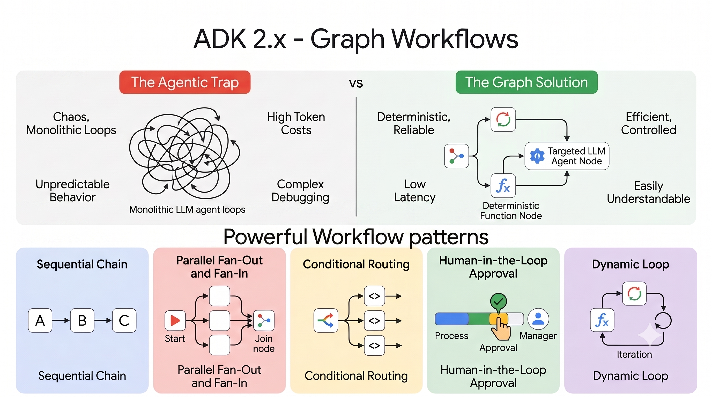
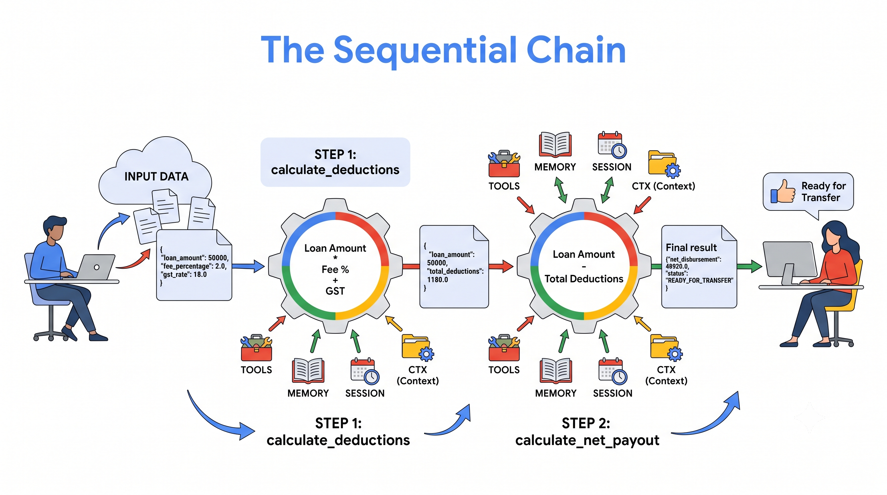

# Lesson 16: Graph-Based Workflows

Every multi-agent pattern you have built so far had a fixed shape. `SequentialAgent` runs its sub-agents in a straight line, one after another, no exceptions. `ParallelAgent` fans everything out at once, then waits. `LoopAgent` repeats the same block until something tells it to stop. All three are useful, and all three are rigid. You pick the shape before you write a line of logic, and the shape never changes while the agent runs.

There is a tempting alternative to all three, and it is worth naming so you can recognize it. Give one big `LlmAgent` every tool your business process could ever need, write one long instruction describing the whole job, and let the model figure out which tool to call and in what order. This works for a demo. It falls apart in production. The model's path through your tools becomes unpredictable, every extra tool in its context adds latency and cost, and when it eventually calls something in the wrong order, there is no clean place to look for why. You end up debugging a black box instead of a program.

`Workflow` is the answer to that trap. Instead of one agent guessing its way through everything, you draw the process out as a graph. The steps that are genuinely deterministic, fetching a record, validating a number, checking a threshold, become plain function nodes. They run instantly and cost nothing, because no LLM is involved in them at all. The steps that genuinely need judgment, summarizing a case, drafting a response, become agent nodes, and only those steps touch the model. The edges between nodes are explicit, written by you, so the path data takes through your system is something you decided, not something the model improvised. You get the model's reasoning exactly where you want it, and deterministic, auditable control everywhere else.

This split matters even more in BFSI than most domains. A loan does not always follow the same five steps in the same order. A transaction either looks fine and clears, or it looks odd and gets flagged, and those two paths do different things before they ever meet again. An AML investigation might need to loop back and re-check a customer's history after a new piece of evidence comes in. None of this fits neatly into "always run A then B then C," and none of it should be left to an LLM to improvise silently, not when the outcome is a real financial decision that needs to hold up to an auditor later. A graph gives you branching and convergence without giving up the paper trail.

`Workflow` is ADK 2.x's flagship new feature for exactly this reason. It is a true graph-based orchestrator, you describe a set of nodes and how they connect, some connections plain, some conditional, and the graph figures out at runtime which path to take, while every step it takes stays traceable back to an edge you wrote. This is a big enough idea that it gets its own arc in this series, Lesson 16 through 16l, ending in a full AML investigation build. Everything in that arc rests on the vocabulary and mechanics in this lesson, so take your time here. Get this right, and the rest of the arc reads like natural extensions of something you already understand.



One more thing before we start. If you have used LangGraph before, a lot of this will feel familiar, nodes, edges, state. If you have not, do not worry, nothing here assumes it. We build everything from first principles.

## The Graph Workflows Vocabulary

Four terms carry this whole lesson. Get comfortable with them now, because every later lesson in this arc assumes you already have them.

**Node.** A node is one unit of work in the graph. Most of the nodes you will write are plain Python functions, wrapped with the `@node` decorator. A node can also wrap other things, an `Agent`, a tool, even another `Workflow`, but for this lesson, every node is a function. A node takes some input, does something with it, and returns a result. That is the whole contract.

**Edge.** An edge is a connection from one node to another. The _simplest edge_ just means "when this node finishes, run that node next." A _conditional edge_ means "when this node finishes, look at which route it chose, and run whichever node matches that route." Edges are what turn a pile of nodes into an actual graph.

**Graph.** The graph is the full map, every node and every edge, considered together. You do not usually build a `Graph` object directly. You hand `Workflow` a list of edges, and it builds the graph for you.

**Workflow.** `Workflow` is the object that actually runs the graph. You give it a name and a list of edges. It works out the nodes from those edges automatically, validates that the graph makes sense, and knows how to execute it, start to finish, following whichever path the data takes.

There is one more name you need before any of this can run: `START`. It is a fixed sentinel value, not something you create, that marks the entry point of the graph. Every graph in this lesson begins with an edge from `START` to whichever node should run first.

## Getting data in and out of a graph

A graph is not useful if you cannot feed it data and read back a result. Here is exactly how both directions work.

**Getting data in.** When you run a `Workflow` through the normal `InMemoryRunner.run_debug(...)` helper, whatever you pass in becomes the `node_input` of the first node or nodes connected to `START`. In this lesson, that is a JSON string. It does not have to be a string forever, once the graph is running, node to node, data can be a dict, a list, a custom object, whatever the next node expects. The string-only restriction is a `run_debug` restriction because it accepts only a string, or a list of strings, as input. Once your data is inside the graph, that restriction disappears completely.

There is a second way data gets into a graph: `ctx.state`. This is a dictionary that every node in the graph can read from and write to. Unlike `node_input`, which only flows from one node to the very next one, `ctx.state` is visible everywhere, for the whole run. You seed it once, before the graph starts, by setting state on the session the graph runs against. You will see exactly how in Part 4.

**Getting a result out.** `InMemoryRunner.run_debug(...)` returns a `list[Event]`. The _last event_ in that list carries the output of whichever node the graph finished on. `events[-1].output` is your practical result, the actual thing your graph computed. Always capture it and print it. Never let a graph's return value disappear silently.

## How a node reads its inputs

Every node function can declare up to three kinds of parameters, and the framework binds each one differently:

- `ctx`, if you declare it, gives you the node's execution context. You use it to set `ctx.route` for conditional branching, among other things.
- `node_input`, if you declare it, gives you whatever the previous node returned, or the original input if this is the first node.
- Any other named parameter you declare gets its value from `ctx.state`. Declare a parameter called `manual_review_limit`, and the framework looks for a key named `manual_review_limit` in `ctx.state` and passes its value in. You do not write any code linking the two, the name is the whole connection. You will see this directly below, in the node that decides whether a loan needs manual review.

A single node can use all three at once. You will see this directly in Part 4, in the node that decides whether a loan needs manual review.

## Building the graph

Let's go step by step. We start with the simplest possible shape, a plain linear chain, so the mechanics are visible with nothing else competing for your attention. Once that is running, we add a conditional branch on top of it, so you see routing and state at the same time.



### Stage 1: building a Sequential chain

**What we are building.** A tiny loan disbursement calculation, two steps. The first step takes a loan amount, a fee percentage, and a GST rate, and works out how much gets deducted. The second step takes that and works out what the borrower actually receives. A borrower gets the net amount disbursed after deducting the fees & tax on fees.

**The nodes.** Here are the two functions, each wrapped with `@node`. We have added `print()` functions to display the flow through the graph. It's not part of the node logic.

```python
import json
from google.adk.workflow import START, Workflow, node

@node
async def calculate_deductions(ctx, node_input: str) -> dict:
    print("  [calculate_deductions] node running")
    print(f"      Got input: {node_input}")
    params = json.loads(node_input)
    loan_amount = params["loan_amount"]
    fee_percentage = params["fee_percentage"]
    gst_rate = params["gst_rate"]

    base_fee = loan_amount * (fee_percentage / 100)
    tax = base_fee * (gst_rate / 100)
    total_deductions = base_fee + tax

    resp = {"loan_amount": loan_amount, "total_deductions": total_deductions}
    print(f"        Returning: {resp}")
    return resp


@node
async def calculate_net_payout(ctx, node_input: dict) -> dict:
    print("  [calculate_net_payout] node running")
    print(f"      Got input: {node_input}")
    loan_amount = node_input["loan_amount"]
    total_deductions = node_input["total_deductions"]
    net_disbursement = loan_amount - total_deductions

    resp = {"net_disbursement": net_disbursement, "status": "READY_FOR_TRANSFER"}
    print(f"        Returning: {resp}")
    return resp
```

**The graph.** Two nodes are not a graph until something wires them together. That something is `Workflow`.

```python
sequential_flow = Workflow(
    name="sequential_flow",
    edges=[(START, calculate_deductions, calculate_net_payout)],
)
```

`START` is a fixed sentinel value, not something you create, that marks the entry point of the graph. Every graph you build in this lesson begins with an edge from `START` to whichever node should run first.

Look closely at that `edges` list. `(START, calculate_deductions, calculate_net_payout)` is a chain, read left to right: start here, then this node, then that node. `Workflow` turns that tuple into two edges for you, `START -> calculate_deductions` and `calculate_deductions -> calculate_net_payout`. You never had to construct an `Edge` object by hand.

**Running it.** To actually execute a graph, wrap it in a `Runner` and call it. `InMemoryRunner.run_debug(...)` is the fastest way to do that while you are still building. **It is a convenience helper ADK ships specifically for quick experimentation**, not something you write yourself. It handles session creation and event streaming for you, so you can call a workflow with one line and look straight at the result. That convenience comes with a real limitation worth stating plainly: `run_debug` only accepts a string, or a list of strings, as input, nothing else! 

`run_debug` is also **not how you would run a workflow in a live production system**, it is a debugging and experimentation tool, meant for exactly the kind of learning we are doing right now. Later lessons in this arc cover the production path properly. For now, it is exactly the right tool for learning how a graph behaves.


```python
runner = InMemoryRunner(agent=sequential_flow)
events = await runner.run_debug(
    '{"loan_amount": 50000, "fee_percentage": 2.0, "gst_rate": 18.0}',
    quiet=True,
)
print("Final result:", events[-1].output)
```

`run_debug` returns a `list[Event]`. The last event in that list carries the output of whichever node the graph finished on. `events[-1].output` is your practical result, the actual thing your graph computed. Always capture it and print it. Never let a graph's return value disappear silently.

One argument worth calling out: `quiet=True`. Left at its default of `False`, `run_debug` logs its own play-by-play to the console, session creation, every event as it streams by. `quiet=True` switches that off, so the only output you see is what your own `print` statements produce. Every example in this lesson sets it, to keep the output easy to read against the code.

## Run the code

Save the node functions, the `sequential_flow` definition, and a small `main()` wrapping the run above into a single file, laid out the same way every lesson in this series is laid out:

Create the following directory structure for this example. Since we don't have any Agents yet, this structure is much simpler than what er are accustomed to. Right now `stage1_linear.py` is just a script you run directly, nothing imports it.

```
adk2_tutorial/
└── agents/
    └── lesson16_workflow_basics/
        └── stage1_linear.py
```

Run the following commands in a new terminal from the project root folder (`adk2_tutorial`):

```bash
# activate your local environment
source .venv/bin/activate
# run the python script
uv run agents/lesson16_workflow_basics/stage1_linear.py
```

You will see this:

```
  [calculate_deductions] node running
      Got input: {"loan_amount": 50000, "fee_percentage": 2.0, "gst_rate": 18.0}
        Returning: {'loan_amount': 50000, 'total_deductions': 1180.0}
  [calculate_net_payout] node running
      Got input: {'loan_amount': 50000, 'total_deductions': 1180.0}
        Returning: {'net_disbursement': 48820.0, 'status': 'READY_FOR_TRANSFER'}
Final result: {'net_disbursement': 48820.0, 'status': 'READY_FOR_TRANSFER'}
```

Read that output against the graph you just built. `calculate_deductions` runs first and prints, because it is the node connected to `START`. `calculate_net_payout` runs second and prints, because the edge you declared points there next. Base fee comes to 1000, tax on that fee comes to 180, total deductions 1180, net payout 48820. Two nodes, one straight line, correct math, and the print order proves the edges ran in the order you wrote them.

That is the complete linear chain.

### Stage 2: adding a conditional branch

**What we are building.** A real disbursement process does not stop at "ready for transfer." Above a certain amount, it needs a human to sign off before the money moves. Below that amount, it clears automatically. A straight line cannot express that choice, so we add a third node that decides, and two branches after it, converging back into one final node.

**The nodes.** Four new pieces: the node that makes the decision, one node per branch, and a node both branches land on afterward.

```python
@node
async def check_compliance_threshold(
    ctx, node_input: dict, manual_review_limit: float
) -> dict:
    print("  [check_compliance_threshold] node running")
    net_disbursement = node_input["net_disbursement"]

    if net_disbursement > manual_review_limit:
        ctx.route = "needs_review"
    else:
        ctx.route = "auto_clear"

    return node_input

@node
async def flag_for_review(node_input: dict) -> dict:
    print("  [flag_for_review] node running")
    node_input["status"] = "PENDING_MANUAL_REVIEW"
    return node_input

@node
async def auto_disburse(node_input: dict) -> dict:
    print("  [auto_disburse] node running")
    node_input["status"] = "AUTO_DISBURSED"
    return node_input

@node
async def log_decision(node_input: dict) -> dict:
    print("  [log_decision] node running")
    return node_input
```

`check_compliance_threshold` uses all three parameter binding rules from Part 3 in one function. `ctx` and `node_input` are the reserved names. `manual_review_limit` is not reserved, so the framework looks for a key of that exact name in `ctx.state`, finds it, and hands it to the function. You never pass that value explicitly. The name is the entire connection.

Setting `ctx.route` is how this node makes its decision visible to the graph. It does not call `flag_for_review` or `auto_disburse` directly. It just states which route it is taking, and the graph looks at that value to decide where to go next.

**The graph.** Now the edges that wire all six nodes together, the two from Stage 1 plus these four:

```python
loan_disbursement_workflow = Workflow(
    name="loan_disbursement_workflow",
    edges=[
        (START, calculate_deductions, calculate_net_payout, check_compliance_threshold),
        (check_compliance_threshold, {"needs_review": flag_for_review, "auto_clear": auto_disburse}),
        (flag_for_review, log_decision),
        (auto_disburse, log_decision),
    ],
)
```

The second line is new syntax: a dictionary in place of a plain node. `{"needs_review": flag_for_review, "auto_clear": auto_disburse}` is a routing map. It tells `Workflow` to build two conditional edges off `check_compliance_threshold`, one that only fires when `ctx.route == "needs_review"`, one that only fires when `ctx.route == "auto_clear"`. Whichever branch runs, both `flag_for_review` and `auto_disburse` lead into the same `log_decision` node, so the graph converges back to a single point no matter which path it took.

**Running it.** This graph needs `manual_review_limit` in `ctx.state` before it runs, and nothing in the graph itself sets that value, so it has to be seeded on the session ahead of time. This is also exactly where `run_debug`'s string-only limitation from Stage 1 becomes real, we cannot hand it a dict of state directly, so we seed state on the session first, then call `run_debug` against that same session:

```python
await runner.session_service.create_session(
    app_name=runner.app_name,
    user_id="lesson16_user",
    session_id="run_1",
    state={"manual_review_limit": 1_000_000},
)

events = await runner.run_debug(
    payload, quiet=True, session_id="run_1", user_id="lesson16_user",
)
```

Get the `user_id` and `session_id` right on both calls. If they do not match exactly between `create_session` and `run_debug`, you are not talking to the session you just seeded, you are talking to a brand new empty one, and `manual_review_limit` will not be there when the graph looks for it.

**Running it from the command line.** Save everything, the six node functions, `loan_disbursement_workflow`, and a `main()` that runs two loans through it, into the same lesson folder, alongside the file from Stage 1:

```
adk2_tutorial/
└── agents/
    └── lesson16_workflow_basics/
        ├── stage1_linear.py
        └── stage2_branch.py
```

From the project root:

```
uv run agents/lesson16_workflow_basics/stage2_branch.py
```

You will see this:

```
Run 1: a loan that clears automatically
  [calculate_deductions] node running
  [calculate_net_payout] node running
  [check_compliance_threshold] node running
  [auto_disburse] node running
  [log_decision] node running
Final result for loan_amount=50000: {'net_disbursement': 48820.0, 'status': 'AUTO_DISBURSED'}

Run 2: a loan that trips manual review
  [calculate_deductions] node running
  [calculate_net_payout] node running
  [check_compliance_threshold] node running
  [flag_for_review] node running
  [log_decision] node running
Final result for loan_amount=5000000: {'net_disbursement': 4882000.0, 'status': 'PENDING_MANUAL_REVIEW'}
```

Watch which node prints in each run. In Run 1, `auto_disburse` fires and `flag_for_review` never does. In Run 2, it is the other way round. Same graph, same code, `check_compliance_threshold` genuinely decided which path ran, and `log_decision` prints in both runs regardless, because that is where the two branches converge. Loan amount 50,000 lands `net_disbursement` at 48,820, well under the 1,000,000 limit, so it routes to `auto_clear`. Loan amount 5,000,000 lands `net_disbursement` at 4,882,000, over the limit, so it routes to `needs_review`.

That is the complete conditional branch.

## Part 5: Running the full lesson

The complete, runnable version of this graph lives alongside the two stage files you just ran, laid out the same way every lesson in this series is laid out:

```
adk2_tutorial/
└── agents/
    └── lesson16_workflow_basics/
        ├── __init__.py
        ├── stage1_linear.py
        ├── stage2_branch.py
        ├── agent.py
        └── main.py
```

`agent.py` defines the graph, the same six nodes and edges from Stage 2, and exposes it as `root_agent`. `main.py` is the driver that runs it. Two ADK-specific details here are worth calling out by name, since they are new even though the rest of the code is not.

First, `root_agent`. `adk web agents`, the tool you have used to inspect agents visually since Lesson 1, only discovers an agent if it finds a variable named exactly `root_agent` inside a proper Python subpackage, one with its own `__init__.py`. A `Workflow` satisfies that contract the same way an `LlmAgent` does, since both are, underneath, a `BaseNode`. That is why `agent.py` ends with a plain assignment, `root_agent = loan_disbursement_workflow`, nothing more elaborate is needed.

Second, `common/runner_utils.py`'s `run_agent_query`. `main.py` deliberately does not use it. That helper reads an LLM's text reply out of the event stream, and this graph has no LLM node in it, only function nodes. A function node never produces the kind of text content that helper looks for, so calling it here would print "(no response received)" even though the graph ran correctly and returned real data. `InMemoryRunner.run_debug` plus `events[-1].output`, exactly as shown in Stage 1 and Stage 2, is the right tool when a graph is pure functions. `run_agent_query` comes back into normal use starting Lesson 16a, once an `LlmAgent` node is in the picture.

Run it from the project root:

```
uv run agents/lesson16_workflow_basics/main.py
```

You should see both runs print their intermediate steps, then their final decisions, `AUTO_DISBURSED` for the smaller loan, `PENDING_MANUAL_REVIEW` for the larger one.

The same folder also works with `adk web agents` from the project root, for the discovery reason explained above.

## What's next

This lesson covered two shapes: a sequential chain and a conditional branch. Those are the two most basic shapes a graph can take, but not the only ones. `Workflow` also supports fanning work out across several nodes at once and joining the results back together, feedback loops where a node can send work backward for another pass, hierarchical graphs where one workflow orchestrates others, and human-in-the-loop patterns where a graph pauses mid-run and waits for a person before continuing. Later lessons in this arc build each of those properly, with the same care we just put into a chain and a branch.

Every node in this lesson has also been a plain function. That covers a lot of real work, but it is not the whole story. Lesson 16a brings a full `LlmAgent` into the graph as a node in its own right, reasoning over the data flowing past it rather than just computing on it deterministically. You will see the difference between running that agent for a single exchange versus letting it carry on a longer task, and how to pin down exactly what shape of data goes in and comes out of an LLM-backed node, the same way `input_schema` and `output_schema` already shape the function nodes you just built. The graph mechanics do not change. What changes is what a node is allowed to be.
